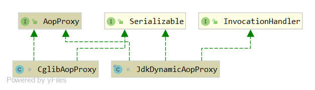
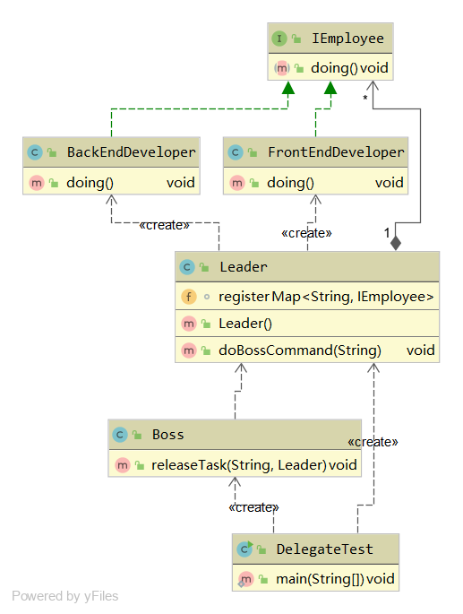
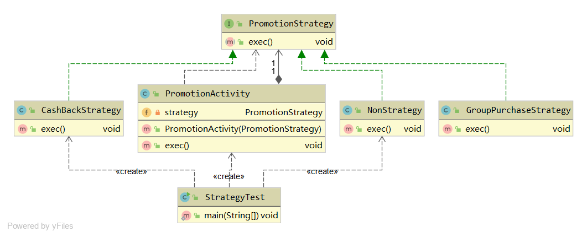
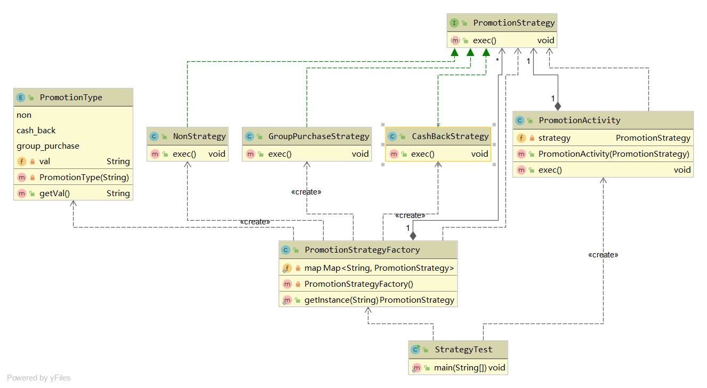

# 七大设计原则


## 开闭原则

对扩展开放，对修改关闭

## 单一职责原则

约定一个类、接口、方法只做一件事，保证单一性

## 依赖倒置原则

通过抽象的接口、类，使得各个类相互不影响

## 接口隔离原则

尽量去保证接口的纯洁性，客户端不应该依赖不需要的接口

## 迪米特法则（最少知道原则）

一个类所依赖的类知道的越少越好

## 里氏替换原则

子类可以扩展父类的功能，但是不能改变父类原来的功能

## 合成复用原则

尽量去使用对象的组合聚合，而不使用集成关系到达复用关系


# 设计模式


## 工厂模式(Factory Pattern)

### 简单工厂模式（Simple Factory Pattern）

是指一个工厂对象决定创建出哪一种产品类的实例。

属于创建型模式，但它不属于GOF 23种设置模式。

> 优点：
>
> - 只需要传入一个正确的参数，就可以创建所需要的对象，不需要知道创建的细节
>
> 缺点：
>
> - 工厂类的职责过重，增加新的产品需要修改工厂类的判断逻辑，违背开闭原则
> - 不易于扩展过于复杂的产品结构

以创建课程为例：

```java
public interface ICourse {
    void record();
}
```

```java
public class JavaCourse implements ICourse {
    @Override
    public void record() {
        System.out.println("录制java课程");
    }
}
```

```java
public class PythonCourse implements ICourse {
    @Override
    public void record() {
        System.out.println("录制Python课程");
    }
}
```

```java
public class SimpleFactory {
    private SimpleFactory() {}
    public static ICourse create(String name) {
        if ("java".equalsIgnoreCase(name)) {
            return new JavaCourse();
        } else if ("python".equalsIgnoreCase(name)) {
            return new PythonCourse();
        } else {
            return null;
        }
    }
    public static <T> T create(Class<T> clazz) {
        try {
            if (clazz != null) {
                return clazz.newInstance();
            }
        } catch (Exception e) {
            e.printStackTrace();
        }
        return null;
    }
}
```

```java
public class SimpleFactoryTest {
    public static void main(String[] args) throws Exception{
        ICourse course = SimpleFactory.create("java");
        course.record();
        ICourse course1 = SimpleFactory.create(JavaCourse.class);
        course1.record();
    }
}
```


代码 UML 类图：


### 工厂方法模式（Factory Method Pattern）

是指定义一个创建对象的接口，但让实现这个接口的类来决定实例化哪个类，工厂方法让类的实例化推迟到子类中进行。

属于创建型设计模式。

> 优点：
>
> - 只关心所需产品对应的工厂，无需关心创建细节
> - 加入新产品符合开闭原则，提高了系统的扩展性
>
> 缺点：
>
> - 类容易过多，增加代码结构的复杂度
> - 增加了系统的抽象性和理解难度

以创建课程为例：

```java
public interface ICourse {
    void record();
}
```

```java
public class JavaCourse implements ICourse {
    @Override
    public void record() {
        System.out.println("录制java课程");
    }
}
```

```java
public class PythonCourse implements ICourse {
    @Override
    public void record() {
        System.out.println("录制Python课程");
    }
}
```

```java
public interface ICourseFactory {
    ICourse create();
}
```

```java
public class JavaCourseFactory implements ICourseFactory {
    @Override
    public ICourse create() {
        return new JavaCourse();
    }
}
```

```java
public class PythonCourseFactory implements ICourseFactory {
    @Override
    public ICourse create() {
        return new PythonCourse();
    }
}
```

```java
public class FactoryMethodTest {
    public static void main(String[] args) {
        ICourseFactory javaCourseFactory = new JavaCourseFactory();
        ICourse javaCourse = javaCourseFactory.create();
        javaCourse.record();
        ICourseFactory pythonCourseFactory = new PythonCourseFactory();
        ICourse pythonCourse = pythonCourseFactory.create();
        pythonCourse.record();
    }
}
```

代码 UML 类图：


### 抽象工厂（Abstract Factory Pattern）

是指提供一个创建一系列相关或相互依赖对象的接口，无需知道他们的具体类。

属于创建型模式。

> 优点：
>
> - 具体产品在应用层代码隔离，无需关系创建细节
> - 可以将一个系列的产品族统一到一起创建
>
> 缺点：
>
> - 规定了所有可能被创建的产品集合，产品族中扩展新的产品困难，需要修改抽象工厂接口
> - 增加了系统的抽象性和理解难度

以创建课程为例：

```java
// 产品族的抽象
public interface ICourse {
    void record();
}
```

```java
public class JavaCourse implements ICourse {
    @Override
    public void record() {
        System.out.println("录制java课程");
    }
}
```

```java
public class PythonCourse implements ICourse {
    @Override
    public void record() {
        System.out.println("录制Python课程");
    }
}
```

```java
// 产品族的抽象
public interface INote {
    void takeNote();
}
```

```java
public class JavaNote implements INote{
    @Override
    public void takeNote() {
        System.out.println("记java笔记");
    }
}
```

```java
public class PythonNote implements INote{
    @Override
    public void takeNote() {
        System.out.println("记python笔记");
    }
}
```

```java
// 产品等级的抽象
public interface ICourseFactory {
    ICourse createCourse();
    INote createNote();
}
```

```java
public class JavaCourseFactory implements ICourseFactory {
    @Override
    public ICourse createCourse() {
        return new JavaCourse();
    }

    @Override
    public INote createNote() {
        return new JavaNote();
    }
}
```

```java
public class PythonCourseFactory implements ICourseFactory {
    @Override
    public ICourse createCourse() {
        return new PythonCourse();
    }

    @Override
    public INote createNote() {
        return new PythonNote();
    }
}
```

```java
public class AbstractFactoryTest {

    public static void main(String[] args) {
        ICourseFactory javaFactory = new JavaCourseFactory();
        ICourse javaCourse = javaFactory.createCourse();
        javaCourse.record();
        INote javaNote = javaFactory.createNote();
        javaNote.takeNote();

        ICourseFactory pythonFactory = new PythonCourseFactory();
        ICourse pythonCourse = pythonFactory.createCourse();
        pythonCourse.record();
        INote pythonNote = pythonFactory.createNote();
        pythonNote.takeNote();
        
    }
}
```


代码 UML 类图：


## 单例模式（Singleton Pattern）

是指确保一个类在任何情况下都绝对只有一个实例，并提供一个全局访问点。

隐藏其所有的构造方法。

属于创建新模式。

>单例需要注意的地方
>
>1. 私有化构造器
>2. 保证线程安全
>3. 延迟加载
>4. 防止序列化和反序列化破坏
>5. 防止反射攻击单例

### 饿汉式单例

```java
public class HungrySingleton {
    private static final HungrySingleton instance = new HungrySingleton();
    
    private HungrySingleton(){}
    
    public static HungrySingleton getInstance() {
        return instance;
    }
    
}
```

>优点：
>
>- 初始化的时候加载
>
>缺点：
>
>- 浪费内存空间

### 懒汉式单例

线程不安全代码实现

> 缺点：线程不安全

```java
public class LazySingleton {

    private static LazySingleton instance= null;
    private LazySingleton() {}

    public static LazySingleton getInstance() {
        if (instance == null)
        	instance = new LazySingleton();
        return instance;
    }

}
```

线程安全代码实现：

>优点：线程安全
>
>缺点：性能差

```java
public class LazySingleton {

    private volatile static LazySingleton instance= null;
    private LazySingleton() {}

    public static LazySingleton getInstance() {
        if (instance == null) {
            synchronized (LazySingleton.class) {
                if (instance == null) {
                    instance = new LazySingleton();
                }
            }
        }
        return instance;
    }

}
```

内部类实现方式：（性能最优）

>优点：性能最优，线程安全
>
>缺点：会被反射攻击

```java
public class InnerClassSingleton implements Serializable {

    private InnerClassSingleton() {
        // 防止反射创建实例
        if (LazyHolder.instance == null) {
            throw new RuntimeException("不允许创建多个实例");
        }
    }

    public static InnerClassSingleton getInstance() {
        return LazyHolder.instance;
    }
    
    public static class LazyHolder {
        public static final InnerClassSingleton instance = new InnerClassSingleton();
    }
    // 防止序列化破坏单例
    public Object readResolve () {
        return LazyHolder.instance;
    }
}
```

反射攻击测试代码：

```java
public static void main(String[] args) throws Exception{
    Class clazz = InnerClassSingleton.class;
    Constructor c = clazz.getDeclaredConstructor();
    c.setAccessible(true);
    InnerClassSingleton instance1 = (InnerClassSingleton) c.newInstance();
    InnerClassSingleton instance2 = InnerClassSingleton.getInstance();
    System.out.println(instance1 == instance2);
}
```

序列化破坏单例测试代码：

```java
public static void main(String[] args) throws Exception{
    InnerClassSingleton singleton1 = InnerClassSingleton.getInstance();
    FileOutputStream fos = new FileOutputStream("InnerClassSingleton.obj");
    ObjectOutputStream oos = new ObjectOutputStream(new BufferedOutputStream(fos));
    oos.writeObject(singleton1);
    oos.flush();
    oos.close();
    FileInputStream fis = new FileInputStream("InnerClassSingleton.obj");
    ObjectInputStream ois = new ObjectInputStream(new BufferedInputStream(fis));
    InnerClassSingleton singleton2 =  (InnerClassSingleton) ois.readObject();
    ois.close();
    System.out.println(singleton2 == singleton1);
}
```


### 注册式单例

#### 枚举式单例

```java
// jdk 保证枚举不被反射、序列化机制破坏
public enum EnumSingleton {
    INSTANCE;

    private Object data;

    public static EnumSingleton getInstance() {
        return INSTANCE;
    }

    public Object getData() {
        return data;
    }
    public void setData(Object data) {
        this.data = data;
    }
}
```


#### 容器式单例

```java
// spring 单例实现
public class ContainerSingleton {
    private ContainerSingleton() {}
    private static Map<String, Object> ioc = new ConcurrentHashMap<>();
    public static Object getBean(String className) {
        synchronized (ioc) {
            if (!ioc.containsKey(className)) {
                Object obj = null;
                try {
                    Object o = Class.forName(className).newInstance();
                    ioc.put(className, obj);
                } catch (Exception e) {
                    e.printStackTrace();
                }
                return obj;
            }
            return ioc.get(className);
        }
    }
}
```

### ThreadLocal 单例

实现线程内部保证线程安全，只创建一个单例

应用场景：动态数据源切换场景

```java
// 伪线程安全
public class ThreadLocalSingleton {

    private ThreadLocalSingleton() {}

    private static final ThreadLocal<ThreadLocalSingleton> threadLocal = ThreadLocal.withInitial(ThreadLocalSingleton::new);

    public static ThreadLocalSingleton getInstance() {
        return threadLocal.get();
    }
}
```


## 原型模式(Prototype Pattern)

是指原型实例指定创建对象的种类，并且通过拷贝这些原型创建新的对象。

调用者不需要知道任何创建细节，不调用构造函数。

属于创建型模式。

>使用场景：
>
>1. 类初始化消耗资源比较多
>2. new产生的一个对象需要非常繁琐的过程 （数据准备、访问权限等）
>3. 构造函数比较复杂
>4. 循环体中生产大量对象时
>
>例子：
>
>BeanUtil.copyPropties() 方法
>
>JSON.parseObject()方法

浅拷贝与深拷贝的区别

- 浅拷贝---能复制变量，如果对象内还有对象，则只能复制对象的地址
- 深拷贝---能复制变量，也能复制当前对象的 内部对象

### 浅拷贝

SpringUtil.copyProperties() 简单逻辑实现 

```java
public class SpringUtil {

    public static void copyProperties(Object source, Object target) throws Exception{
        // 反射 target 对象
        Class<?> targetClass = target.getClass();
        // 获取 target 对象属性
        Field[] targetFields = targetClass.getDeclaredFields();
        // 反射 source 对象
        Class<?> sourceClass = source.getClass();
        // 获取 source 对象属性
        Field[] sourceFields = sourceClass.getDeclaredFields();
        for (Field targetField : targetFields) {
            for (Field sourceField : sourceFields) {
                // 判断是否有相同的属性
                if (targetField.getName().equals(sourceField.getName())) {
                    String setName = "set"+ 		targetField.getName().substring(0,1).toUpperCase()+ 				targetField.getName().substring(1);
                    // 获取目标映射属性的set方法
                    Method targetMethod = targetClass.getDeclaredMethod(setName, String.class);
                    String getName = "get" + sourceField.getName().substring(0,1).toUpperCase()+ sourceField.getName().substring(1);
                    // 获取原属性的get方法
                    Method sourceMethod = sourceClass.getDeclaredMethod(getName , null);
                    // 获取 source对应的属性值
                    Object value = sourceMethod.invoke(source);
                    // 设置到 target 对象的属性值中
                    targetMethod.invoke(target,value);
                }
            }
        }
    }

    public static void main(String[] args) throws Exception{
        Test test = new Test("shen", "132520");
        Test1 test1 = new Test1();
        copyProperties(test, test1);
        System.out.println(test);
        System.out.println(test1);
        // 输出
        // Test{name='shen', phone='132520'}
        // Test1{name='shen', phone='132520', sex='null'}
    }

}
@Data
class Test {

    private String name;
    private String phone;

    public Test(String name, String phone) {
        this.name = name;
        this.phone = phone;
    }

    @Override
    public String toString() {
        return "Test{" + "name='" + name + '\'' + ", phone='" + phone + '\'' + '}';
    }
}
@Data
class Test1 {

    private String name;
    private String phone;
    private String sex;

    @Override
    public String toString() {
        return "Test1{" + "name='" + name + '\'' + ", phone='" + phone + '\'' + ", sex='" + sex + '\'' + '}';
    }
}
```


### 深拷贝

深拷贝代码实现

```java
@Data
public class Father implements Cloneable {

    private String name;
    private Son son;

    public Father(String name, Son son) {
        this.name = name;
        this.son = son;
    }

    @Override
    protected Father clone() throws CloneNotSupportedException {
        Father father = (Father) super.clone();
        father.son = (Son) this.son.clone();
        return father;
    }
}
@Data
class Son implements Cloneable {
    private String name;
    @Override
    protected Object clone() throws CloneNotSupportedException {
        return super.clone();
    }
}

class Main{
    public static void main(String[] args) throws Exception{
        Son son = new Son("son");
        Father father = new Father("father", son);
        System.out.println(father + "," +father.getSon());
        Father clone = father.clone();
        System.out.println(clone+ "," +clone.getSon());
        // 输出
        //dp.prototype.Father@71bc1ae4,dp.prototype.Son@6ed3ef1
        //dp.prototype.Father@2437c6dc,dp.prototype.Son@1f89ab83
    }
}
```


## 代理模式(Proxy Pattern)

是指为其他对象提供一种代理，以控制这个对象的访问。

代理对象在客服端和目标对象之间起到中介作用。

属于结构性设计模式


### 静态代理

显示声明被代理对象

```java
public interface Person {
    void findLove();
}
public class Son implements Person {
    @Override
    public void findLove() {
        System.out.println("大长腿！！");
    }
}
public class Father implements Person {
    private Son son;
    public Father(Son son) {
        this.son = son;
    }
    @Override
    public void findLove() {
        System.out.println("找啊找");
        son.findLove();
        System.out.println("找到了");
    }
}
public class Test {
    public static void main(String[] args) {
        Person father = new Father(new Son());
        father.findLove();
    }
}
```


### jdk 动态代理

>  实现原理：
>
> 1. 拿到被代理类的引用，并且获得它的所有的接口（反射获取）
> 2. JDK Proxy类重新生成一个新的类，实现了被代理类所有接口的方法
> 3. 动态生成Java代码，把增强逻辑加入到新生成代码中
> 4. 编译生成新的 java 代码的class文件
> 5. 加载并重新运行新的class，得到类就是全新类

测试代码加`System.getProperties().put("sun.misc.ProxyGenerator.saveGeneratedFiles", "true");` 可以把生成的代码输出到文件

**不足：代理类必须要实现一个接口**

```java
public interface Person {
    void findLove();
}
public class Girl implements Person {
    @Override
    public void findLove() {
        System.out.println("找帅哥");
    }
}
public class JdkMeiPo implements InvocationHandler {
    private Person person;
    public Object doInvoke(Person person) throws Exception{
        this.person = person;
        Class clazz = this.person.getClass();
        return Proxy.newProxyInstance(clazz.getClassLoader(), clazz.getInterfaces(), this);
    }
    @Override
    public Object invoke(Object proxy, Method method, Object[] args) throws Throwable {
        before();
        Object invoke = method.invoke(this.person, args);
        after();
        return invoke;
    }
    private void before() {
        System.out.println("媒婆找对象去");
    }
    private void after() {
        System.out.println("媒婆找到对象");
    }
}
public class Test {
    public static void main(String[] args) throws Exception {
        Person obj = (Person) new JdkMeiPo().doInvoke(new Girl());
        obj.findLove();
    }
}
```


### CGLIB动态代理

**不足：不能代理final修饰的方法** 

```java
public class CglibMeiPo implements MethodInterceptor {
    public Object doInvoke(Class<?> clazz) throws Exception {
        // 相当于proxy类
        Enhancer enhancer = new Enhancer();
        enhancer.setSuperclass(clazz);
        enhancer.setCallback(this);
        return enhancer.create();
    }
    @Override
    public Object intercept(Object o, Method method, Object[] objects, MethodProxy methodProxy) throws Throwable {
        before();
        Object invoke = methodProxy.invokeSuper(o, objects);
        after();
        return invoke;
    }
    private void before() {
        System.out.println("媒婆找对象去");
    }
    private void after() {
        System.out.println("媒婆找到对象");
    }
}
public class Customer {
    public void findLove(){
        System.out.println("啧啧啧");
    }
}
public class TestCglib {
    public static void main(String[] args) throws Exception {
        Customer customer = (Customer) new CglibMeiPo().doInvoke(Customer.class);
        customer.findLove();
    }
}
```


### jdk 与 cglib 对比

相同

​	目的：都是生成一个新的类，去实现增强代码逻辑的功能

不同：

1. 实现方式
   - jdk 是实现了被代理对象的接口
   - cglib是继承类被代理对象

2. 适用性
   - jdk直接写Class 字节码
   - cglib使用ASM框架写Class字节码，生成代理类效率更低

3. 执行效率
   - jdk生成代理类的逻辑简单，执行效率相对要低，每次都要反射动态调用
   - cglib生成代理类的逻辑复杂，调用效率更高。生成了一个包含所有逻辑的FastClass，不需要在反射调用 


 

### spring aop代理实现

#### spring 运用代理模式

先看 ProxyFactoryBean 核心方法就是getIbject() 方法，源码如下

```java
// ProxyFactoryBean
public Object getObject() throws BeansException {
    initializeAdvisorChain();
    // 判断是否单例
    if (isSingleton()) {
        // 生成单例对象
        return getSingletonInstance();
    }
    else {
        if (this.targetName == null) {
            logger.warn("Using non-singleton proxies with singleton targets is often undesirable. " +
                        "Enable prototype proxies by setting the 'targetName' property.");
        }
        // 生成原型对象
        return newPrototypeInstance();
    }
}
```


spring利用动态代理实现Aop有两个非常重要的类， 一个是JdkDynamicAopProxy 和CglibAopProxy，类图如下




#### spring 代理选择原则

1. 当Bean有实现接口时，spring就会使用jdk的动态代理
2. 当Bean没有实现接口时，spring就会使用cglib
3. spring可以通过配置强制使用Cglib，只需要在spring的配置文件中加入`<aop:aspectj-autoproxy proxy-target-class="true">`


### 代理模式的优缺点

- 优点
  1. 代理模式能将代理对象与真实被调用的目标对象分离
  2. 一定程度上降低了系统的耦合程度，易于扩展
  3. 代理可以起到保护目标对象的作用
  4. 增加目标对象的职责
- 缺点
  1. 会造成系统设计中类的数量增加
  2. 在客户端和目标对象之间增加了一个代理对象，会造成请求处理速度变慢
  3. 增加了系统的复杂度


## 委派模式(Delegate Pattern)

委派模式的基本作用就是负责任务的调度和分配任务，跟代理模式很像，可以看做是一种特殊情况下的静态代理的全权代理，但是代理模式注重过程，而委派模式注重结果。

不属于GOF 设计模式之一。

属于行为型模式

spring 中 以delegate、dispatch 结尾的类，大部分都是委派模式

以老板给经理发布任务，经理委派给具体员工干活的场景为例：

```java
public class Boss {
    // 发布任务
    public void releaseTask(String command, Leader leader) {
        leader.doBossCommand(command);
    }
}
```

```java
public class Leader {
    Map<String, IEmployee> register = new HashMap<>();
	// 初始化，经理需要知道手下能干什么任务，并指派给谁处理
    public Leader() {
        register.put("前端开发", new FrontEndDeveloper());
        register.put("后端开发", new BackEndDeveloper());
    }

    public void doBossCommand(String command) {
        if ("前端开发".equals(command)) {
            register.get(command).doing();
        } else if ("后端开发".equals(command)) {
            register.get(command).doing();
        } else {
            return;
        }
        // 扩展麻烦，可以结合策略模式优化
    }
}
```

```java
public interface IEmployee {
    void doing();
}
```

```java
public class BackEndDeveloper implements IEmployee {
    @Override
    public void doing() {
        System.out.println("开发后台逻辑");
    }
}
```

```java
public class FrontEndDeveloper implements IEmployee{
    @Override
    public void doing() {
        System.out.println("开发前端页面");
    }
}
```

```java
// 测试类
public class DelegateTest {
    public static void main(String[] args) {
        new Boss().releaseTask("后端开发", new Leader());
    }
}
```

代码 UML 类图如下：




## 策略模式(Strategy pattern)

策略模式是指定义了算法家族、分别封装起来，让它们之间可以互相替换，此模式让算法的变化不会影响到使用算法的用户。

可以避免多if...else 和switch语句。

>优点：
>
>1. 符合开闭原则
>2. 避免多重条件语句的使用
>3. 提高算法的保密性和安全性
>
>缺点：
>
>1. 客户端必须知道所有的策略，并且自行觉得使用哪一个策略类
>2. 代码中会产生非常多策略类，增加维护难度

以买商品优惠活动为例：

```java
// 优惠活动算法抽象
public interface PromotionStrategy {
    void exec();
}
```

```java
// 返现算法
public class CashBackStrategy implements PromotionStrategy {
    @Override
    public void exec() {
        System.out.println("执行返现活动算法");
    }
}
```

```java
// 团购算法
public class GroupPurchaseStrategy implements PromotionStrategy {
    @Override
    public void exec() {
        System.out.println("执行团购活动算法");
    }
}
```

```java
// 无活动算法
public class NonStrategy implements PromotionStrategy {
    @Override
    public void exec() {
        System.out.println("没有活动");
    }
}
```

```java
// 优惠活动
public class PromotionActivity {
    private PromotionStrategy strategy;
    public PromotionActivity(PromotionStrategy strategy) {
        this.strategy = strategy;
    }
    public void exec() {
        strategy.exec();
    }
}
```

```java
//测试
public class StrategyTest {
    public static void main(String[] args) {
        String promotionType = "CashBack";
        if ("CashBack".equals(promotionType)) {
            new PromotionActivity(new CashBackStrategy()).exec();
        } else if ("GroupPurchase".equals(promotionType)) {
            new PromotionActivity(new CashBackStrategy()).exec();
        } else {
            new PromotionActivity(new NonStrategy()).exec();
        }
        //..... 扩展导致过多的逻辑，可以结合单例、简单工厂优化
    }
}
```

代码 UML 类图如下：




## 模板模式


## 适配器模式


## 装饰器模式


## 观察者模式


# 多模式结合优化

## 策略模式+工厂模式+单例模式 优化 优惠券活动

```java
// 优惠活动算法抽象
public interface PromotionStrategy {
    void exec();
}
```

```java
// 返现算法
public class CashBackStrategy implements PromotionStrategy {
    @Override
    public void exec() {
        System.out.println("执行返现活动算法");
    }
}
```

```java
// 团购算法
public class GroupPurchaseStrategy implements PromotionStrategy {
    @Override
    public void exec() {
        System.out.println("执行团购活动算法");
    }
}
```

```java
// 无活动算法
public class NonStrategy implements PromotionStrategy {
    @Override
    public void exec() {
        System.out.println("没有活动");
    }
}
```

```java
// 优惠活动
public class PromotionActivity {
    private PromotionStrategy strategy;
    public PromotionActivity(PromotionStrategy strategy) {
        this.strategy = strategy;
    }
    public void exec() {
        strategy.exec();
    }
}
```

```java
// 算法生成工厂
public class PromotionStrategyFactory {
    private PromotionStrategyFactory() {}
    // 饿汉式单例
    private static Map<String, PromotionStrategy> map = new HashMap<>();
    static {
        map.put(PromotionType.non.getVal(), new NonStrategy());
        map.put(PromotionType.cash_back.getVal(), new CashBackStrategy());
        map.put(PromotionType.group_purchase.getVal(), new GroupPurchaseStrategy());
    }
    public static PromotionStrategy getInstance(String type) {
        // 简单工厂模式
        // 根据不同key返回算法实例
        if (!map.containsKey(type)) {
            return map.get(PromotionType.non.getVal());
        }
        return map.get(type);
    }
}
```

```java
// 优惠类型
public enum PromotionType {
    non("0"),
    cash_back("1"),
    group_purchase("2");
    private String val;
    PromotionType(String val) {
        this.val = val;
    }
    public String getVal(){
        return val;
    }
}
```

```java
// 测试
public class StrategyTest {
    public static void main(String[] args) {
        String key = "1";
        new PromotionActivity(PromotionStrategyFactory.getInstance(key)).exec();
    }
}
```

类图：

