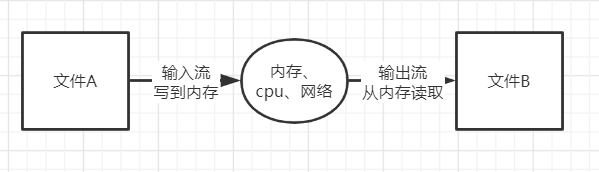
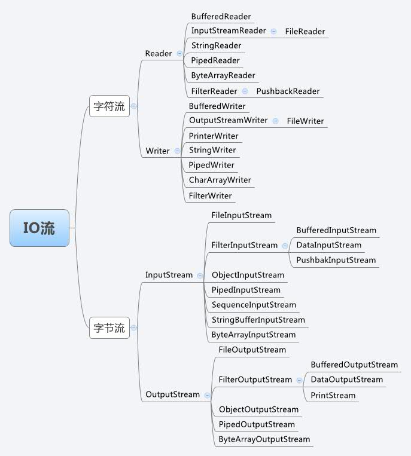

# 流的概念和作用

流是一组有顺序的，有起点和终点的字节集合，是对数据传输的总称或抽象。即数据在两设备间的传输称为流，**流的本质是数据传输，根据数据传输特性将流抽象为各种类，方便更直观的进行数据操作。** 


# IO流的分类

- 根据处理数据类型的不同分为：字符流和字节流
- 根据数据流向不同分为：输入流和输出流


## 字符流和字节流

字节流是最基本的，采用ASCII编码，所有的`InputStream`和`OutputStream`的子类都是,主要用在处理二进制数据，它是按字节来处理的，但实际中很多的数据是文本，又提出了字符流的概念，采用Unicode编码。它是按虚拟机的encode来处理，也就是要进行字符集的转化

字节流和字符流的区别：

- 读写单位不同：字节流以字节（8 bit）为单位，字符流以字符为单位，根据码表映射字符，一次可能读多个字节。
- 处理对象不同：字节流能处理所有类型的数据（如图片、avi 等），而字符流只能处理字符类型的数据。

结论：只要是处理纯文本数据，就优先考虑使用字符流。 除此之外都使用字节流。


## 输入流和输出流

对输入流只能进行读操作，对输出流只能进行写操作。



# 代码案例

## 用字节流读取文件内容

```java
public class App {
    public static void main(String[] args) throws IOException {
        // 获取源文件的字节流对象
        InputStream is = new FileInputStream("e://a.txt");
        int temp = 0;
        while ((temp = is.read()) != -1) {
            System.out.println(temp); // 对于的ACISS码
        }
        is.close(); // 关闭
    }
}

```


## 用字节流写入文件

```java
public class App {
    public static void main(String[] args) throws IOException {
        // 获得文件的输出流对象
        OutputStream os = new FileOutputStream("e://a.txt");
         // 往文件写入内容
        os.write(97); // ACISS码的97 对应 a
        os.write(98); // ACISS码的98 对应 b
        os.write(99); // ACISS码的98 对应 c
        os.flush();  // 刷新此输出流 并 强制写出所有缓冲的输出字节
        os.close();	 // 关闭
    }
}
```


## 字节输入流 `inputStream` 与字节输出流 `OutputStream`

```java
import java.io.*;
// 拷贝一个文件
public class App {
    public static void main(String[] args) throws IOException {
        //读取的源文件
        InputStream is = new FileInputStream("e://a.jpg");
        //输出的目标文件
        OutputStream os = new FileOutputStream("e://b.jpg");
        // 缓存区
        byte[] buf = new byte[1024];
        // 读取位置
        int bytesRead = 0;
        while ((bytesRead = is.read(buf)) != -1) { // 每一次从源文件 读取 对应缓存区的容量
            os.write(buf, 0, bytesRead); // 每一次向目标文件 写入 对应缓存区的容量
        }
        os.flush();     // 刷新此输出流 并 强制写出所有缓冲的输出字节
        os.close();     // 最后打开的流要关闭
        is.close();    // 最后打开的流要关闭
    }
}
```


## 字符流读取文件

```java
public class App {
    public static void main(String[] args) throws IOException {
        // 获取源文件的字符流对象
        FileReader fr = new FileReader("e://a.txt");
        // 定义一个 char 数组接受文件中的字符
        char[] a = new char[1];
        int temp = 0;
        while ((temp = fr.read(a)) != -1) {
            System.out.println(a);
        }
        fr.close();
    }
}
```


## 字符流写入文件

```java
public class App {
    public static void main(String[] args) throws IOException {
        // 获取源文件的字符流对象
        FileWriter fw = new FileWriter("e://a.txt");
        // 定义一个 char 数组接受文件中的字符
        fw.write("祝倩云");
        fw.flush();
        fw.close();
    }
}
```


## 字符输入流`Reader`与字符输出流`Writer`

```java
// 复制文件内容
public class App {
    public static void main(String[] args) throws IOException {
        // 源文件
        FileReader fr = new FileReader("e://a.txt");
        // 目标文件
        FileWriter fw = new FileWriter("e://b.txt");
        // 暂存区
        char[] a = new char[1];
        int temp = 0;
        while ((temp = fr.read(a)) != -1) {
            fw.write(a);
        }
        fw.flush();
        fw.close();
        fr.close();
    }
}
```


# io 相关的包




# 常用文件相关的类

## `File`类

File类是对文件系统中文件以及文件夹进行封装的对象，可以通过对象的思想来操作文件和文件夹。 File类保存文件或目录的各种元数据信息，包括文件名、文件长度、最后修改时间、是否可读、获取当前文件的路径名，判断指定文件是否存在、获得当前目录中的文件列表，创建、删除文件和目录等方法。  

```java
public class App {
    public static void main(String[] args) throws IOException {
        File file = new File("e://a.txt");
        String name = file.getName(); // 获取文件名
        file.isDirectory();     // 是否文件夹
        file.isFile();      // 是否文件
        file.mkdir();   // 创建文件
        file.delete();  // 删除文件
        // .... 还有很多
    }
}
```


## `RandomAccessFile`类


该对象并不是流体系中的一员，其封装了字节流，同时还封装了一个缓冲区（字符数组），通过内部的指针来操作字符数组中的数据。 该对象特点：

1. 该对象只能操作文件，所以构造函数接收两种类型的参数：a.字符串文件路径；b. File对象。
2. 该对象既可以对文件进行读操作，也能进行写操作，在进行对象实例化时可指定操作模式(r, rw)

```java
public class App {
    public static void main(String[] args) throws IOException {
        RandomAccessFile raf = new RandomAccessFile("E://a.txt", "rw");
        // 获取 RandomAccessFile对象文件指针的位置，初始位置为0
        System.out.println("初始位置：" + raf.getFilePointer());
        //移动文件记录指针的位置
        raf.seek(2);
        System.out.println("移动之后位置：" + raf.getFilePointer());
        byte[] a = new byte[1];
        // 读取移动后位置的值
        raf.read(a);
        System.out.println(Arrays.toString(a));
 		// 再次移动位置
        raf.seek(5);
        // 在该位置写入值
        raf.writeBytes("a");
    }
}
```


# 字符流与字节流转换

转换流的特点：

1. 其是字符流和字节流之间的桥梁
2. 可对读取到的字节数据经过指定编码转换成字符
3. 可对读取到的字符数据经过指定编码转换成字节

何时使用转换流？

1. 当字节和字符之间有转换动作时；
2. 流操作的数据需要编码或解码时。

具体的对象体现：

1. `InputStreamReader`:*字节到字符的桥梁*
2. `OutputStreamWriter`:*字符到字节的桥梁*

这两个流对象是字符体系中的成员，它们有转换作用，本身又是字符流，所以在构造的时候需要传入字节流对象进来。


## 字节流转成字符流

```java
public class App {
    public static void main(String[] args) throws IOException {
        //构建字节输入流对象
        FileInputStream fileInputStream = new FileInputStream("E:\\a.txt");
        //构建字节字符转换流对象
        InputStreamReader inputStreamReader = new InputStreamReader(fileInputStream);
        //构建字符输入流对象
        BufferedReader bufferedReader = new BufferedReader(inputStreamReader);
        //读取数据
        char[] chars = new char[1024];
        int off = 0;
        while (bufferedReader.ready()) {
            off = bufferedReader.read(chars);
        }
        //打印输出
        String s = new String(chars, 0, off);
        System.out.println(s);
        //关闭流
        bufferedReader.close();
        inputStreamReader.close();
        fileInputStream.close();
    }
}
```


## 字符流转成字节流

```java
public class App {
    public static void main(String[] args) throws IOException {
        //构建输出流字节对象
        FileOutputStream fileOutputStream = new FileOutputStream("E:\\b.txt");
        //构建输出流字节字符转换对象
        OutputStreamWriter outputStreamWriter = new OutputStreamWriter(fileOutputStream);
        //构建字符输出流对象
        BufferedWriter bufferedWriter = new BufferedWriter(outputStreamWriter);
        //构建数据
        char[] chars = new char[3];
        chars[0] = '祝';
        chars[1] = '倩';
        chars[2] = '芸';
        //输出数据
        bufferedWriter.write(chars);
        //刷新流
        bufferedWriter.flush();
        //关闭流
        bufferedWriter.close();
        outputStreamWriter.close();
        fileOutputStream.close();
    }
}
```

