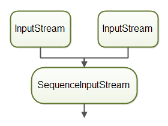
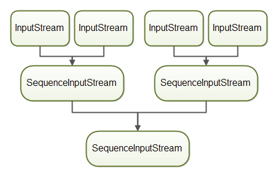

# 系统学习 Java IO (五)----使用 SequenceInputStream 组合多个流
SequenceInputStream 可以将两个或多个其他 InputStream 合并为一个。 首先，SequenceInputStream 将读取第一个 InputStream 中的所有字节，然后读取第二个 InputStream 中的所有字节。 这就是它被称为 SequenceInputStream 的原因，因为 InputStream 实例是按顺序读取的。


## 构造方法
1. SequenceInputStream(InputStream s1, InputStream s2): 通过两个参数初始化新创建的 SequenceInputStream（将按顺序读取这两个参数，先读取 s1，然后读取 s2）
2. SequenceInputStream(Enumeration<? extends InputStream> e): 通过枚举对象来初始化新创建的 SequenceInputStream，该参数必须是生成运行时类型为 InputStream 对象的 Enumeration 型参数。

提一下，Enumeration 接口是 Iterator 迭代器的“古老版本”；
把 2 个流结合的一个例子：

```java
public class SequenceInputStreamExample {
    public static void main(String[] args) throws IOException {
        InputStream input1 = new FileInputStream("D:\\test\\1.txt");
        InputStream input2 = new FileInputStream("D:\\test\\2.txt");

        SequenceInputStream sequenceInputStream = new SequenceInputStream(input1, input2);
        int data = sequenceInputStream.read();
        while (data != -1) {
            System.out.print((char)data);
            data = sequenceInputStream.read();
        }
    }
}
```
这里使用了第一个构造函数，直接接收 2 个流，并把他们合并成一个流返回，这样可以使用被组合的两个 InputStream 实例，就像它是一个流一样。但是在读取完成之前，还是不可以关闭被组合的 2 个流，否则再进行读取会抛出异常。

## 组合 2 个以上的 InputStream

可以通过 2 种方式将两个以上的 InputStream 实例与 SequenceInputStream 组合在一起。

1. 第一种方法是将所有 InputStream 实例放入 Vector 中，并将 Vector.elements() 传递给 SequenceInputStream 构造函数。 下面是一个如何将 Vector 传递给 SequenceInputStream 构造函数的示例：

```java
public class SequenceInputStreamExample {
    public static void main(String[] args) throws IOException {
        InputStream input1 = new FileInputStream("D:\\test\\1.txt");
        InputStream input2 = new FileInputStream("D:\\test\\2.txt");
        InputStream input3 = new FileInputStream("D:\\test\\3.txt");

        Vector<InputStream> streams = new Vector<>();
        streams.add(input1);
        streams.add(input2);
        streams.add(input3);
        // 利用 Vector 对象的 elements() 方法返回 enumeration 对象
        SequenceInputStream sequenceInputStream = new SequenceInputStream(streams.elements());
        int data = sequenceInputStream.read();
        while (data != -1) {
            System.out.print((char)data);
            data = sequenceInputStream.read();
        }
    }
}
```

2. 第二种方法是将 InputStream 实例两两组合到 SequenceInputStream 实例中，然后再和其他 SequenceInputStream 组合。 以下是实例：

```java
public class SequenceInputStreamExample {
    public static void main(String[] args) throws IOException {
        InputStream input1 = new FileInputStream("D:\\test\\1.txt");
        InputStream input2 = new FileInputStream("D:\\test\\2.txt");
        InputStream input3 = new FileInputStream("D:\\test\\3.txt");

        SequenceInputStream sequenceInputStream1 = new SequenceInputStream(input1, input2);
        SequenceInputStream sequenceInputStream = new SequenceInputStream(sequenceInputStream1, input3);
        int data = sequenceInputStream.read();
        while (data != -1) {
            System.out.print((char)data);
            data = sequenceInputStream.read();
        }
        sequenceInputStream.close();
    }
}
```



其实直接传进构造器的 2 个 InputStream ，也会被构造器内部包装成一个 Vector 的。

## 关闭 SequenceInputStream
当 SequenceInputStream 关闭时，它还将关闭它从中读取的 InputStream 实例，可以调用 close() 方法，还可以使用 Java 7 中引入的 try-with-resources 构造关闭。


```java
public void close() throws IOException {
    do {
        nextStream();
    } while (in != null);
}

final void nextStream() throws IOException {
    if (in != null) {
        in.close();
    }
    if (e.hasMoreElements()) {
        in = (InputStream) e.nextElement();
        if (in == null)
            throw new NullPointerException();
    }
    else in = null;
}
```