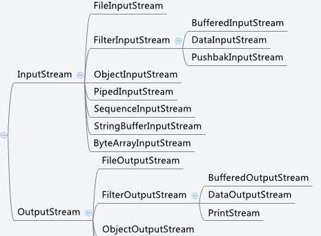

# 系统学习 Java IO (八)----装饰流 FilterInputStream/FilterOutputStream

这两个流的作用是：“封装其它的输入流，并为它们提供额外的功能”
他们的直接子类有：

BufferedInputStream 的作用就是为“输入流提供缓冲功能，以及 mark() 和 reset() 功能”
DataInputStream 是用来装饰其它输入流，它“允许应用程序以与机器无关方式从底层输入流中读取基本 Java 数据类型”
接下来我们会对具体每一个展开分析的。

FilterInputStream 是用于实现自己的过滤输入流的基类。 基本上它只是覆盖 InputStream 中的所有方法，没有任何特殊行为。
在其内部对所有方法的所有调用传递给包装的一个 InputStream 对象调用。

在其构造器中将一个 InputStream 对象传递给 FilterInputStream ，将参数 in 分配给字段 this.in，以便记住它供以后使用,如下所示：
`protected FilterInputStream(InputStream in);`
`public int read() throws IOException {return in.read(); }`

我个人认为这个类没有什么目的，也没有看到这个类在 InputStream 中添加任何改变行为。

同样， FilterOutputStream 是用于实现自己的过滤输出流的基类。 基本上它只是覆盖了 OutputStream 中的所有方法。

也无法看到这个类实际上添加或更改了 OutputStream 中的任何行为。 如果要继承此类，则可以直接继承 OutputStream 类，避免多一层没用的类。
