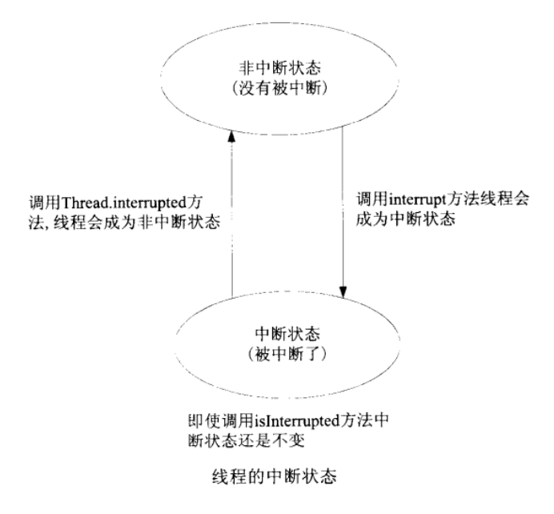
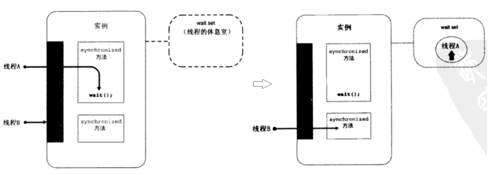
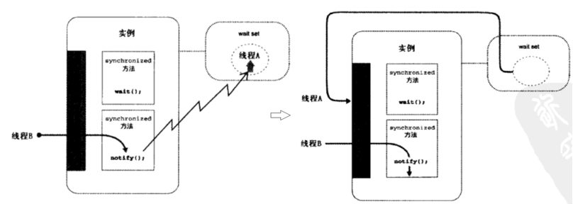
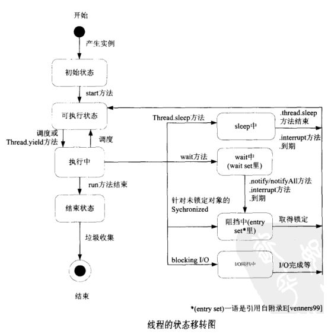

# Java多线程基础（一）——线程与锁

## 一、线程的基本概念

### 1.1 单线程

简单的说，单线程就是进程中只有一个线程。单线程在程序执行时，所走的程序路径按照连续顺序排下来，前面的必须处理好，后面的才会执行。

*Java示例：*

```java
public class SingleThread {
    public static void main(String[] args) {
        for (int i = 0; i < 10000; i++) {
            System.out.print(i + " ");
        }
    }
}
```

*上述 `Java`代码中，只有一个主线程执行 `main`方法。*


### 1.2 多线程

由一个以上线程组成的程序称为多线程程序。常见的多线程程序如：GUI应用程序、I/O操作、网络容器等。
Java中，一定是从主线程开始执行（main方法），然后在主线程的某个位置启动新的线程。


## 二、线程的基本操作

### 2.1 创建

Java中创建多线程类两种方法：

**1、继承java.lang.Thread**

*Java示例：*

```java
public class MyThread extends Thread {
    public void run() {
        for (int i = 0; i < 10000; i++) {
            System.out.print(i + " ");
        }
    }
}
public class MultiThread {
    public static void main(String[] args) {
        MyThread t = new MyThread();
        t.start();    //启动子线程
        //主线程继续同时向下执行
        for (int i = 0; i < 10000; i++) {
            System.out.print(i + " ");
        }
    }
}
```

上述代码中，`MyThread` 类继承了类 `java.lang.Thread` ，并覆写了 `run` 方法。主线程从 `main` 方法开始执行，当主线程执行至 `t.start()` 时，启动新线程（注意此处是调用 `start` 方法，不是 `run` 方法），新线程会并发执行自身的 `run` 方法。

**2、实现java.lang.Runnable接口**

*Java示例：*

```java
public class MyThread implements Runnable {
    public void run() {
        for (int i = 0; i < 10000; i++) {
            System.out.print(i + " ");
        }
    }
}
public class MultiThread {
    public static void main(String[] args) {
        Thread t = new Thread(new MyThread());
        t.start();    //启动子线程
        //主线程继续同时向下执行
        for (int i = 0; i < 10000; i++) {
            System.out.print(i + " ");
        }
    }
}
```

上述代码中， `MyThread` 类实现了 `java.lang.Runnable` 接口，并覆写了`run`方法，其它与继承 `java.lang.Thread` 完全相同。实际上，`java.lang.Thread` 类本身也实现了 `Runnable` 接口，只不过  `java.lang.Thread` 类的 `run` 方法主体里空的，通常被子类覆写（ `override` ）。

> 注意：主线程执行完成后，如果还有子线程正在执行，程序也不会结束。只有当所有线程都结束时（不含Daemon Thread），程序才会结束。


### 2.2 暂停

Java中线程的暂停是调用 `java.lang.Thread` 类的 `sleep` 方法（注意是**类方法**）。该方法会使**当前正在执行的线程**暂停指定的时间，如果线程持有锁， `sleep` 方法结束前并不会释放该锁。

*Java示例：*

```java
public class Main {
    public static void main(String[] args) {
        for (int i = 0; i < 10; i++) {
            System.out.print(i + " ");
            try {
                Thread.sleep(1000);    //当前main线程暂停1000ms
            } catch (InterruptedException e) {
            }
        }
    }
}
```


上述代码中，当 `main` 线程调用 `Thread.sleep(1000)` 后，线程会被暂停，如果被 `interrupt` ，则会抛出 `InterruptedException` 异常。


### 2.3 互斥

Java中线程的共享互斥操作，会使用 `synchronized` 关键字。线程共享互斥的架构称为监视（monitor），而获取锁有时也称为“持有(own)监视”。

每个锁在同一时刻，只能由一个线程持有。
*注意：`synchronized` 方法或声明执行期间，如程序遇到任何异常或return，线程都会释放锁。*

**1、synchronized方法**

*Java示例1：*

```java
//synchronized实例方法
public synchronized void deposit(int m) {
    System.out.print("This is synchronized method.");
}
```

*注：synchronized实例方法采用this锁（即当前对象）去做线程的共享互斥。*

*Java示例2：*

```java
//synchronized类方法
public static synchronized void deposit(int m) {
    System.out.print("This is synchronized static method.");
}
```

*注：synchronized类方法采用类对象锁（即当前类的类对象）去做线程的共享互斥。如上述示例中，采用类.class（继承自java.lang.Class）作为锁。*


**2、synchronized声明**
*Java示例：*

```java
public void deposit(int m) {
    synchronized (this) {
        System.out.print("This is synchronized statement with this lock.");
    }
    synchronized (Something.class) {
        System.out.print("This is synchronized statement with class lock.");
    }
}
```

*注：synchronized声明可以采用任意锁，上述示例中，分别采用了对象锁（this）和类锁（something.class）*

### 2.4 中断

java.lang.Thread类有一个 `interrupt` 方法，该方法直接对线程调用。当被interrupt的线程正在sleep或wait时，会抛出`InterruptedException`异常。
事实上，`interrupt`方法只是改变目标线程的中断状态（interrupt status），而那些会抛出`InterruptedException`异常的方法，如wait、sleep、join等，都是在方法内部不断地检查中断状态的值。

- **interrupt方法**

Thread实例方法：必须由其它线程获取被调用线程的实例后，进行调用。实际上，只是改变了被调用线程的内部中断状态；

- **Thread.interrupted方法**

Thread类方法：必须在当前执行线程内调用，该方法返回当前线程的内部中断状态，然后清除中断状态（置为false） ；

- **isInterrupted方法**

Thread实例方法：用来检查指定线程的中断状态。当线程为中断状态时，会返回true；否则返回false。




### 2.5 协调

**1、wait set / wait方法**
wait set是一个虚拟的概念，每个Java类的实例都有一个wait set，当对象执行wait方法时，当前线程就会暂停，并进入该对象的wait set。
当发生以下事件时，线程才会退出wait set：
① 有其它线程以notify方法唤醒该线程
② 有其它线程以notifyAll方法唤醒该线程
③ 有其它线程以interrupt方法唤醒该线程
④ wait方法已到期
*注：当前线程若要执行 `obj.wait()`，则必须先获取该对象锁。当线程进入wait set后，就已经释放了该对象锁。*

下图中线程A先获得对象锁，然后调用wait()方法（此时线程B无法获取锁，只能等待）。当线程A调用完wait()方法进入wait set后会自动释放锁，线程B获得锁。




**2、notify方法**
notify方法相当于从wait set中从挑出一个线程并唤醒。
下图中线程A在当前实例对象的wait set中等待，此时线程B必须拿到同一实例的对象锁，才能调用notify方法唤醒wait set中的任意一个线程。
*注：线程B调用 `notify` 方法后，并不会立即释放锁，会有一段时间差。*



**3、notifyAll方法**
notifyAll方法相当于将wait set中的所有线程都唤醒。

**4、总结**
wait、notify、notifyAll这三个方法都是java.lang.Object类的方法（注意，不是Thread类的方法）。
若线程没有拿到当前对象锁就直接调用对象的这些方法，都会抛出java.lang.IllegalMonitorStateException异常。

- `obj.wait()`是把当前线程放到obj的wait set；
- `obj.notify()`是从obj的wait set里唤醒1个线程；
- `obj.notifyAll()`是唤醒所有在obj的wait set里的线程。


## 三、线程的状态转移



- 当创建一个Thread子类或实现Runnable接口类的实例时，线程进入【初始】状态；
- 调用实例的start方法后，线程进入【可执行】状态；
- 系统会在某一时刻自动调度处于【可执行】状态的线程，被调度的线程会调用run方法，进入【执行中】状态；
- 线程执行完run方法后，进入【结束】状态；
- 处于【结束】状态的线程，在某一时刻，会被JVM垃圾回收；
- 处于【执行中】状态的线程，若调用了Thread.yield方法，会回到【可执行】状态，等待再次被调度；
- 处于【执行中】状态的线程，若调用了wait方法，会进入wait set并一直等待，直到被其它线程通过notify、notifyAll、interrupt方法唤醒；
- 处于【执行中】状态的线程，若调用了Thread.sleep方法，会进入【Sleep】状态，无法继续向下执行。当sleep时间结束或被interrupt时，会回到【可执行状态】；
- 处于【执行中】状态的线程，若遇到阻塞I/O操作，也会停止等待I/O完成，然后回到【可执行状态】；

