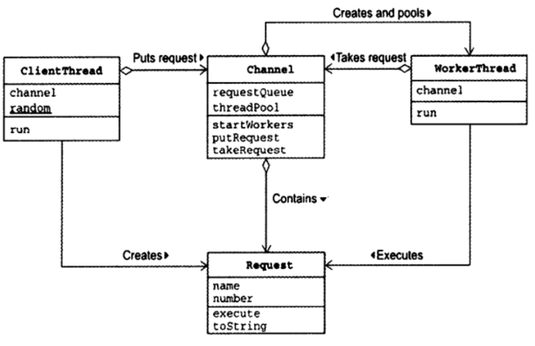
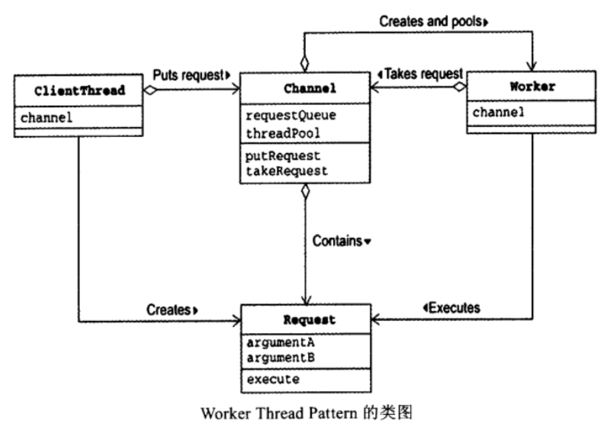
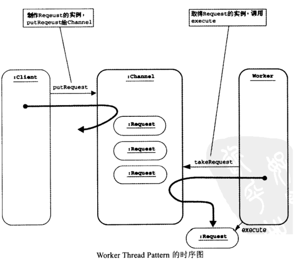

# Java多线程基础（十）——Work Thread模式

## 一、定义

Work Thread模式和Thread-Per-Message模式类似，Thread-Per-Message每次都创建一个新的线程处理请求，而Work Thread模式预先会创建一个线程池（Thread Pool），每次从线程池中取出线程处理请求。

## 二、模式案例



*Request请求类：* 

```java
public class Request {
    private final String name;
    private final int number;
    private static final Random random = new Random();
    public Request(String name, int number) {
        this.name = name;
        this.number = number;
    }
    public void execute() {
        System.out.println(Thread.currentThread().getName() + " executes " + this);
        try {
            Thread.sleep(random.nextInt(1000));
        } catch (InterruptedException e) {
        }
    }
    public String toString() {
        return "[ Request from " + name + " No." + number + " ]";
    }
}
```

*Client线程类：*
Client线程类用来送出请求：

- 创建Request实例
- 将这个实例传送给Channel类的putRequest方法

```java
public class ClientThread extends Thread {
    private final Channel channel;
    private static final Random random = new Random();
    public ClientThread(String name, Channel channel) {
        super(name);
        this.channel = channel;
    }
    public void run() {
        try {
            for (int i = 0; true; i++) {
                Request request = new Request(getName(), i);
                channel.putRequest(request);
                Thread.sleep(random.nextInt(1000));
            }
        } catch (InterruptedException e) {
        }
    }
}
```

*Worker线程类：*
WorkerThread类表示工人线程，工人线程可以执行以下动作：

- 从Channel实例取出Request实例
- 调用Request实例的execute方法

```java
public class WorkerThread extends Thread {
    private final Channel channel;
    public WorkerThread(String name, Channel channel) {
        super(name);
        this.channel = channel;
    }
    public void run() {
        while (true) {
            Request request = channel.takeRequest();
            request.execute();
        }
    }
}
```


*Channel类：* 

```java
/**
 *Channel类可用来接受、传送工作请求，并保存工人线程。
 */
public class Channel {
    private static final int MAX_REQUEST = 100; // 最大请求数
    private final Request[] requestQueue;         // 请求队列
    private int tail;
    private int head;
    private int count;
    private final WorkerThread[] threadPool;
 
    public Channel(int threads) {
        this.requestQueue = new Request[MAX_REQUEST];
        this.head = 0;
        this.tail = 0;
        this.count = 0;
 
        threadPool = new WorkerThread[threads];
        for (int i = 0; i < threadPool.length; i++) {
            threadPool[i] = new WorkerThread("Worker-" + i, this);
        }
    }
    public void startWorkers() {
        for (int i = 0; i < threadPool.length; i++) {
            threadPool[i].start();
        }
    }
    public synchronized void putRequest(Request request) {
        while (count >= requestQueue.length) {
            try {
                wait();
            } catch (InterruptedException e) {
            }
        }
        requestQueue[tail] = request;
        tail = (tail + 1) % requestQueue.length;
        count++;
        notifyAll();
    }
    public synchronized Request takeRequest() {
        while (count <= 0) {
            try {
                wait();
            } catch (InterruptedException e) {
            }
        }
        Request request = requestQueue[head];
        head = (head + 1) % requestQueue.length;
        count--;
        notifyAll();
        return request;
    }
}
```

*执行：*

```java
public class Main {
    public static void main(String[] args) {
        Channel channel = new Channel(5);
        channel.startWorkers();
        new ClientThread("Alice", channel).start();
        new ClientThread("Bobby", channel).start();
        new ClientThread("Chris", channel).start();
    }
}
```

## 三、模式讲解

Work Thread模式的角色如下：

- Client（委托人）参与者

Client参与者会创建请求(Request)，然后传送给Channel参与者。

- Channel（通道）参与者

Channel参与者保存Request请求队列，同时会预创建Worker线程。

- Worker（工人）参与者

Worker参与者会从Channel获取Request。

- Request（请求）参与者

Worker参与者会从Channel获取Request。






*注：启动线程是一项繁重的工作，Worker Thread模式预先创建一批线程，可以重复使用线程，达到资源再利用、提升性能的目的。*


  