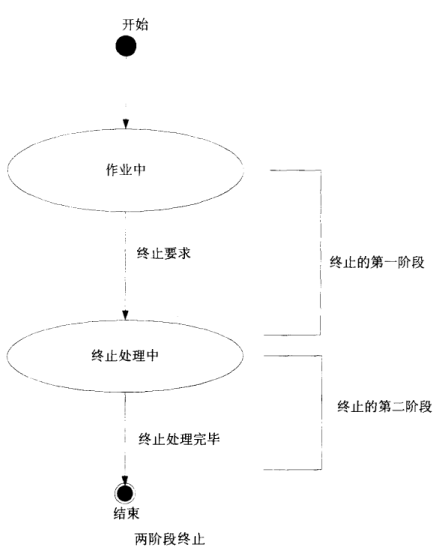

# Java多线程基础（十二）——Two-phase Termination模式

## 一、定义

我们将线程的正常处理状态称为“作业中”，当希望结束这个线程时，则送出“终止请求”。接着，这个线程并不会立刻结束，而是进入“终止处理中”状态，此时线程还是运行着的，可能处理一些释放资源等操作。直到终止处理完毕，才会真正结束。

Two-phase Termination主要考虑以下问题：

- 安全地结束（安全性）；
- 一定会进行终止处理（生命性）；
- 收到“终止请求”后，要尽快进行终止处理（响应性）；



## 二、模式案例

该案例中，线程每隔500ms将计数器增加1，在大约10s后结束。

*计数线程类：*

```java
public class CountupThread extends Thread {
    private long counter = 0;
    private volatile boolean shutdownRequested = false;
    public void shutdownRequest() {
        shutdownRequested = true;
        interrupt();
    }
    public boolean isShutdownRequested() {
        return shutdownRequested;
    }
    public final void run() {
        try {
            while (!shutdownRequested) {
                doWork();
            }
        } catch (InterruptedException e) {
        } finally {
            doShutdown();
        }
    }
    private void doWork() throws InterruptedException {
        counter++;
        System.out.println("doWork: counter = " + counter);
        Thread.sleep(500);
    }
    private void doShutdown() {
        System.out.println("doShutdown: counter = " + counter);
    }
}
```

*执行：* 

```java
public class Main {
    public static void main(String[] args) {
        System.out.println("main: BEGIN");
        try {
            CountupThread t = new CountupThread();
            t.start();
            Thread.sleep(10000);
            System.out.println("main: shutdownRequest");
            t.shutdownRequest();
            System.out.println("main: join");
            t.join();
        } catch (InterruptedException e) {
            e.printStackTrace();
        }
        System.out.println("main: END");
    }
}
```

## 三、模式讲解

Two-phase Termination模式的角色如下：

- TerminationRequester参与者

TerminationRequester参与者用于调用终止请求。（案例中的Main类）

- Terminator参与者

Terminator参与者接受终止请求，进行实际的终止处理，提供shutdownRequest终止方法供外界调用。
Terminator参与者拥有一个标识（门闩）表示是否已经收到终止请求


