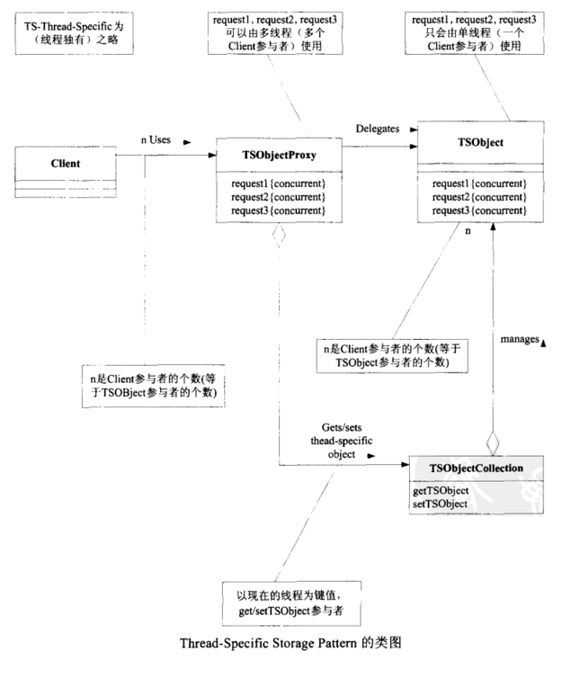

# Java多线程基础（十三）——Thread-Specific Storage（ThreadLocal）模式

## 一、定义

Thread-Specific Storage就是“线程独有的存储库”，该模式会对每个线程提供独有的内存空间。
`java.lang.ThreadLocal` 类提供了该模式的实现，ThreadLocal的实例是一种集合（collection）架构，该实例管理了很多对象，可以想象成一个保管有大量保险箱的房间。

java.lang.ThreadLocal类的方法：

- **public void set()**

该方法会检查当前调用线程，默认以该线程的 `Thread.currentThread()` 值作为键，来保存指定的值。

- **public Object get()**

该方法会检查当前调用线程，默认以该线程的 `Thread.currentThread()` 值作为键，获取保存指定的值。

## 二、模式案例

*TSLog类：*

```java
//实际执行记录日志的类，每个线程都会拥有一个该类的实例
public class TSLog {
    private PrintWriter writer = null;
    public TSLog(String filename) {
        try {
            writer = new PrintWriter(new FileWriter(filename));
        } catch (IOException e) {
            e.printStackTrace();
        }
    }
    public void println(String s) {
        writer.println(s);
    }
    public void close() {
        writer.println("==== End of log ====");
        writer.close();
    }
}
```

*Log类：*

```java
public class Log {
    private static final ThreadLocal<TSLog> tsLogCollection = new ThreadLocal<TSLog>();
    public static void println(String s) {
        getTSLog().println(s);
    }
    public static void close() {
        getTSLog().close();
    }
    private static TSLog getTSLog() {
        TSLog tsLog = (TSLog) tsLogCollection.get();
        if (tsLog == null) {
            tsLog = new TSLog(Thread.currentThread().getName() + "-log.txt");
            tsLogCollection.set(tsLog);
        }
        return tsLog;
    }
}
```

*ClientThread类：*

```java
public class ClientThread extends Thread {
    public ClientThread(String name) {
        super(name);
    }
    public void run() {
        System.out.println(getName() + " BEGIN");
        for (int i = 0; i < 10; i++) {
            Log.println("i = " + i);
            try {
                Thread.sleep(100);
            } catch (InterruptedException e) {
            }
        }
        Log.close();
        System.out.println(getName() + " END");
    }
}
```

*执行：*
Alice、Bobby、Chris三个线程调用Log类的同一个方法，但实际上每个线程都拥有独自的TSLog实例。

```java
public class Main {
    public static void main(String[] args) {
        new ClientThread("Alice").start();
        new ClientThread("Bobby").start();
        new ClientThread("Chris").start();
    }
}
```


## 三、模式讲解

Thread-Specific Storage模式的角色如下：

- Client（委托人）参与者

Client参与者会将工作委托给TSObjectProxy参与者。（案例中的ClientThread类就是Client）

- TSObjectProxy（线程独有对象的代理者）参与者

TSObjectProxy参与者会处理多个Client委托的工作。（案例中的Log类就是TSObjectProxy）

- TSObjectCollection（线程独有对象的集合）参与者

（案例中的`java.lang.ThreadLocal`类就是TSObjectCollection）

- TSObject（线程独有的对象）参与者

TSObject存放线程所特有的信息，TSObject实例的方法只会由单线程调用，由TSObjectCollection管理，每个线程都拥有独立的TSObject实例。（案例中的TSLog类就是TSObject）



## 四、ThreadLocal的原理

ThreadLocal类主要有四个方法：

**1、初始化返回值的方法：**
该方法实现只返回 null，并且修饰符为protected，很明显，如果用户想返回初始值不为null，则需要重写该方法；

```java
protected T initialValue() {
    return null;
}
```

**2、get方法，获取线程本地副本变量**

```java
public T get() {
    Thread t = Thread.currentThread();
    ThreadLocalMap map = getMap(t);
    if (map != null) {
        ThreadLocalMap.Entry e = map.getEntry(this);
        if (e != null) {
            T result = (T)e.value;
            return result;
        }
    }
    return setInitialValue();
}
```

**3、set方法，设置线程本地副本变量**

```java
public void set(T value) {
    Thread t = Thread.currentThread();
    ThreadLocalMap map = getMap(t);
    if (map != null)
        map.set(this, value);
    else
        createMap(t, value);
}
```

**4、remove方法，移除线程本地副本变量**

```java
public void remove() {
 ThreadLocalMap m = getMap(Thread.currentThread());
 if (m != null)
     m.remove(this);
}
```

------

如果需要我们自己来设计ThreadLocal对象，那么，一般的实现思路：
设计一个线程安全的Map，key就是当前线程对象，Value就是线程本地变量的值。

然而，JDK的实现思路：

> 让每个Thread对象，自身持有一个Map，这个Map的Key就是当前ThreadLocal对象，Value是本地线程变量值。相对于加锁的实现方式，这样做可以提升性能，其实是一种以时间换空间的思路。

ThreadLocal类有个`getMap()`方法，其实就是返回Thread对象自身的Map——threadLocals。

```java
ThreadLocalMap getMap(Thread t) {
    return t.threadLocals;
}
```

threadLocals是一种`ThreadLocal.ThreadLocalMap`类型的数据结构，作为内部类定义在ThreadLocal类中，其内部采用一种**WeakReference**的方式保存键值对。

