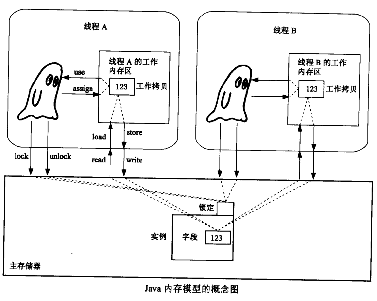

# Java多线程基础（二）——Java内存模型

## 一、主存储器与工作存储器

Java内存模型（memory model）分为主存储器（main memory）和工作存储器（working memory）两种。

**主存储器（main memory）：**
类的实例所存在的区域，main memory为所有的线程所共享。

**工作存储器（working memory）：**
每个线程各自独立所拥有的作业区，在working memory中，存有main memory中的部分拷贝，称之为工作拷贝（working copy）。



## 二、字段的使用

### 2.1 字段的引用

线程无法直接对主存储器进行操作，当线程需要引用实例的字段的值时，会一次将字段值从主存储器拷贝到工作存储器上（相当于上图中的read->load）。
当线程再次需要引用相同的字段时，可能直接使用刚才的工作拷贝（use），也可能重新从主存储器获取（read->load->use）。
具体会出现哪种情况，由JVM决定。

### 2.2 字段的赋值

由于线程无法直接对主存储器进行操作，所以也就无法直接将值指定给字段。
当线程欲将值指定给字段时，会一次将值指定给位于工作存储器上的工作拷贝（assign），指定完成后，工作拷贝的内容便会复制到主存储器（store->write），至于何时进行复制，由JVM决定。
因此，当线程反复对一个实例的字段进行赋值时，可能只会对工作拷贝进行指定（assign），此时只有指定的最后结果会在某个时刻拷贝到主存储器（store-write）；也可能在每次指定时，都进行拷贝到主存储器的操作（assign->store->write）。

## 三、线程的原子操作

Java语言规范定义了线程的六种原子操作：

- read
  负责从主存储器（main memory）拷贝到工作存储器（working memory）
- write
  与上述相反，负责从工作存储器（working memory）拷贝到主存储器（main memory）
- use
  表示线程引用工作存储器（working memory）的值
- assign
  表示线程将值指定给工作存储器（working memory）
- lock
  表示线程取得锁定
- unlock
  表示线程解除锁定

## 四、synchronied的本质

### 4.1 线程欲进入synchronized

线程欲进入synchronized时，会执行以下两类操作：

- 强制写入主存储器（main memory）

当线程欲进入synchronized时，如果该线程的工作存储器（working memory）上有未映像到主存储器的拷贝，则这些内容会强制写入主存储器（store->write），则这些计算结果就会对其它线程可见（visible）。

- 工作存储器（working memory）的释放

当线程欲进入synchronized时，工作存储器上的工作拷贝会被全部丢弃。之后，欲引用主存储器上的值的线程，必定会从主存储器将值拷贝到工作拷贝（read->load）。

### 4.2 线程欲退出synchronized

线程欲退出synchronized时，会执行以下操作：

- 强制写入主存储器（main memory）

当线程欲退出synchronized时，如果该线程的工作存储器（working memory）上有未映像到主存储器的拷贝，则这些内容会强制写入主存储器（store->write），则这些计算结果就会对其它线程可见（visible）。

*注意： 线程欲退出synchronized时，不会执行工作存储器（working memory）的释放 操作。*

## 五、volatile的本质

volatile具有以下两种功能：

- 进行内存同步

volatile只能做内存同步，不能取代synchronized关键字做线程同步。
当线程欲引用volatile字段的值时，通常都会发生从主存储器到工作存储器的拷贝操作；相反的，将值指定给写着volatile的字段后，工作存储器的内容通常会立即映像到主存储器

- 以原子（atomic）方式进行long、double的指定

## 六、Double Checked Locking Pattern的危险性

### 6.1 可能存在缺陷的单例模式

设计模式中有一种单例模式（Singleton Pattern），通常采用锁来保证线程的安全性。

*Main类：*

```java
//两个Main线程同时调用单例方法getInstance
public class Main extends Thread {
    public static void main(String[] args) {
        new Main().start();
        new Main().start();
    }
    public void run() {
        System.out.println(Thread.currentThread().getName() + ":" + MySystem.getInstance().getDate());
    }
}
```

*单例类：*

```java
//采用延迟加载+双重锁的形式保证线程安全以及性能
public class MySystem {
    private static MySystem instance = null;
    private Date date = new Date();
 
    private MySystem() {
    }
    public Date getDate() {
        return date;
    }
    public static MySystem getInstance() {
        if (instance == null) {
            synchronized (MySystem.class) {
                if (instance == null) {
                    instance = new MySystem();
                }
            }
        }
        return instance;
    }
}
```

*分析：*
上述Main类的 `MySystem.getInstance().getDate()` 调用可能返回null或其它值。
假设有两个线程A和B，按照以下顺序执行：


当线程A执行完A-4且未退出synchronized时，线程B开始执行，此时B获得了A创建好的instance实例。
但是注意，此时instance实例可能并未完全初始化完成。
这是因为线程A制作MySystem实例时，会给date字段指定值new Date()，此时可能只完成了assign操作（线程A对工作存取器上的工作拷贝进行指定），在线程A退出synchronized时，线程A的工作存储器上的值不保证一定会映像到主存储器上（store->write）。

所以，当线程B在线程A退出前就调用MySystem.getInstance().getDate()方法的话，由于主存储器上的date字段并未被赋值过，所以B得到的date字段就是未初始化过的。

*注意：上面描述的这种情况是否真的会发生，取决于JVM，由Java语言规范决定。*

*解决方法：*
采用**懒加载**模式，在MySystem类中直接为instance 字段赋值：
`private static MySystem instance = new MySystem();`

