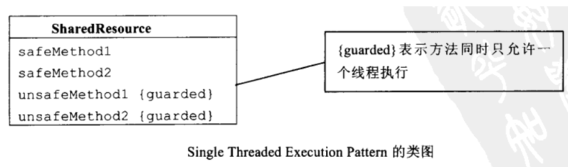
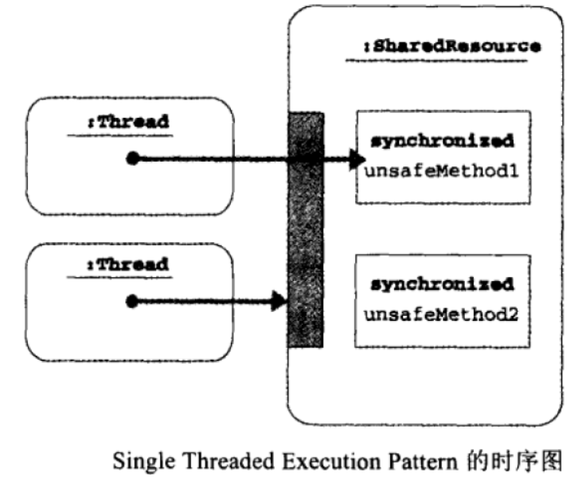

# Java多线程基础（三）——Single Threaded Execution模式

## 一、定义

Single Threaded Execution 是指“以1个线程执行”的意思，有时也称为Critical Section（临界区）。

## 二、模式案例

*案例：*
假设有三个人，频繁地通过一扇门，规定每次只能通过一个人，当通过一个人时，程序会将通过的总人次加1，同时记录该次通过人的姓名和出生地。

*门的定义：*

```java
public class Gate {
    private int counter = 0;
    private String name = "Nobody";
    private String address = "Nowhere";
    
    public void pass(String name, String address) {
        this.counter++;
        this.name = name;
        this.address = address;
        check();
    }
    private void check() {
        if (name.charAt(0) != address.charAt(0)) {
            System.out.println("***** BROKEN ***** " + toString());
        }
    }
    public String toString() {
        return "No." + counter + ": " + name + ", " + address;
    }
}
```

*人的定义：*

```
public class UserThread extends Thread {
    private final Gate gate;
    private final String myname;
    private final String myaddress;
    public UserThread(Gate gate, String myname, String myaddress) {
        this.gate = gate;
        this.myname = myname;
        this.myaddress = myaddress;
    }
    public void run() {
        System.out.println(myname + " BEGIN");
        while (true) {
            gate.pass(myname, myaddress);
        }
    }
}
```

*执行：*

```java
public class Main {
    public static void main(String[] args) {
        System.out.println("Testing Gate, hit CTRL+C to exit.");
        Gate gate = new Gate();
        new UserThread(gate, "Alice", "Alaska").start();
        new UserThread(gate, "Bobby", "Brazil").start();
        new UserThread(gate, "Chris", "Canada").start();
    }
}
```

*结果：*

```
Testing Gate, hit CTRL+C to exit.
Alice BEGIN
Bobby BEGIN
Chris BEGIN
***** BROKEN ***** No.3: Chris, Alaska
***** BROKEN ***** No.3: Chris, Alaska
***** BROKEN ***** No.3: Chris, Alaska
***** BROKEN ***** No.6: Alice, Canada
***** BROKEN ***** No.6: Alice, Canada
***** BROKEN ***** No.6: Alice, Canada
***** BROKEN ***** No.9: Bobby, Brazil
***** BROKEN ***** No.10: Bobby, Alaska
```


*分析：*
可以看到，上述Gate类并非线程安全的，因为pass方法会被多个线程同时调用，且该方法中会修改Gate类字段的值。

*优化：*

```java
//将Gate类变为线程安全的类：
public class Gate {
    private int counter = 0;
    private String name = "Nobody";
    private String address = "Nowhere";
     
    public synchronized void pass(String name, String address) {
        this.counter++;
        this.name = name;
        this.address = address;
        check();
    }
    public synchronized String toString() {
        return "No." + counter + ": " + name + ", " + address;
    }
    private void check() {
        if (name.charAt(0) != address.charAt(0)) {
            System.out.println("***** BROKEN ***** " + toString());
        }
    }
}
```


## 三、模式讲解

**角色：**
Single Threaded Execution 模式的角色如下：

- SharedResource(共享资源)参与者

SharedResource就是多线线程会同时访问的资源类，该类通常具有2类方法：

```
①SafeMethod——从多个线程同时调用也不会发生问题的方法
②UnsafeMethod——从多个线程同时调用会发生问题，这类方法需要加以防护，指定只能由单线程访问区域，即临界区（critical section）。
```


  


