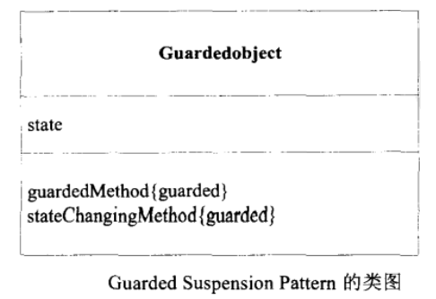

# Java多线程基础（五）——Guarded Suspension模式

## 一、定义

guarded是“被保护着的”、“被防卫着的”意思，suspension则是“暂停”的意思。当现在并不适合马上执行某个操作时，就要求想要执行该操作的线程等待，这就是Guarded Suspension Pattern。
Guarded Suspension Pattern 会要求线程等候，以保障实例的安全性，其它类似的称呼还有guarded wait、spin lock等。

## 二、模式案例

下面的案例是一种简单的消息处理模型，客户端线程发起请求，有请求队列缓存请求，然后发送给服务端线程进行处理。

*Request类：*

```java
//request类表示请求
public class Request {
    private final String name;
    public Request(String name) {
        this.name = name;
    }
    public String getName() {
        return name;
    }
    public String toString() {
        return "[ Request " + name + " ]";
    }
}
```

*客户端线程类：*

```java
//客户端线程不断生成请求，插入请求队列
public class ClientThread extends Thread {
    private Random random;
    private RequestQueue requestQueue;
    public ClientThread(RequestQueue requestQueue, String name, long seed) {
        super(name);
        this.requestQueue = requestQueue;
        this.random = new Random(seed);
    }
    public void run() {
        for (int i = 0; i < 10000; i++) {
            Request request = new Request("No." + i);
            System.out.println(Thread.currentThread().getName() + " requests " + request);
            requestQueue.putRequest(request);
            try {
                Thread.sleep(random.nextInt(1000));
            } catch (InterruptedException e) {
            }
        }
    }
}
```

*服务端线程类：*

```java
//客户端线程不断从请求队列中获取请求，然后处理请求
public class ServerThread extends Thread {
    private Random random;
    private RequestQueue requestQueue;
    public ServerThread(RequestQueue requestQueue, String name, long seed) {
        super(name);
        this.requestQueue = requestQueue;
        this.random = new Random(seed);
    }
    public void run() {
        for (int i = 0; i < 10000; i++) {
            Request request = requestQueue.getRequest();
            System.out.println(Thread.currentThread().getName() + " handles  " + request);
            try {
                Thread.sleep(random.nextInt(1000));
            } catch (InterruptedException e) {
            }
        }
    }
}
```

*请求队列类：*

```java
public class RequestQueue {
    private final LinkedList<Request> queue = new LinkedList<Request>();
    public synchronized Request getRequest() {
        while (queue.size() <= 0) {
            try {                                   
                wait();
            } catch (InterruptedException e) {      
            }                                       
        }                                           
        return (Request)queue.removeFirst();
    }
    public synchronized void putRequest(Request request) {
        queue.addLast(request);
        notifyAll();
    }
}
```

*注：getRequest方法中有一个判断 `while (queue.size() <= 0)` ，该判断称为Guarded Suspension Pattern 的警戒条件（guard condition）。*

*执行：*

```java
public class Main {
    public static void main(String[] args) {
        RequestQueue requestQueue = new RequestQueue();
        new ClientThread(requestQueue, "Alice", 3141592L).start();
        new ServerThread(requestQueue, "Bobby", 6535897L).start();
    }
}
```

## 三、模式讲解

*角色：*
Guarded Suspension Pattern 的角色如下：

- GuardedObject (被防卫的对象)参与者

GuardedObject 参与者是一个拥有被防卫的方法（guardedMethod）的类。当线程执行guardedMethod时，只要满足警戒条件，就能继续执行，否则线程会进入wait set区等待。警戒条件是否成立随着GuardedObject的状态而变化。
GuardedObject 参与者除了guardedMethod外，可能还有用来更改实例状态的的方法stateChangingMethod。

在Java语言中，是使用while语句和wait方法来实现guardedMethod的；使用notify/notifyAll方法实现stateChangingMethod。如案例中的RequestQueue 类。

*注意：Guarded Suspension Pattern 需要使用while，这样可以使从wait set被唤醒的线程在继续向下执行前检查Guard条件。如果改用if，当多个线程被唤醒时，由于wait是继续向下执行的，可能会出现问题。*

