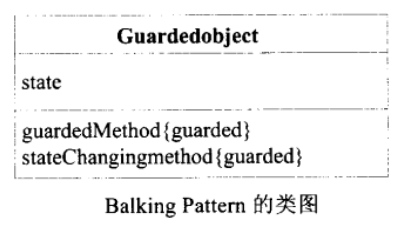

# Java多线程基础（六）——Balking模式


## 一、定义

Balking是“退缩不前”的意思。Balking Pattern和Guarded Suspension Pattern 一样需要警戒条件。在Balking Pattern中，当警戒条件不成立时，会马上中断，而Guarded Suspension Pattern 则是等待到可以执行时再去执行。

## 二、模式案例

该案例会保存数据的属性，之前所保存的属性都会被覆盖。如果当前数据的属性与上次保存的属性并无不同，就不执行保存。

*Data定义：*

```java
public class Data {
    private String filename;     // 文件名
    private String content;      // 数据内容
    private boolean changed;     // 标识数据是否已修改
    public Data(String filename, String content) {
        this.filename = filename;
        this.content = content;
        this.changed = true;
    }
    // 修改数据
    public synchronized void change(String newContent) {
        content = newContent;
        changed = true;
    }
    // 若数据有修改，则保存，否则直接返回
    public synchronized void save() throws IOException {
        if (!changed) {
            System.out.println(Thread.currentThread().getName() + " balks");
            return;
        }
        doSave();
        changed = false;
    }
    private void doSave() throws IOException {
        System.out.println(Thread.currentThread().getName() + " calls doSave, content = " + content);
        Writer writer = new FileWriter(filename);
        writer.write(content);
        writer.close();
    }
}
```

*修改线程定义：*

```java
//修改线程模仿“一边修改文章，一边保存”
public class ChangerThread extends Thread {
    private Data data;
    private Random random = new Random();
    public ChangerThread(String name, Data data) {
        super(name);
        this.data = data;
    }
    public void run() {
        try {
            for (int i = 0; true; i++) {
                data.change("No." + i);
                Thread.sleep(random.nextInt(1000));
                data.save();
            }
        } catch (IOException e) {
            e.printStackTrace();
        } catch (InterruptedException e) {
            e.printStackTrace();
        }
    }
}
```

*存储线程定义：*

```java
//存储线程每个1s，会对数据进行一次保存，就像文本处理软件的“自动保存”一样。
public class SaverThread extends Thread {
    private Data data;
    public SaverThread(String name, Data data) {
        super(name);
        this.data = data;
    }
    public void run() {
        try {
            while (true) {
                data.save(); // 存储资料
                Thread.sleep(1000); // 休息约1秒
            }
        } catch (IOException e) {
            e.printStackTrace();
        } catch (InterruptedException e) {
            e.printStackTrace();
        }
    }
}
```

*执行：*

```java
public class Main {
    public static void main(String[] args) {
        Data data = new Data("data.txt", "(empty)");
        new ChangerThread("ChangerThread", data).start();
        new SaverThread("SaverThread", data).start();
    }
}
```


## 三、模式讲解

Balking 模式的角色如下：

- GuardedObject(被警戒的对象)参与者

GuardedObject参与者是一个拥有被警戒的方法(guardedMethod)的类。当线程执行guardedMethod时，只有满足警戒条件时，才会继续执行，否则会立即返回。警戒条件的成立与否，会随着GuardedObject参与者的状态而变化。

*注：上述示例中，Data类就是GuardedObject(被警戒的对象)参与者，save方法是guardedMethod，change方法是stateChangingMethod。*




