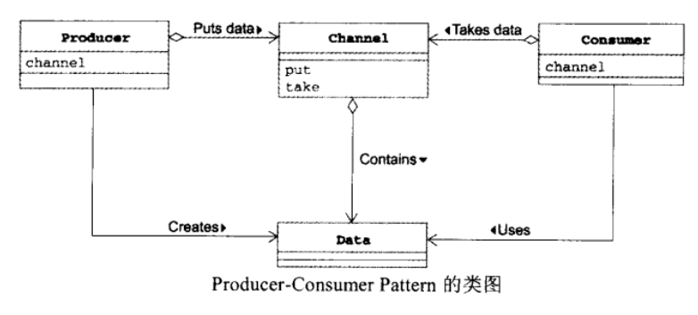

# Java多线程基础（七）——Producer-Consumer模式

## 一、定义

Producer-Consumer Pattern就是生产者-消费者模式。
生产者和消费者在为不同的处理线程，生产者必须将数据安全地交给消费者，消费者进行消费时，如果生产者还没有建立数据，则消费者需要等待。
一般来说，可能存在多个生产者和消费者，不过也有可能生产者和消费者都只有一个，当双方都只有一个时，我们也称之为*Pipe Pattern*。

## 二、模式案例

该案例中，定义了3个角色：厨师、客人、桌子。

*厨师（生产者）定义：*

```java
public class MakerThread extends Thread {
    private final Random random;
    private final Table table;
    private static int id = 0;     //蛋糕的流水号(所有厨师共通)
    public MakerThread(String name, Table table, long seed) {
        super(name);
        this.table = table;
        this.random = new Random(seed);
    }
    public void run() {
        try {
            while (true) {
                Thread.sleep(random.nextInt(1000));
                String cake = "[ Cake No." + nextId() + " by " + getName() + " ]";
                table.put(cake);
            }
        } catch (InterruptedException e) {
        }
    }
    private static synchronized int nextId() {
        return id++;
    }
}
```

*客人（消费者）定义：*

```java
public class EaterThread extends Thread {
    private final Random random;
    private final Table table;
    public EaterThread(String name, Table table, long seed) {
        super(name);
        this.table = table;
        this.random = new Random(seed);
    }
    public void run() {
        try {
            while (true) {
                String cake = table.take();
                Thread.sleep(random.nextInt(1000));
            }
        } catch (InterruptedException e) {
        }
    }
}
```

*桌子（队列）定义：*

```java
public class Table {
    private final String[] buffer;
    private int tail;
    private int head;
    private int count;
 
    public Table(int count) {
        this.buffer = new String[count];
        this.head = 0;
        this.tail = 0;
        this.count = 0;
    }
    public synchronized void put(String cake) throws InterruptedException {
        System.out.println(Thread.currentThread().getName() + " puts " + cake);
        while (count >= buffer.length) {
            wait();
        }
        buffer[tail] = cake;
        tail = (tail + 1) % buffer.length;
        count++;
        notifyAll();
    }
    public synchronized String take() throws InterruptedException {
        while (count <= 0) {
            wait();
        }
        String cake = buffer[head];
        head = (head + 1) % buffer.length;
        count--;
        notifyAll();
        System.out.println(Thread.currentThread().getName() + " takes " + cake);
        return cake;
    }
}
```

*执行：*

```java
public class Main {
    public static void main(String[] args) {
        Table table = new Table(3);
        new MakerThread("MakerThread-1", table, 31415).start();
        new MakerThread("MakerThread-2", table, 92653).start();
        new MakerThread("MakerThread-3", table, 58979).start();
        new EaterThread("EaterThread-1", table, 32384).start();
        new EaterThread("EaterThread-2", table, 62643).start();
        new EaterThread("EaterThread-3", table, 38327).start();
    }
}
```

## 三、模式讲解

Producer-Consumer模式的角色如下：

- Data(数据)参与者

Data代表了实际生产或消费的数据。

- Producer(生产者)参与者

Producer会创建Data，然后传递给Channel参与者。

- Consumer(消费者)参与者

Consumer从Channel参与者获取Data数据，进行处理。

- Channel(通道)参与者

Channel从Producer参与者处接受Data参与者，并保管起来，并应Consumer参与者的要求，将Data参与者传送出去。为确保安全性，Producer参与者与Consumer参与者要对访问共享互斥。

