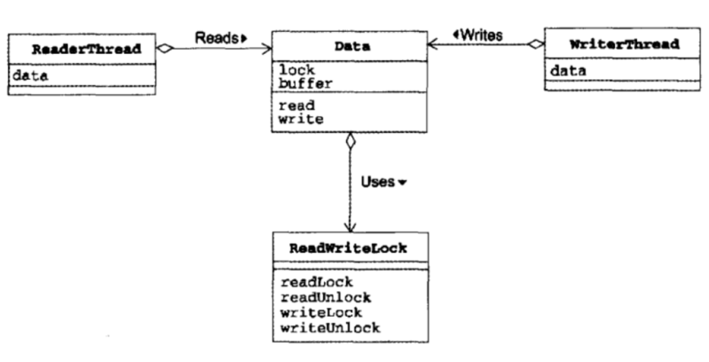
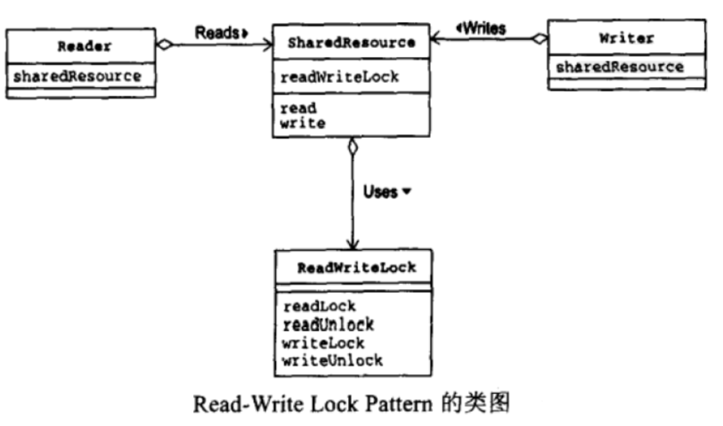
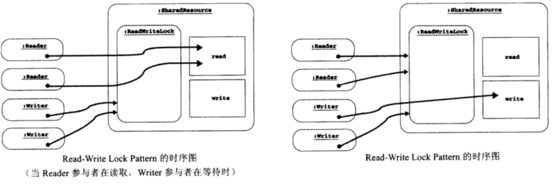

# Java多线程基础（八）——Read-Write Lock模式

## 一、定义

Read-Write Lock Pattern将读取与写入分开处理，在读取数据之前必须获取用来读取的锁定，而写入的时候必须获取用来写入的锁定。因为读取时实例的状态不会改变，所以多个线程可以同时读取；但是，写入会改变实例的状态，所以当有一个线程写入的时候，其它线程既不能读取与不能写入。

## 二、模式案例



*Data类：*
数据类可以被多个线程同时访问。

```java
public class Data {
    private final char[] buffer;
    private final ReadWriteLock lock = new ReadWriteLock();
    public Data(int size) {
        this.buffer = new char[size];
        for (int i = 0; i < buffer.length; i++) {
            buffer[i] = '*';
        }
    }
    public char[] read() throws InterruptedException {
        lock.readLock();
        try {
            return doRead();
        } finally {
            lock.readUnlock();
        }
    }
    public void write(char c) throws InterruptedException {
        lock.writeLock();
        try {
            doWrite(c);
        } finally {
            lock.writeUnlock();
        }
    }
    private char[] doRead() {
        char[] newbuf = new char[buffer.length];
        for (int i = 0; i < buffer.length; i++) {
            newbuf[i] = buffer[i];
        }
        slowly();
        return newbuf;
    }
    private void doWrite(char c) {
        for (int i = 0; i < buffer.length; i++) {
            buffer[i] = c;
            slowly();
        }
    }
    private void slowly() {
        try {
            Thread.sleep(50);
        } catch (InterruptedException e) {
        }
    }
}
```


*WriterThread类：*

```java
public class WriterThread extends Thread {
    private static final Random random = new Random();
    private final Data data;
    private final String filler;
    private int index = 0;
    public WriterThread(Data data, String filler) {
        this.data = data;
        this.filler = filler;
    }
    public void run() {
        try {
            while (true) {
                char c = nextchar();
                data.write(c);
                Thread.sleep(random.nextInt(3000));
            }
        } catch (InterruptedException e) {
        }
    }
    private char nextchar() {
        char c = filler.charAt(index);
        index++;
        if (index >= filler.length()) {
            index = 0;
        }
        return c;
    }
}
```

*ReaderThread类：*

```java
public class ReaderThread extends Thread {
    private final Data data;
    public ReaderThread(Data data) {
        this.data = data;
    }
    public void run() {
        try {
            while (true) {
                char[] readbuf = data.read();
                System.out.println(Thread.currentThread().getName() + " reads " + String.valueOf(readbuf));
            }
        } catch (InterruptedException e) {
        }
    }
}
```

*ReadWriteLock类：*
读写锁需要防止以下两类冲突：

- “读取”和“写入”的冲突（read-write conflict）
- “写入”和“写入”的冲突（write-write conflict）
- 注意：“读取”和“读取”之间不会冲突


```java
public final class ReadWriteLock {
    private int readingReaders = 0;        //正在读取线程的数量 
    private int writingWriters = 0;     //正在写入线程的数量
    public synchronized void readLock() throws InterruptedException {
        while (writingWriters > 0 ) {
            wait();
        }
        readingReaders++;                      
    }
    public synchronized void readUnlock() {
        readingReaders--;   
        notifyAll();
    }
    public synchronized void writeLock() throws InterruptedException {
        while (readingReaders > 0 || writingWriters > 0) {
            wait();
        }
        writingWriters++;                       
    }
    public synchronized void writeUnlock() {
        writingWriters--;     
        notifyAll();
    }
}
```

*执行：*

```java
public class Main {
    public static void main(String[] args) {
        Data data = new Data(10);
        new ReaderThread(data).start();
        new ReaderThread(data).start();
        new ReaderThread(data).start();
        new ReaderThread(data).start();
        new ReaderThread(data).start();
        new ReaderThread(data).start();
        new WriterThread(data, "ABCDEFGHIJKLMNOPQRSTUVWXYZ").start();
        new WriterThread(data, "abcdefghijklmnopqrstuvwxyz").start();
    }
}
```

## 三、模式讲解

Read-Write Lock模式的角色如下：

- Reader(读取者)参与者

Reader参与者会对SharedResource进行读。

- Writer(写入者)参与者

Writer参与者会对SharedResource进行写。

- SharedResource(共享资源)参与者

SharedResource代表Reader和Writer所共享的资源对象，SharedResource提供不改变内部状态的read操作，以及会改变内部状态的write操作。

- ReadWriteLock(读写锁)参与者

ReadWriteLock提供了对SharedResource参与者进行read操作和write操作时需要的锁定。






