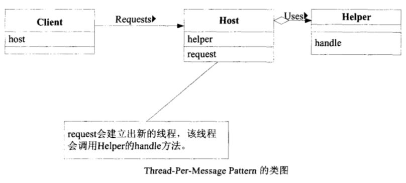

# Java多线程基础（九）——Thread-Per-Message模式

## 一、定义

Thread-Per-Message模式是指每个message一个线程，message可以理解成“消息”、“命令”或者“请求”。每一个message都会分配一个线程，由这个线程执行工作，使用Thread-Per-Message Pattern时，“委托消息的一端”与“执行消息的一端”回会是不同的线程。

## 二、模式案例

该案例中，由Host分发请求，每一个请求分发一个新的线程进行处理。

*Host类定义：*

```java
public class Host {
    private final Helper helper = new Helper();
    public void request(final int count, final char c) {
        System.out.println("    request(" + count + ", " + c + ") BEGIN");
        new Thread() {
            public void run() {
                helper.handle(count, c);
            }
        }.start();
        System.out.println("    request(" + count + ", " + c + ") END");
    }
}
```

*Helper类定义：*

```java
public class Helper {
    public void handle(int count, char c) {
        System.out.println("        handle(" + count + ", " + c + ") BEGIN");
        for (int i = 0; i < count; i++) {
            slowly();
            System.out.print(c);
        }
        System.out.println("");
        System.out.println("        handle(" + count + ", " + c + ") END");
    }
    private void slowly() {
        try {
            Thread.sleep(100);
        } catch (InterruptedException e) {
        }
    }
}
```

*执行：*

```java
public class Main {
    public static void main(String[] args) {
        System.out.println("main BEGIN");
        Host host = new Host();
        host.request(10, 'A');
        host.request(20, 'B');
        host.request(30, 'C');
        System.out.println("main END");
    }
}
```

## 三、模式讲解

Thread-Per-Message模式的角色如下：

- Client(委托人)参与者

Client参与者会对Host参与者送出请求(Request)。上述案例中，Client参与者就是Main类。

- Host参与者

Host参与者接受来自Client的请求，然后建立新的线程处理它。

- Helper(帮助者)参与者

Helper实际处理请求的。

