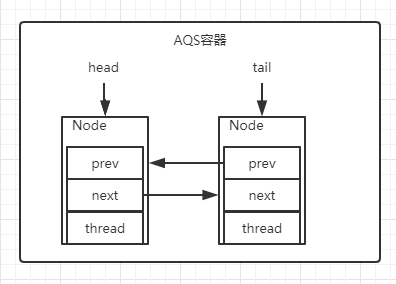
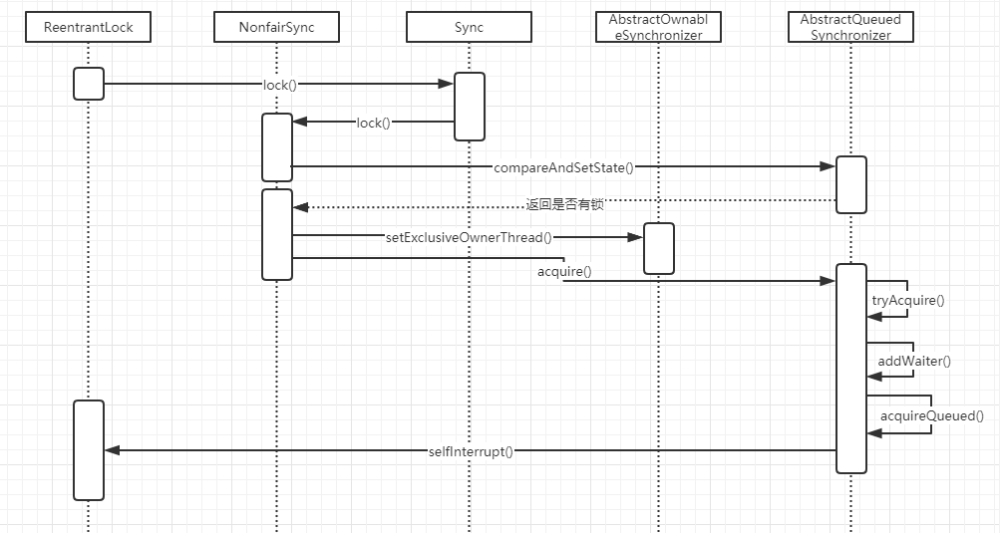

# AQS


## AQS内部实现


AQS 内部维护了一个FIFO的双向链表。




```java
static final class Node {
    static final Node SHARED = new Node();
    static final Node EXCLUSIVE = null;
    static final int CANCELLED =  1;
    static final int SIGNAL    = -1;
    static final int CONDITION = -2;
    static final int PROPAGATE = -3;
    volatile int waitStatus;
    volatile Node prev;//前置节点
    volatile Node next;//后继节点
    volatile Thread thread;//当前线程
    Node nextWaiter;//存储在condition队列中的后继节点
	//是否为共享锁
    final boolean isShared() {
        return nextWaiter == SHARED;
    }
    final Node predecessor() throws NullPointerException {
        Node p = prev;
        if (p == null)
            throw new NullPointerException();
        else
            return p;
    }
    Node() {}
    // 将线程构造成一个Node，添加到等待队列
    Node(Thread thread, Node mode) {
        this.nextWaiter = mode;
        this.thread = thread;
    }
    // 这个方法会在Condition队列中使用
    Node(Thread thread, int waitStatus) {
        this.waitStatus = waitStatus;
        this.thread = thread;
    }
}
```


# ReentrantLock 源码分析


ReentrantLock 加锁时序图




## ReentrantLock.lock()

```java
public void lock() {
    sync.lock();
}
```

`sync` 实际上是一个抽象的静态内部类，它继承了AQS来实现重入锁的逻辑。

`Sync`有两个具体的实现类，分别是：
`NofairSync`：表示可以存在抢占锁的功能，也就是说不管当前队列上是否存在其他线程等待，新线程都有机会抢占锁
`FailSync`: 表示所有线程严格按照 FIFO 来获取锁

## NofairSync.lock()

```java
static final class NonfairSync extends Sync {
    final void lock() {
        // CAS 判断是否有锁
        if (compareAndSetState(0, 1))
            // 设置当前线程为独占锁
            setExclusiveOwnerThread(Thread.currentThread());
        else
            // 竞争锁逻辑
            acquire(1);
    }
}
```


### AQS.compareAndSetState()

```java
protected final boolean compareAndSetState(int expect, int update) {
    // 判断state是否与预期值expect相等
	// 相等则更新为update，返回true
    // 否则返回false
    return unsafe.compareAndSwapInt(this, stateOffset, expect, update);
}
```

`state` 是AQS中的一个属性，对于重入锁的实现来说，表示一个同步状态。

1. 当state=0时，表示无锁状态
2. 当state>0时，表示已经有线程获得了锁，也就是state=1，要是有重入锁，那state会递增。同样释放锁的时候，要state=0时，其它线程才有资格获得锁。


### AQS.accquire()

```java
public final void acquire(int arg) {
    if (!tryAcquire(arg) &&
        acquireQueued(addWaiter(Node.EXCLUSIVE), arg))
        selfInterrupt();
}
```


这个方法的主要逻辑是
1. 通过`tryAcquire`尝试获取独占锁，如果成功返回 true，失败返回 false
2. 如果`tryAcquire `失败，则会通过`addWaiter `方法将当前线程封装成 Node 添加到 AQS 队列尾部
3. `acquireQueued`，将 Node 作为参数，通过自旋去尝试获取锁。


#### NonfairSync.tryAcquire()

```java
protected final boolean tryAcquire(int acquires) {
    //尝试获取锁，如果成功返回 true，不成功返回 false
    return nonfairTryAcquire(acquires);
}
```


##### ReentrantLock.nonfairTryAcquire()

```java
final boolean nonfairTryAcquire(int acquires) {
    // 获取当前线程
    final Thread current = Thread.currentThread();
    int c = getState();// 获取state值
    if (c == 0) { // 无锁状态
        if (compareAndSetState(0, acquires)) {
            // 设置当前线程为独占锁
            setExclusiveOwnerThread(current);
            return true;
        }
    }
    // 如果同一个线程来获得锁，直接增加重入次数
    else if (current == getExclusiveOwnerThread()) {
        int nextc = c + acquires;
        if (nextc < 0) // overflow
            throw new Error("Maximum lock count exceeded");
        setState(nextc);
        return true;
    }
    return false;
}
```

代码逻辑：

1. 获取当前线程，判断当前的锁的状态
2. 如果 state=0 表示当前是无锁状态，通过 cas 更新 state 状态的值
3. 当前线程是属于重入，则增加重入次数

#### AQS.addWaiter()

```java
private Node addWaiter(Node mode) {
    // 封装成Node
    Node node = new Node(Thread.currentThread(), mode);
    // 设置pred = tail 默认为null
    Node pred = tail;
    // 这一段是优化，减少enq()自选操作
    if (pred != null) { // tail 不为空，说明队列中存在节点
        node.prev = pred; // 把当前线程的Node的prev指向tail
        //通过cas把node加入到AQS队列
        if (compareAndSetTail(pred, node)) {
            // 设置成功后，把原tail节点的next指向当前node
            pred.next = node;
            return node;
        }
    }
    // 自旋加入到队列中
    enq(node);
    return node;
}
```


当`tryAcquire `方法获取锁失败以后，则会先调用`addWaiter `将当前线程封装成`Node`
入参 `mode` 表示当前节点的状态，传递的参数是`Node.EXCLUSIVE`，表示独占状
态。意味着重入锁用到了 AQS 的独占锁功能

1. 将当前线程封装成`Node`
2. 当前链表中的`tail `节点是否为空，如果不为空，则通过 cas 操作把当前线程的`node `添加到 AQS 队列
3. 如果为空或者 cas 失败，调用`enq()`将节点添加到 AQS 队列

##### AQS.enq()

```java
//通过自旋操作把当前节点加入到队列中
private Node enq(final Node node) {
    for (;;) {
        Node t = tail;
        if (t == null) { // Must initialize
            if (compareAndSetHead(new Node()))
                tail = head;
        } else {
            node.prev = t;
            if (compareAndSetTail(t, node)) {
                t.next = node;
                return t;
            }
        }
    }
}
```


#### AQS.acquireQueued()

```java
final boolean acquireQueued(final Node node, int arg) {
    boolean failed = true;
    try {
        boolean interrupted = false;
        for (;;) {
            // 获取当前节点的prev节点
            final Node p = node.predecessor();
            // 如果是head节点，说明有资格去争抢锁
            if (p == head && tryAcquire(arg)) {
                //获得锁成功，设置头节点为当前node
                setHead(node);
                //原头结点从链表中移除
                p.next = null; // help GC
                failed = false;
                return interrupted;
            }
            //tryAcquire(arg)返回false，说明获得锁失败
            if (shouldParkAfterFailedAcquire(p, node) &&
                parkAndCheckInterrupt())
                interrupted = true;
        }
    } finally {
        if (failed)
            cancelAcquire(node);
    }
}
```

通过`addWaiter`方法把线程添加到链表后，会接着把 Node 作为参数传递给`acquireQueued`方法，去竞争锁
1. 获取当前节点的`prev`节点
2. 如果`prev`节点为`head`节点，那么它就有资格去争抢锁，调用`tryAcquire`抢占锁
3. 抢占锁成功以后，把获得锁的节点设置为 `head`，并且移除原来的初始化`head`节点
4. 如果获得锁失败，则根据`waitStatus`决定是否需要挂起线程
5. 最后，通过`cancelAcquire`取消获得锁的操作


##### AQS.shouldParkAfterFailedAcquire()

```java
private static boolean shouldParkAfterFailedAcquire(Node pred, Node node) {
    // 前置节点的waitStatus
    int ws = pred.waitStatus;
    // 如果前置节点为SIGNAL,意味着只需要等待其它前置节点的线程被释放
    if (ws == Node.SIGNAL)
		// 可以直接挂起线程
        return true;
    // 意味着prev节点取消了排队，直接移除这个节点
    if (ws > 0) {
        do {
            node.prev = pred = pred.prev;
        } while (pred.waitStatus > 0);
        pred.next = node;
    } else {
        // 利用cas设置prev节点的状态为SIGNAL
        compareAndSetWaitStatus(pred, ws, Node.SIGNAL);
    }
    return false;
}

private static final boolean compareAndSetWaitStatus(Node node, int expect, int update) {
    return unsafe.compareAndSwapInt(node, waitStatusOffset, expect, update);
}
```


如果 ThreadA 的锁还没有释放的情况下，ThreadB 和 ThreadC 来争抢锁肯定是会
失败，那么失败以后会调用`shouldParkAfterFailedAcquire `方法，返回 false 时，也就是不需要挂起，返回 true，则需要调用 `parkAndCheckInterrupt`挂起当前线程。

变量waitStatus则表示当前Node结点的等待状态。

Node 有 5 中状态，分别是：CANCELLED(1)、SIGNAL(-1)、CONDITION(-2)、 PROPAGATE(-3)、默认状态(0)

- `CANCELLED`: 在同步队列中等待的线程等待超时或被中断，需要从同步队列中取消该`Node`的结点, 其结点的`waitStatus`为`CANCELLED`，即结束状态，进入该状态后的结点将不会再变化
- `SIGNA`: 只要前置节点释放锁，就会通知标识为 SIGNAL 状态的后续节点的线程`CONDITION`： 和`Condition `有关系
- `PROPAGATE`：共享模式下，`PROPAGATE`状态的线程处于可运行状态

- 默认:初始状态


##### AQS.parkAndCheckInterrupt()


```java
private final boolean parkAndCheckInterrupt() {
    LockSupport.park(this);
    return Thread.interrupted();
}
```


使用 LockSupport.park 挂起当前线程编程 WATING 状态

`Thread.interrupted`，返回当前线程是否被其他线程触发过中断请求，也就是
`thread.interrupt()`; 如果有触发过中断请求，那么这个方法会返回当前的中断标识true，并且对中断标识进行复位标识已经响应过了中断请求。如果返回 true，意味着在`acquire`方法中会执行 `selfInterrupt()`。


##### AQS.selfInterrupt()

```java
static void selfInterrupt() {
    Thread.currentThread().interrupt();
}
```

标识如果当前线程在`acquireQueued`中被中断过，则需要产生一个中断请求，原因是线程在调用 `acquireQueued`方法的时候是不会响应中断请求的。


## ReentrantLock.unlock()

```java
public void unlock() {
    sync.release(1);
}
```


## NofairSync.release()

```java
public final boolean release(int arg) {
	// 释放锁成功
    if (tryRelease(arg)) {
        // 得到AQS中head节点
        Node h = head;
        if (h != null && h.waitStatus != 0)
            // 唤醒后续节点
            unparkSuccessor(h);
        return true;
    }
    return false;
}
```


### ReentrantLock.tryRelease()

```java
protected final boolean tryRelease(int releases) {
    int c = getState() - releases;
    if (Thread.currentThread() != getExclusiveOwnerThread())
        throw new IllegalMonitorStateException();
    boolean free = false;
    if (c == 0) {
        free = true;
        setExclusiveOwnerThread(null);
    }
    setState(c);
    return free;
}
```


这个方法可以认为是一个设置锁状态的操作，通过将`state`状态减掉传入的参数值
（参数是 1），如果结果状态为 0，就将排它锁的 Owner 设置为 null，以使得其它的线程有机会进行执行。
在排它锁中，加锁的时候状态会增加 1（当然可以自己修改这个值），在解锁的时
候减掉 1，同一个锁，在可以重入后，可能会被叠加为 2、3、4 这些值，只有 unlock()的次数与 lock()的次数对应才会将 Owner 线程设置为空，而且也只有这种情况下才会返回 true。


### AQS.unparkSuccessor()

```java
private void unparkSuccessor(Node node) {
    // 获得head节点的状态
    int ws = node.waitStatus;
    if (ws < 0)
        // 设置head节点状态为0
        compareAndSetWaitStatus(node, ws, 0);
	// 获得head下一个节点
    Node s = node.next;
    if (s == null || s.waitStatus > 0) {
        //如果下一个节点为 null 或者 status>0 表示 cancelled 状态.
        //通过从尾部节点开始扫描，找到距离 head 最近的一个waitStatus<=0 的节点
        s = null;
        for (Node t = tail; t != null && t != node; t = t.prev)
            if (t.waitStatus <= 0)
                s = t;
    }
    //next 节点不为空，直接唤醒这个线程即可
    if (s != null)
        LockSupport.unpark(s.thread);
}
```


