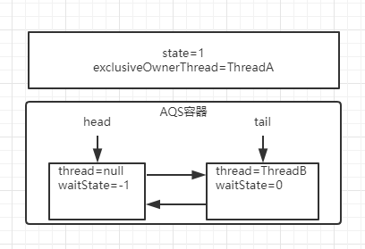
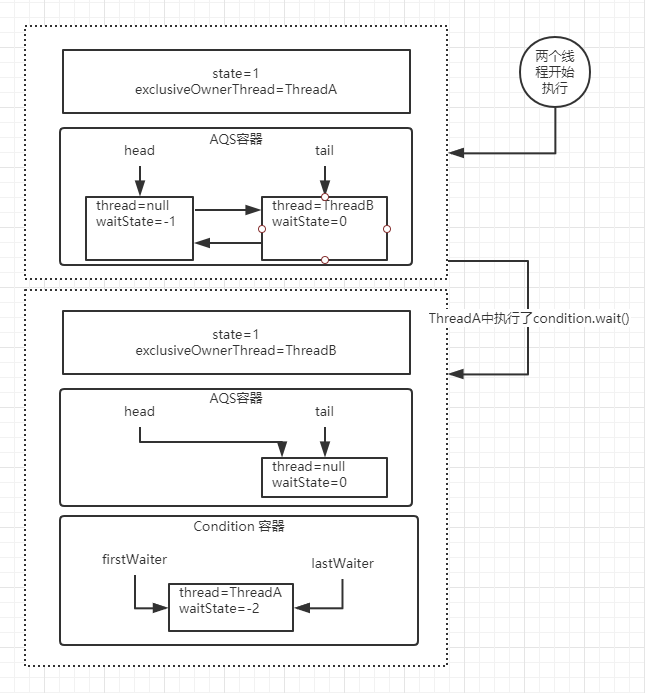
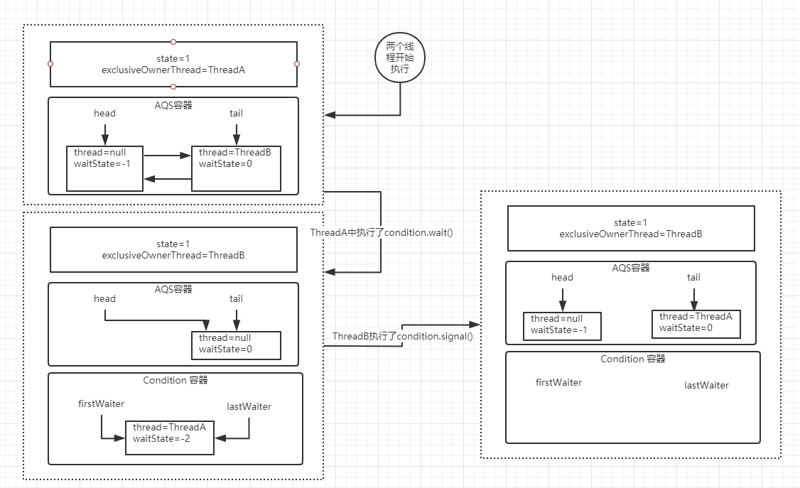
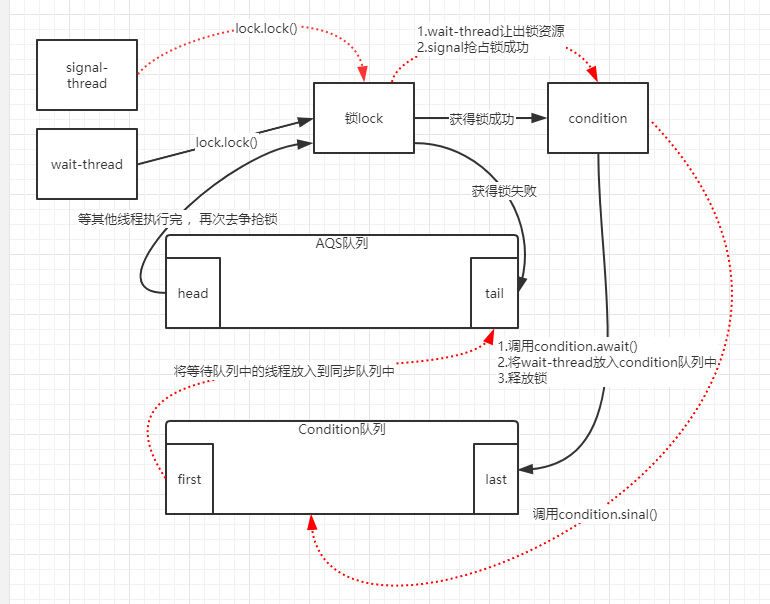

# Condition 

## 基本使用

Condition 是一个多线程协调通信的工具类，可以让某些线程一起等待某个条件，只有满足条件时，线程才会被唤醒（等同于synchronized 中的wait/notify）

**ConditionWait** 

```java
public class ConditionWait extends Thread{

    private Lock lock;

    private Condition condition;

    public ConditionWait(Lock lock, Condition condition) {
        this.lock = lock;
        this.condition = condition;
    }

    @Override
    public void run() {
        try {
            lock.lock();
            System.out.println("ConditionWait  start");
            condition.await();
            System.out.println("ConditionWait  end");
        } catch (InterruptedException e) {
            e.printStackTrace();
        } finally {
            lock.unlock();
        }
    }
}
```


**ConditionSignal** 

```java
public class ConditionSignal extends Thread{
    private Lock lock;
    private Condition condition;
    public ConditionSignal(Lock lock, Condition condition) {
        this.lock = lock;
        this.condition = condition;
    }
    @Override
    public void run() {
        try {
            lock.lock();
            System.out.println("ConditionSignal  start");
            condition.signal();
            System.out.println("ConditionSignal  end");
        } catch (Exception e) {
            e.printStackTrace();
        } finally {
            lock.unlock();
        }
    }
}
```

**ConditionDemo** 

```java
public class ConditionDemo {
    static Lock lock = new ReentrantLock();
    static Condition condition = lock.newCondition();
    public static void main(String[] args) {
        new ConditionWait(lock, condition).start();
        new ConditionSignal(lock, condition).start();
    }
}
```


## 源码分析

AQS 是基于FIFO双向链表实现，Condition 是基于单链实现。


首先使用Condition，需要或得lock锁，所以意味着会存在一个AQS同步队列。

设想一下，假如有两个线程同时运行，那么AQS队列可能会是下面的情况

重入锁下：

state表示同步状态，0：无锁，>1：有锁

waitState: 表示当前node节点等待状态。




然后根据两个线程代码执行，threadA 调用了 `Condition.wait()` 会是当前线程（上图ThreadA）进入Condition队列并释放锁，AQS队列中下一节点去争抢锁（上图ThreadB）。当前线程会挂起等待被唤醒。





### Condition.await()

```java
public final void await() throws InterruptedException {
    if (Thread.interrupted())// 表示await允许被中断
        throw new InterruptedException();
    // 采用链表格式创建一个condition状态的节点
    Node node = addConditionWaiter();
    // 释放当前线程的锁，得到锁的状态，并唤醒AQS队列中的一个线程
    int savedState = fullyRelease(node);
    int interruptMode = 0;
    // 如果当前节点没有在同步队列上，即还没有被唤醒，则将当前线程阻塞
    while (!isOnSyncQueue(node)) {// 判断这个节点是否在AQS队列中，第一次判断为false，因为上面代码已经释放锁了
        LockSupport.park(this);// park 挂起线程
        if ((interruptMode = checkInterruptWhileWaiting(node)) != 0)
            break;
    }
    // 当这个线程被唤醒，会尝试争抢锁,acquireQueued()返回false表示拿到锁
    // interruptMode != THROW_IE 表示这个线程没有成功入队，但singal执行enq()让其入队了
    // 将这个变量设置成REINTERRUPT
    if (acquireQueued(node, savedState) && interruptMode != THROW_IE)
        interruptMode = REINTERRUPT;
    // 如果node下一节点是null，就不需要清理Cancelled状态的节点
    if (node.nextWaiter != null) // clean up if cancelled
        unlinkCancelledWaiters();
    // 如果线程被中断了,需要抛出异常.或者什么都不做
    if (interruptMode != 0)
        reportInterruptAfterWait(interruptMode);
}
```


#### AQS.addConditionWaiter()


```java
// 这里的链表是Condition同步队列，是单向链表
private Node addConditionWaiter() {
    Node t = lastWaiter;
    //如果lastWaiter不等于空并且waitStatus不等于CONDITION时，把冲好这个节点从链表中移除
    if (t != null && t.waitStatus != Node.CONDITION) {
        unlinkCancelledWaiters();
        t = lastWaiter;
    }
    // 构建一个Node节点
    Node node = new Node(Thread.currentThread(), Node.CONDITION);
    if (t == null)
        firstWaiter = node;
    else
        t.nextWaiter = node;
    lastWaiter = node;
    return node;
}
```


#### AQS.fullyRelease()

```java
final int fullyRelease(Node node) {
    boolean failed = true;
    try {
        // 获得重入次数
        int savedState = getState();
        if (release(savedState)) {//释放并唤醒下一个同步队列中断的线程
            failed = false;
            return savedState;
        } else {
            throw new IllegalMonitorStateException();
        }
    } finally {
        if (failed)
            node.waitStatus = Node.CANCELLED;
    }
}
```

fullRelease，就是彻底的释放锁，什么叫彻底呢，就是如果 当前锁存在多次重入，那么在这个方法中只需要释放一次就会把所有的重入次数归零。


#### AQS.isOnSyncQueue()

```java
final boolean isOnSyncQueue(Node node) {
    if (node.waitStatus == Node.CONDITION || node.prev == null)
        return false;
    if (node.next != null) // If has successor, it must be on queue
        return true;

    return findNodeFromTail(node);
}
```

判断当前线程是否在同步队列中，false表示不存在。

如果不存在AQS队列中，说明当前节点没有唤醒去争抢同步锁，所以需要把当前线程阻塞起来，直到其它的线程调用signal、signalAll 唤醒

如果存在AQS队列中，意味着它需要去竞争同步锁去获得执行程序执行权限


### Condition.signal()

`Condition.await()`方法会阻塞 ThreadA，然后 ThreadB 抢占到了锁获得了执行权限，这个时候在 ThreadB 中调用了`Condition.signal()`方法，将会唤醒在等待队列中节点





```java
public final void signal() {
    //先判断当前线程是否获得了锁，这个判断比较简单，
    //直接用获得锁的线程和当前线程相比即可
    if (!isHeldExclusively())
        throw new IllegalMonitorStateException();
    // 拿到 Condition队列上第一个节点
    Node first = firstWaiter;
    if (first != null)
        doSignal(first);
}
```


#### Condition.doSignal()

```java
private void doSignal(Node first) {
    do {
        // 从Condition队列中删除firstWaiter
        if ( (firstWaiter = first.nextWaiter) == null)
            lastWaiter = null;
        first.nextWaiter = null;
    } while (!transferForSignal(first) &&
             (first = firstWaiter) != null);
}
```


##### AQS.transferForSignal()

```java
final boolean transferForSignal(Node node) {
    //更新节点的状态为 0，如果更新失败，只有一种可能就是节点被 CANCELLED 了
    if (!compareAndSetWaitStatus(node, Node.CONDITION, 0))
        return false;
	//调用 enq，把当前节点添加到AQS 队列。
    //并且返回返回按当前节点的上一个节点，也就是原tail 节点
    Node p = enq(node);
    int ws = p.waitStatus;
    // 如果上一个节点的状态被取消了, 或者尝试设置上一个节点的状态为SIGNAL失败
    // SIGNAL表示: 他的next节点需要停止阻塞
    if (ws > 0 || !compareAndSetWaitStatus(p, ws, Node.SIGNAL))
        // 唤醒节点上的线程
        LockSupport.unpark(node.thread);
    return true;
}
```


该方法先是 CAS 修改了节点状态，如果成功，就将这个节点放到 AQS 队列中，然后唤醒这个节点上的线程。此时，那个节点就会在 await 方法中苏醒


## Condition 整个执行逻辑图解




# CountDownLatch

countdownlatch 是一个同步工具类，它允许一个或多个线程一直等待，直到其他线程的操作执行完毕再执行。从命名可以解读到 countdown 是倒数的意思，类似于我们倒计时的概念。

模拟投票场景：

```java
public static void main(String[] args) throws InterruptedException {
    int size = 10; //定义十个人投票
    CountDownLatch latch = new CountDownLatch(size); //定义10个容量计数器
    for (int i = 0; i < size; i++) {
        // 模拟投票
        new Thread(() -> {
            System.out.println(Thread.currentThread().getName() + "  投票...");
            latch.countDown(); //投完票计数器减一
        }).start();
    }
    latch.await();//等待计数器为0 才进行下面的任务
    System.out.println("所有人投票完毕，统计票数...");
}
```

CountDownLatch的api：

1. CountDownLatch.await() 使当前线程在锁存器倒计数至零之前一直等待，除非线程被中断或超出了指定的等待时间。
2. CountDownLatch.countDown() 递减锁存器的计数，如果计数到达零，则释放所有等待的线程。
3. CountDownLatch.getCount() 返回当前计数。
4. CountDownLatch.toString() 返回标识此锁存器及其状态的字符串。状态用括号括起来，包括字符串 "Count ="，后跟当前计数。


# Semaphore


从概念上讲，信号量维护了一个许可集。如有必要，在许可可用前会阻塞每一个 acquire()，然后再获取该许可。每个 release() 添加一个许可，从而可能释放一个正在阻塞的获取者。

实际业务场景运用：限流

简单模拟限流场景代码

```java
public class SemaphoreDemo {
    public void limit(Semaphore semaphore) {
        try {
            semaphore.acquire();// 获取信号量
            // 入参可以传入 HttpServletRequest
            System.out.println(Thread.currentThread().getName()+ " 处理请求");
            TimeUnit.SECONDS.sleep(2);
            semaphore.release();// 释放信号量
            System.out.println(Thread.currentThread().getName()+ " 处理完毕，释放请求");
        } catch (InterruptedException e) {
            e.printStackTrace();
        }
    }
    public static void main(String[] args) throws InterruptedException {
        // 创建一个容量2的公平的信号量
        Semaphore semaphore = new Semaphore(2, true);
        SemaphoreDemo semaphoreDemo = new SemaphoreDemo();
        //模拟并发请求
        for (int i = 0; i < 100; i++) {
            new Thread(()->{
                semaphoreDemo.limit(semaphore);
            }).start();
        }
    }
}
```


Semaphore的api：

1. Semaphore.acquire() 获取信号量
2. Semaphore.release() 释放信号量


# CyclicBarrier


它允许一组线程互相等待，直到到达某个公共屏障点 (common barrier point)。在涉及一组固定大小的线程的程序中，这些线程必须不时地互相等待，此时 CyclicBarrier 很有用。

简单来说，就是定义n个线程，当线程处理完，就会等待，直到所有线程处理完，才会进行下一步操作或者结束。

模拟开会场景

```java
public class CyclicBarrierDemo {

    Random random = new Random();
    public void meet(CyclicBarrier cyclicBarrier){
        try {
            TimeUnit.SECONDS.sleep(random.nextInt(5)); // 假设去会议室的时间
            System.out.println(Thread.currentThread().getName() + " 去会议室....");
            cyclicBarrier.await(); // 等待其他人开会
            System.out.println(Thread.currentThread().getName() + " 散会");
        } catch (Exception e) {
            e.printStackTrace();
        }
    }
    public static void main(String[] args) throws Exception {
        CyclicBarrierDemo d = new CyclicBarrierDemo();
        int size = 3; //定义队员数量
        //定义屏障数量，并达到数量之后完成对应的操作
        CyclicBarrier barrier = new CyclicBarrier(size, () -> {
            System.out.println("会议中....");
            try {
                TimeUnit.SECONDS.sleep(4);
            } catch (InterruptedException e) {
                e.printStackTrace();
            }
        });
        for (int i = 0; i < size; i++) {
            new Thread(() -> d.meet(barrier)).start();
        }
    }

}
```


CyclicBarrier的api：

1. CyclicBarrier.await() 在所有参与者都已经在此 barrier 上调用 await 方法之前，将一直等待。
2. CyclicBarrier.getNumberWaiting() 返回当前在屏障处等待的参与者数目。
3. CyclicBarrier.getParties() 返回要求启动此 barrier 的参与者数目。
4. CyclicBarrier.isBroken() 查询此屏障是否处于损坏状态。
5. CyclicBarrier.reset() 将屏障重置为其初始状态。


**注意点** 

1. 对于指定计数值 `parties`，若由于某种原因，没有足够的线程调用`CyclicBarrier.await()`，则所有调用`await `的线程都会被阻塞； 
2. 同样的`CyclicBarrier`也可以调用`await(timeout, unit)`，设置超时时间，在设定时间内，如果没有足够线程到达，则解除阻塞状态，继续工作； 
3. 通过 reset 重置计数，会使得进入 await 的线程出现 BrokenBarrierException； 
4. 如果采用是 `CyclicBarrier(int parties, Runnable barrierAction)`构造方法，执行 barrierAction 操作的是最 后一个到达的线程


# Exchanger

专业术语：对元素进行配对和交换的线程的同步点。每个线程将条目上的某个方法呈现给 exchange 方法，与伙伴线程进行匹配，并且在返回时接收其伙伴的对象。Exchanger 可能被视为 SynchronousQueue 的双向形式。Exchanger 可能在应用程序（比如遗传算法和管道设计）中很有用。

用途：可以用于两个线程某个对象的比对、或者对象的传递

```java
public class ExchangerDemo {
    public void a(Exchanger<String> exchanger) {
        System.out.println("a 方法执行...");
        try {
            System.out.println("a 线程正在抓取数据...");
            Thread.sleep(2000);
            System.out.println("a 线程抓取到数据...");
            String res = "12345";
            System.out.println("a 等待对比结果...");
            String value = exchanger.exchange(res);
            System.out.println("开始进行比对...");
            System.out.println("比对结果为：" + value.equals(res));
        } catch (InterruptedException e) {
            e.printStackTrace();
        }

    }
    public void b(Exchanger<String> exchanger) {
        System.out.println("b 方法开始执行...");
        try {
            System.out.println("b 方法开始抓取数据...");
            Thread.sleep(4000);
            System.out.println("b 方法抓取数据结束...");
            String res = "12345";
            exchanger.exchange(res);
        } catch (InterruptedException e) {
            e.printStackTrace();
        }
    }
    public static void main(String[] args) {
        ExchangerDemo d = new ExchangerDemo();
        Exchanger<String> exchanger = new Exchanger<>();
        new Thread(() -> d.a(exchanger)).start();
        new Thread(() -> d.b(exchanger)).start();
    }
}
```


Exchanger的api：

1. Exchanger.exchange() 等待另一个线程到达此交换点（除非当前线程被中断），然后将给定的对象传送给该线程，并接收该线程的对象。
   如果另一个线程已经在交换点等待，则出于线程调度目的，继续执行此线程，并接收当前线程传入的对象。当前线程立即返回，接收其他线程传递的交换对象。