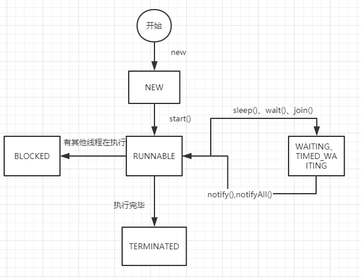

# 线程基础

## 线程的生命周期




## 线程如何停止


### 使用线程自带的方法

使用 thread.interrupt() 来修改终止标记

```java
public static void main(String[] args) throws InterruptedException {
    Thread thread = new Thread(()-> {
        while (!Thread.currentThread().isInterrupted()) {
            try {
                TimeUnit.SECONDS.sleep(5);
            } catch (InterruptedException e) {
                e.printStackTrace();
                break;
            }
        }
    });
    thread.start();
    TimeUnit.SECONDS.sleep(3);
    thread.interrupt();
}
```


### 自定义方法

自定义一个终止标记

```java
public static void main(String[] args) throws InterruptedException {
    Thread thread = new Thread(()-> {
        while (!isStop) {
            try {
                TimeUnit.SECONDS.sleep(5);
            } catch (InterruptedException e) {
                e.printStackTrace();
                break;
            }
        }
    });
    thread.start();
    TimeUnit.SECONDS.sleep(2);
    isStop = true;
}
```


# volatile

**volatile 是为了解决什么问题**：

​	保证各个线程对于共享变量的可见性

**volatile是如何来保证可见性的呢**

​	在生成汇编指令的时候，会生成一个锁之类。

这个锁的之类主要是完成以下两步（JMM模型分为主内存跟工作内存）

1. 把工作内存的变量写到主内存
2. 通过缓存一致性协议强制刷新各个工作内存的变量

**因为强制刷新工作内存的操作是不安全的，volatile是不保证原子性**

**volatile是如何来保证有序性**

​	通过内存屏障来保证读共享变量前的读写顺序不变，写操作之前的读写顺序不变


# cas

**什么是cas**

​	通过对比内存地址中的当前值跟预期值，来更新标记，并返回是否更新成功

**cas会存在的问题**

1. ABA问题：解决方法 使用AtomicStampedReference.compareAndSet()，通过对比当前引用跟预期引用，当前标记跟预期标记是否相等。
2. 循环时间过长造成cpu的开销（设置循环次数、或者循环时间）
3. 只能保证一个变量的原子操作：把多个变量封装成一个对象来使用（AtomicReference）、或者加锁


# final


写final域的重排序规则会要求编译器在final域的写之后，构造函数 return 之前插入一个StoreStore障屏。

读final域的重排序规则要求编译器在读final域的操作前面插入一个LoadLoad屏障。


# 内存屏障

首先，内存屏障按保障可见性来划分可分为`LoadBarrier` 和 `StoreBarrier` ；`LoadBarrier`作用是将其他写线程对于共享变量的更新从其他处理器同步至当前线程的执行处理器，`StoreBarrier`的作用是保证写线程对共享变量的更新对于其他读线程的执行处理器是可同步的

按照保证有序性来划分，内存屏障可以分为`AcquireBarrier`和`ReleaseBarrier` ：`AcquireBarrier`加在读操作后，作用是防止该读操作与屏障后的任何读写操作重排序；而`ReleaseBarrier`加在写操作之前，作用是防止该写操作和屏障之前的任何读写操作重排序


# happens-before


# 线程池

