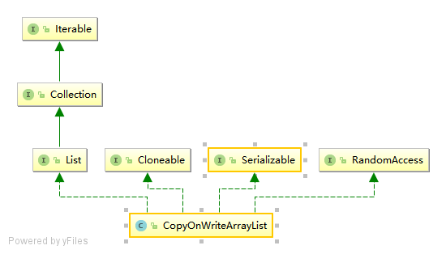

# CopyOnWriteArrayList

# 简介

CopyOnWriteArrayList 是 ArrayList 的线程安全版本，内部也是通过数组实现，每次对数组的修改都完全拷贝一份新的数组来修改，修改完了再替换掉老数组，这样保证了只阻塞写操作，不阻塞读操作，实现了读写分离。


# 继承体系



- CopyOnWriteArrayList 实现了List, RandomAccess, Cloneable,Serializable等接口。
- CopyOnWriteArrayList 实现了List，提供了基础的添加、删除、遍历等操作。
- CopyOnWriteArrayList 实现了RandomAccess，提供了随机访问的能力。
- CopyOnWriteArrayList 实现了Cloneable，可以被克隆。
- CopyOnWriteArrayList 实现了Serializable，可以被序列化。

# 源码解析

## 属性

```java
// 用于写操作是加锁
final transient ReentrantLock lock = new ReentrantLock();
// 真正存储元素的地方，只能通过getArray()/setArray() 访问
private transient volatile Object[] array;
```

1. lock：用于写操作加锁，使用transient修饰表示不自动序列化
2. array：真正存储元素的地方，使用transient修饰表示不自动序列化，使用volatile修饰表示一个线程对这个字段的修改，其它线程可见


## `CopyOnWriteArrayList()` 构造方法

创建空数组

```java
public CopyOnWriteArrayList() {
    // 所有操作对array的操作都是通过setArray()/getArray() 进行
    setArray(new Object[0]);
}
final void setArray(Object[] a) {
    array = a;
}
```


## `CopyOnWriteArrayList(Collection c)` 构造方法

如果c是CopyOnWriteArrayList类型，直接把它的数组赋值给当前list的数组，注意这里是浅拷贝，两个集合共用同一个数组。

如果c不是CopyOnWriteArrayList类型，则进行拷贝把c的元素全部拷贝到当前list的数组中。

```java
public CopyOnWriteArrayList(Collection<? extends E> c) {
    Object[] elements;
    if (c.getClass() == CopyOnWriteArrayList.class)
        // 如果c也是CopyOnWriteArrayList类型
        // 那么直接把它的数组拿过来使用
        elements = ((CopyOnWriteArrayList<?>)c).getArray();
    else {
        // 否则调用其toArray()方法将集合元素转化为数组
        elements = c.toArray();
		// 这里c.toArray()返回的不一定是Object[]类型
        if (elements.getClass() != Object[].class)
            elements = Arrays.copyOf(elements, elements.length, Object[].class);
    }
    setArray(elements);
}
```


## `CopyOnWriteArrayList(E[] toCopyIn)` 构造方法

把toCopyIn的元素拷贝给当前list的数组。

```java
public CopyOnWriteArrayList(E[] toCopyIn) {
    setArray(Arrays.copyOf(toCopyIn, toCopyIn.length, Object[].class));
}
```

## `add(E e)` 方法

添加一个元素到末尾。

```java
public boolean add(E e) {
    final ReentrantLock lock = this.lock;
    // 加锁
    lock.lock();
    try {
        // 获取旧数组
        Object[] elements = getArray();
        int len = elements.length;
        // 将旧数组元素拷贝到新数组中
        // 将旧数组元素拷贝到新数组中
        Object[] newElements = Arrays.copyOf(elements, len + 1);
        // 将新添加的元素放在最后一位
        newElements[len] = e;
        // 更新旧数组元素
        setArray(newElements);
        return true;
    } finally {
        // 释放锁
        lock.unlock();
    }
}
```

>代码逻辑：
>
>1. 加锁
>2. 获取旧数组
>3. 新增一个数组，长度为旧数组长度+1，并把旧数组元素拷贝到新数组
>4. 把新添加的元素放到数组的最后一位
>5. 更新旧数组
>6. 释放锁


## `add(int index, E element)` 方法

```java
public void add(int index, E element) {
    final ReentrantLock lock = this.lock;
    // 加锁
    lock.lock();
    try {
        // 获取旧数组
        Object[] elements = getArray();
        int len = elements.length;
        // 检查越界
        if (index > len || index < 0)
            throw new IndexOutOfBoundsException("Index: "+index+ ", Size: "+len);
        Object[] newElements;
        int numMoved = len - index;
        if (numMoved == 0)
            // 如果插入的位置是最后一位
            // 那么拷贝一个n+1的数组, 其前n个元素与旧数组一致
            newElements = Arrays.copyOf(elements, len + 1);
        else {
            // 如果插入的位置不是最后一位
            // 那么新建一个n+1的数组
            newElements = new Object[len + 1];
            // 拷贝旧数组前index的元素到新数组中
            System.arraycopy(elements, 0, newElements, 0, index);
            // 将index及其之后的元素往后挪一位拷贝到新数组中
            // 这样正好index位置是空出来的
            System.arraycopy(elements, index, newElements, index + 1, numMoved);
        }
        newElements[index] = element;
        // 更新旧数组元素
        setArray(newElements);
    } finally {
        // 释放锁
        lock.unlock();
    }
}
```

> 代码逻辑：
>
> 1. 加锁
> 2. 检查索引是否合法
> 3. 如果索引等于数组长度，那就拷贝一个len+1的数组
> 4. 如果索引不等于数组长度，那就新建一个len+1的数组，并按索引位置分成两部分，索引之前（不包含）的部分拷贝到新数组索引之前（不包含）的部分，索引之后（包含）的位置拷贝到新数组索引之后（不包含）的位置，索引所在位置留空；
> 5. 把索引位置赋值为待添加的元素；
> 6. 把新数组赋值给当前对象的array属性，覆盖原数组；
> 7. 释放锁


## `addIfAbsent(E e)` 方法

添加一个不存在于这个集合中的元素

```java
public boolean addIfAbsent(E e) {
    // 获取元素数组
    Object[] snapshot = getArray();
    // 检查元素如果不存在，返回false
    // 存在调用addIfAbsent() 添加元素
    return indexOf(e, snapshot, 0, snapshot.length) >= 0 ? false :
    addIfAbsent(e, snapshot);
}

private boolean addIfAbsent(E e, Object[] snapshot) {
    final ReentrantLock lock = this.lock;
    // 加锁
    lock.lock();
    try {
        // 获得旧数组
        Object[] current = getArray();
        int len = current.length;
        // 如果快照与刚获取的数组不一致
        // 说明有修改
        if (snapshot != current) {
            // 重新检查元素是否在刚获取的数组里
            int common = Math.min(snapshot.length, len);
            for (int i = 0; i < common; i++)
                // 到这个方法里面了, 说明元素不在快照里面
                if (current[i] != snapshot[i] && eq(e, current[i]))
                    return false;
            if (indexOf(e, current, common, len) >= 0)
                return false;
        }
        // 拷贝一份n+1的数组
        Object[] newElements = Arrays.copyOf(current, len + 1);
        // 将元素放在最后一位
        newElements[len] = e;
        // 更新旧数组元素
        setArray(newElements);
        return true;
    } finally {
        // 释放锁
        lock.unlock();
    }
}
```

> 代码逻辑：
>
> 1. 检查元素是否存在于数组中
> 2. 如果存在直接返回false，如果不存在调用 `addIfAbsent()` 方法
> 3. 加锁
> 4. 如果当前数组不等于传入的快照，说明有修改，检查带添加的元素是否存在于当前数组中，如果存在直接返回false;
> 5. 拷贝一个新数组，长度等于原数组长度加1，并把原数组元素拷贝到新数组中；
> 6. 把新元素添加到数组最后一位；
> 7. 把新数组赋值给当前对象的array属性，覆盖原数组；
> 8. 释放锁；

## `get(int index)` 方法

获取指定索引的元素，支持随机访问，时间复杂度为 ${O(1)}$ 。

```java
public E get(int index) {
    // 获取元素不需要加锁
    // 直接返回index位置的元素
    // 这里是没有做越界检查的, 因为数组本身会做越界检查
    return get(getArray(), index);
}

private E get(Object[] a, int index) {
    return (E) a[index];
}
```

> 代码逻辑：
>
> 1. 获取元素数组
> 2. 返回指定索引位置的元素

## `remove(int index)` 方法

删除指定索引位置的元素。

```java
public E remove(int index) {
    final ReentrantLock lock = this.lock;
    // 加锁
    lock.lock();
    try {
        // 获取数组
        Object[] elements = getArray();
        int len = elements.length;
        // 获取索引所在位置的元素
        E oldValue = get(elements, index);
        int numMoved = len - index - 1;
        if (numMoved == 0)
            // 如果移除的是最后一位
            // 那么直接拷贝一份n-1的新数组, 最后一位就自动删除了
            setArray(Arrays.copyOf(elements, len - 1));
        else {
            // 如果移除的不是最后一位
            // 那么新建一个n-1的新数组
            Object[] newElements = new Object[len - 1];
            // 将前index的元素拷贝到新数组中
            System.arraycopy(elements, 0, newElements, 0, index);
            // 将index后面(不包含)的元素往前挪一位
            // 这样正好把index位置覆盖掉了, 相当于删除了
            System.arraycopy(elements, index + 1, newElements, index, numMoved);
            setArray(newElements);
        }
        return oldValue;
    } finally {
        lock.unlock();
    }
}
```


> 代码逻辑：
>
> 1. 加锁
> 2. 获取旧数组
> 3. 获取指定索引位置的值
> 4. 如果移除的是最后一位元素，则把原数组的前 len-1 个元素拷贝到新数组中，并把新数组拷贝到当前对象的数组属性
> 5. 如果移除的不是最后一位元素，则新建一个 len-1 长度的数组，并把原数组除了指定索引位置的元素全部拷贝到新的数组中，并把新数组拷贝到当前对象的数组属性
> 6. 解锁返回删除的旧值


## `size()` 方法

返回数组长度

```java
public int size() {
    // 获取元素个数不需要加锁
    // 直接返回数组长度
    return getArray().length;
}
```


# 总结

- CopyOnWriteArrayList使用ReentrantLock重入锁加锁，保证线程安全；
- CopyOnWriteArrayList的写操作都要先拷贝一份新数组，在新数组中做修改，修改完了再用新数组替换老数组，所以空间复杂度是O(n)，性能比较低下；
- CopyOnWriteArrayList的读操作支持随机访问，时间复杂度为O(1)；
- CopyOnWriteArrayList采用读写分离的思想，读操作不加锁，写操作加锁，且写操作占用较大内存空间，所以适用于读多写少的场合；
- CopyOnWriteArrayList只保证最终一致性，不保证实时一致性；


