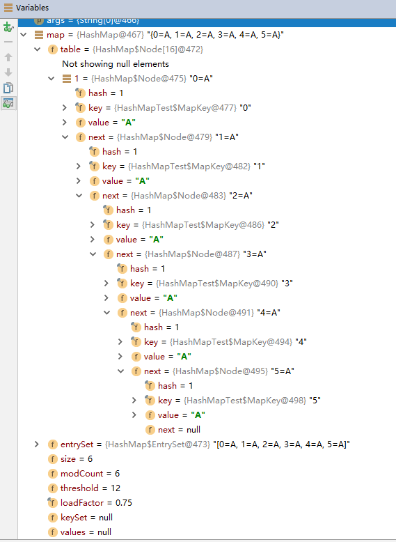
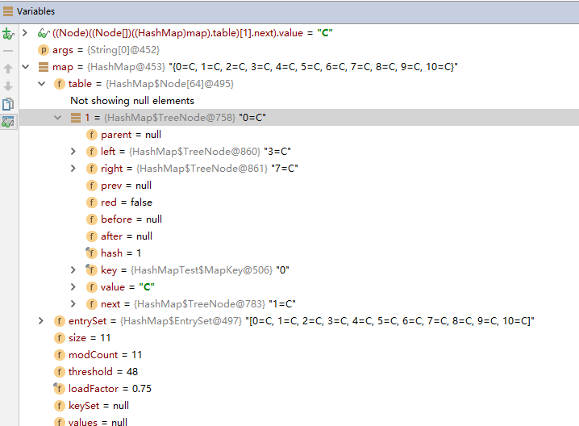
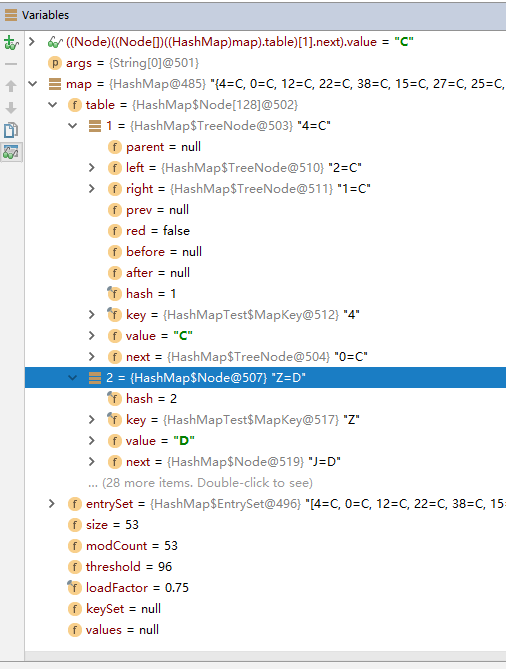

# HashMap 代码测试

测试代码，重写key的 `hashCode()` 和 `equals()` 方法，使得hashmap中的 `hash(key)` 碰撞。


```java
public class HashMapTest {

    public static void main(String[] args) {
        Map<MapKey,String> map = new HashMap<MapKey, String>();
        //第一阶段， hashCode的值全为 1
        for (int i = 0; i < 6; i++) {
            map.put(new MapKey(String.valueOf(i)), "A");
        }
        //第二阶段， hashCode的值全为 1
        for (int i = 0; i < 10; i++) {
            map.put(new MapKey(String.valueOf(i)), "B");
        }
        //第三阶段， hashCode的值全为 1
        for (int i = 0; i < 50; i++) {
            map.put(new MapKey(String.valueOf(i)), "C");
        }
        //第四阶段， hashCode的值全为 2
        map.put(new MapKey("Z"), "D");
        map.put(new MapKey("J"), "D");
        map.put(new MapKey("F"), "D");
        System.out.println(map);
    }

    /**
     * 重写了hashCode使得hashCode碰撞极高
     */
    static class MapKey {
        private static final String REG = "[0-9]+";

        private String key;

        public MapKey(String key) {
            this.key = key;
        }

        @Override
        public boolean equals(Object o) {
            if (this == o) return true;
            if (o == null || getClass() != o.getClass()) return false;
            MapKey mapKey = (MapKey) o;
            return !(key != null ? !key.equals(mapKey.key) : mapKey.key != null);
        }
        /*
         * 确保每次key的hashCode都相同
         */
        @Override
        public int hashCode() {
            if (key == null){
                return 0;
            }
            Pattern pattern = Pattern.compile(REG);
            // 所有数字，hashCode全部给1，为了复现碰撞极高， 且更容易树化(超过8)
            if (pattern.matcher(key).matches()) {
                return 1;
            }else {
                // 非数字
                return 2;
            }
        }
        @Override
        public String toString() {
            return key;
        }
    }

}
```


# 第一阶段

> 操作：循环6次，HashCode全部为1，赋值6次
>
> 表现：
>
> 1. 插入6条数据，这个时候桶中的bin数据小于`TREEIFY_THRESHOLD = 8` ，此时没有发生任何非常规操作（扩容、树化等）此时，HashMap中，各属性值如下：
>
> hashmap结构：链表

- table: 长度=16 
  - 有效数组节点个数：1
    - 链表的长度为：6
    - 头结点：key=0
    - 尾结点：key=5
- entrySet： 长度=6
- modCount = 6
- threshold = 12
- loadFactor = 0.75





# 第二阶段

> 操作：循环10次，HashCode全部为1，赋值10次
>
> 表现：
>
> 1. i=(0-5)时，所有属性与第一阶段相同
> 2. i=6时，modCount= 7，size = 7，threshold = 12
> 3. i=7时，modCount= 8，size = 8，threshold = 12
> 4. i=8时，执行下述逻辑且满足 `tab.length<MIN_TREEIFY_CAPACITY(64)` ,扩容一倍。此时modCount= 9，size = 9，threshold = 24，tab.length = 32
> 5. i=9时，执行下述逻辑且满足 `tab.length<MIN_TREEIFY_CAPACITY(64)` ,扩容一倍。此时modCount= 10，size = 10，threshold = 48，tab.length = 64
>
> hashmap结构：链表

```java
// HashMap.putVal(...) 中代码部分逻辑
if (binCount >= TREEIFY_THRESHOLD - 1) 
    treeifyBin(tab, hash);
// HashMap.treeifyBin(...) 中代码部分逻辑
if (tab == null || (n = tab.length) < MIN_TREEIFY_CAPACITY)
	resize();
```


# 第三阶段

>操作：循环50次，HashCode全部为1，赋值50次
>
>表现：
>
>1. i=(0-9)时，所有属性与第二阶段相同。此时modCount= 10，size = 10，threshold = 48，tab.length = 64
>2. i=10时，此时modCount= 11，size = 11，threshold = 48，tab.length = 64，满足树化条件（tab[i].length>8&&tab.length>64）进行树化操作，生成如下图所示红黑树结构(TreeNode)。
>
>
>
>3. i=(11-47)时，size<=threshold，所以不扩容，只是在TreeNode节点中添加元素。此时modCount= 48，size = 48，threshold = 48，tab.length = 64。执行下述代码逻辑
>
>   ```java
>   // HashMap.putVal(...) 中代码部分逻辑
>   else if (p instanceof TreeNode)
>       e = ((TreeNode<K,V>)p).putTreeVal(this, tab, hash, key, value);
>   ```
>
>4. i=48时，触发下述代码，执行扩容。此时modCount= 49，size = 49，threshold = 96，tab.length = 128
>
>   ```java
>   // HashMap.putVal(...) 中代码部分逻辑
>   if (++size > threshold)
>       resize();
>   ```
>
>5. i=49时，无其他操作。此时modCount= 50，size = 50，threshold = 96，tab.length = 128


# 第四阶段

这个阶段主要测试：如果一个桶采用了树形结构存储，其他桶是不是也采用树形结构存储。结论是，如果其他桶中bin的数量没有超过TREEIFY_THRESHOLD，则用链表存储，如果超过TREEIFY_THRESHOLD ，则用树形存储。

此时table已中第一个是红黑树，第二个依然是链表。 所以由链表变成红黑树也只是当前桶挂载的bin会进行转换，不会影响其它桶的数据结构。



