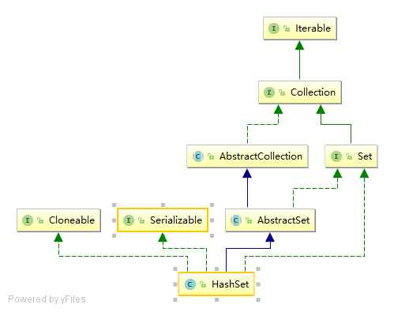

# HashSet

数学上的集合是指不包含重复元素的容器，即集合中不存在两个相同的元素，在java里面对应Set。

HashSet是Set的一种实现方式，底层主要使用HashMap来确保元素不重复。


# 继承关系




# 源码分析

## 属性


```java
// 内部使用HashMap
private transient HashMap<E,Object> map;
// 虚拟对象，用来作为value放到map中
private static final Object PRESENT = new Object();
```

## 构造方法

```java
public HashSet() {
    map = new HashMap<>();
}
public HashSet(Collection<? extends E> c) {
    map = new HashMap<>(Math.max((int) (c.size()/.75f) + 1, 16));
    addAll(c);
}
public HashSet(int initialCapacity, float loadFactor) {
    map = new HashMap<>(initialCapacity, loadFactor);
}
public HashSet(int initialCapacity) {
    map = new HashMap<>(initialCapacity);
}
// 非public，主要是给LinkedHashSet使用的
HashSet(int initialCapacity, float loadFactor, boolean dummy) {
    map = new LinkedHashMap<>(initialCapacity, loadFactor);
}
```

构造方法都是调用HashMap对应的构造方法。

最后一个构造方法有点特殊，它不是public的，意味着它只能被同一个包调用，这是LinkedHashSet专属的方法。

## `add(E e)` 添加元素

直接调用HashMap的put()方法，把元素本身作为key，把PRESENT作为value，也就是这个map中所有的value都是一样的。

```java
public boolean add(E e) {
    return map.put(e, PRESENT)==null;
}
```

## `remove(Object o)` 删除元素

直接调用HashMap的remove()方法，注意map的remove返回是删除元素的value，而Set的remov返回的是boolean类型。

这里要检查一下，如果是null的话说明没有该元素，如果不是null肯定等于PRESENT。

```java
public boolean remove(Object o) {
    return map.remove(o)==PRESENT;
}
```

# `contains(Object o)` 查询元素

Set没有get()方法哦，因为get似乎没有意义，不像List那样可以按index获取元素。

这里只要一个检查元素是否存在的方法contains()，直接调用map的containsKey()方法。

```java
public boolean contains(Object o) {
    return map.containsKey(o);
}
```

# 总结

（1）HashSet内部使用HashMap的key存储元素，以此来保证元素不重复；

（2）HashSet是无序的，因为HashMap的key是无序的；

（3）HashSet中允许有一个null元素，因为HashMap允许key为null；

（4）HashSet是非线程安全的；

（5）HashSet是没有get()方法的；


# 彩蛋

（1）阿里手册上有说，使用java中的集合时要自己指定集合的大小，通过这篇源码的分析，你知道初始化HashMap的时候初始容量怎么传吗？

我们发现有下面这个构造方法，很清楚明白地告诉了我们怎么指定容量。

假如，我们预估HashMap要存储n个元素，那么，它的容量就应该指定为((n/0.75f) + 1)，如果这个值小于16，那就直接使用16得了。

初始化时指定容量是为了减少扩容的次数，提高效率。

```java
public HashSet(Collection<? extends E> c) {
    map = new HashMap<>(Math.max((int) (c.size()/.75f) + 1, 16));
    addAll(c);
}
```


（2）什么是fail-fast？

fail-fast机制是java集合中的一种错误机制。

当使用迭代器迭代时，如果发现集合有修改，则快速失败做出响应，抛出ConcurrentModificationException异常。

这种修改有可能是其它线程的修改，也有可能是当前线程自己的修改导致的，比如迭代的过程中直接调用remove()删除元素等。

另外，并不是java中所有的集合都有fail-fast的机制。比如，像最终一致性的ConcurrentHashMap、CopyOnWriterArrayList等都是没有fast-fail的。

那么，fail-fast是怎么实现的呢？

细心的同学可能会发现，像ArrayList、HashMap中都有一个属性叫 `modCount`，每次对集合的修改这个值都会加1，在遍历前记录这个值到 `expectedModCount`中，遍历中检查两者是否一致，如果出现不一致就说明有修改，则抛出ConcurrentModificationException异常。