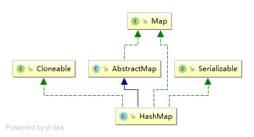

# HashMap

# 简介

HashMap采用key/value存储结构，每个key对应唯一的value，查询和修改的速度都很快，能达到O(1)的平均时间复杂度。它是非线程安全的，且不保证元素存储的顺序。

# 继承体系

- HashMap实现了Cloneable，可以被克隆。
- HashMap实现了Serializable，可以被序列化。
- HashMap继承自AbstractMap，实现了Map接口，具有Map的所有功能。

