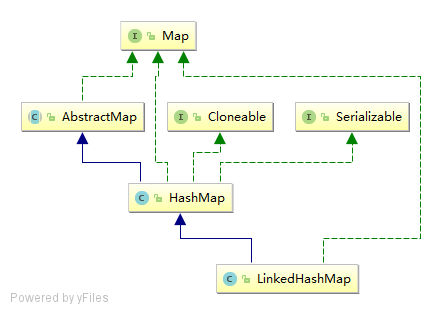

# LinkedHashMap

# 简介

LinkedHashMap内部维护了一个双向链表，能保证元素按插入的顺序访问，也能以访问顺序访问，可以用来实现LRU（最近最少使用）缓存策略。

LinkedHashMap可以看成是 LinkedList + HashMap。

# 继承体系

LinkedHashMap继承HashMap，拥有HashMap的所有特性，并且额外增加了按一定顺序访问的特性。

