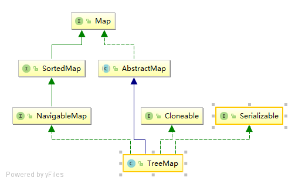

# TreeMap

# 简介

TreeMap使用红黑树存储元素，可以保证元素按key值的大小进行遍历。


# 继承体系



TreeMap实现了Map、SortedMap、NavigableMap、Cloneable、Serializable等接口。

SortedMap规定了元素可以按key的大小来遍历，它定义了一些返回部分map的方法。

NavigableMap是对SortedMap的增强，定义了一些返回离目标key最近的元素的方法。


# 存储结构

TreeMap只使用到了红黑树，所以它的时间复杂度为O(log n)。


# 源码分析

## 属性

```java
// 比较器，如果没传则key要实现Comparable接口
private final Comparator<? super K> comparator;
// 根节点
private transient Entry<K,V> root;
// 元素个数
private transient int size = 0;
// 修改次数
private transient int modCount = 0;
```

1. comparator：按key的大小排序有两种方式，一种是key实现Comparable接口，一种方式通过构造方法传入比较器。

2. root：根节点，TreeMap没有桶的概念，所有的元素都存储在一颗树中。

## Entry内部类

存储节点，典型的红黑树结构。

```java
static final class Entry<K,V> implements Map.Entry<K,V> {
    K key;
    V value;
    Entry<K,V> left;
    Entry<K,V> right;
    Entry<K,V> parent;
    boolean color = BLACK;
}
```


## 构造方法

```java
//默认构造方法，key必须实现Comparable接口
public TreeMap() {
    comparator = null;
}
// 使用传入的comparator比较两个key的大小
public TreeMap(Comparator<? super K> comparator) {
    this.comparator = comparator;
}
//key必须实现Comparable接口，把传入map中的所有元素保存到新的TreeMap中
public TreeMap(Map<? extends K, ? extends V> m) {
    comparator = null;
    putAll(m);
}
//使用传入map的比较器，并把传入map中的所有元素保存到新的TreeMap中
public TreeMap(SortedMap<K, ? extends V> m) {
    comparator = m.comparator();
    try {
        buildFromSorted(m.size(), m.entrySet().iterator(), null, null);
    } catch (java.io.IOException cannotHappen) {
    } catch (ClassNotFoundException cannotHappen) {
    }
}
```

构造方法主要分成两类，一类是使用comparator比较器，一类是key必须实现Comparable接口。

其实，笔者认为这两种比较方式可以合并成一种，当没有传comparator的时候，可以用以下方式来给comparator赋值，这样后续所有的比较操作都可以使用一样的逻辑处理了，而不用每次都检查comparator为空的时候又用Comparable来实现一遍逻辑。

```java
// 如果comparator为空，则key必须实现Comparable接口，所以这里肯定可以强转
// 这样在构造方法中统一替换掉，后续的逻辑就都一致了
// 倒序
new TreeMap<>(Comparator.reverseOrder());
// 正序（默认）
new TreeMap<>(Comparator.reverseOrder());
```


## `get(Obkect key)` 方法

获取元素，典型的二叉查找树的查找方法。

```java
public V get(Object key) {
    // 根据key查找元素
    Entry<K,V> p = getEntry(key);
    // 找到了返回value值，没找到返回null
    return (p==null ? null : p.value);
}
final Entry<K,V> getEntry(Object key) {
    // 如果comparator不为空，使用comparator的版本获取元素
    if (comparator != null)
        return getEntryUsingComparator(key);
    // 如果key为空返回空指针异常
    if (key == null)
        throw new NullPointerException();
    // 将key强转为Comparable
    @SuppressWarnings("unchecked")
    Comparable<? super K> k = (Comparable<? super K>) key;
    // 从根元素开始遍历
    Entry<K,V> p = root;
    while (p != null) {
        int cmp = k.compareTo(p.key);
        if (cmp < 0)
            // 如果小于0从左子树查找
            p = p.left;
        else if (cmp > 0)
            // 如果大于0从右子树查找
            p = p.right;
        else
            // 如果相等说明找到了直接返回
            return p;
    }
    // 没找到返回null
    return null;
}

final Entry<K,V> getEntryUsingComparator(Object key) {
    @SuppressWarnings("unchecked")
    K k = (K) key;
    Comparator<? super K> cpr = comparator;
    if (cpr != null) {
        // 从根元素开始遍历
        Entry<K,V> p = root;
        while (p != null) {
            int cmp = cpr.compare(k, p.key);
            if (cmp < 0)
                // 如果小于0从左子树查找
                p = p.left;
            else if (cmp > 0)
                // 如果大于0从右子树查找
                p = p.right;
            else
                // 如果相等说明找到了直接返回
                return p;
        }
    }
    // 没找到返回null
    return null;
}
```


## `put(K key, V value)` 方法

```java
public V put(K key, V value) {
    Entry<K,V> t = root;
    if (t == null) {
        compare(key, key); // type (and possibly null) check
		// 如果没有根节点，直接插入到根节点
        root = new Entry<>(key, value, null);
        size = 1;
        modCount++;
        return null;
    }
    // key比较的结果
    int cmp;
    // 用来寻找待插入节点的父节点
    Entry<K,V> parent;
    // split comparator and comparable paths
    // 根据是否有comparator使用不同的分支
    Comparator<? super K> cpr = comparator;
    if (cpr != null) {
        // 如果使用的是comparator方式，key值可以为null，只要在comparator.compare()中允许即可
        // 从根节点开始遍历寻找
        do {
            parent = t;
            cmp = cpr.compare(key, t.key);
            if (cmp < 0)
                // 如果小于0从左子树寻找
                t = t.left;
            else if (cmp > 0)
                // 如果大于0从右子树寻找
                t = t.right;
            else
                // 如果等于0，说明插入的节点已经存在了，直接更换其value值并返回旧值
                return t.setValue(value);
        } while (t != null);
    }
    else {
        // 如果使用的是Comparable方式，key不能为null
        if (key == null)
            throw new NullPointerException();
        @SuppressWarnings("unchecked")
        Comparable<? super K> k = (Comparable<? super K>) key;
        // 从根节点开始遍历寻找
        do {
            parent = t;
            cmp = k.compareTo(t.key);
            if (cmp < 0)
                // 如果小于0从左子树寻找
                t = t.left;
            else if (cmp > 0)
                // 如果大于0从右子树寻找
                t = t.right;
            else
                // 如果等于0，说明插入的节点已经存在了，直接更换其value值并返回旧值
                return t.setValue(value);
        } while (t != null);
    }
    // 如果没找到，那么新建一个节点，并插入到树中
    Entry<K,V> e = new Entry<>(key, value, parent);
    if (cmp < 0)
        // 如果小于0插入到左子节点
        parent.left = e;
    else
        // 如果大于0插入到右子节点
        parent.right = e;
    // 插入之后的平衡
    fixAfterInsertion(e);
    // 元素个数加1（不需要扩容）
    size++;
    // 修改次数加1
    modCount++;
    // 如果插入了新节点返回空
    return null;
}
```


```java
// 插入再平衡
private void fixAfterInsertion(Entry<K,V> x) {
    // 插入的节点为红节点，x为当前节点
    x.color = RED;
	// 只有当插入节点不是根节点且其父节点为红色时才需要平衡
    while (x != null && x != root && x.parent.color == RED) {
        if (parentOf(x) == leftOf(parentOf(parentOf(x)))) {
            // a）如果父节点是祖父节点的左节点
            // y为叔叔节点
            Entry<K,V> y = rightOf(parentOf(parentOf(x)));
            if (colorOf(y) == RED) {
                // 情况1）如果叔叔节点为红色
                // （1）将父节点设为黑色
                setColor(parentOf(x), BLACK);
                // （2）将叔叔节点设为黑色
                setColor(y, BLACK);
                // （3）将祖父节点设为红色
                setColor(parentOf(parentOf(x)), RED);
                // （4）将祖父节点设为新的当前节点
                x = parentOf(parentOf(x));
            } else {
                // 如果叔叔节点为黑色
                // 情况2）如果当前节点为其父节点的右节点
                if (x == rightOf(parentOf(x))) {
                    // （1）将父节点设为当前节点
                    x = parentOf(x);
                    // （2）以新当前节点左旋
                    rotateLeft(x);
                }
                // 情况3）如果当前节点为其父节点的左节点（如果是情况2）则左旋之后新当前节点正好为其父节点的左节点了）
                // （1）将父节点设为黑色
                setColor(parentOf(x), BLACK);
                // （2）将祖父节点设为红色
                setColor(parentOf(parentOf(x)), RED);
                // （3）以祖父节点为支点进行右旋
                rotateRight(parentOf(parentOf(x)));
            }
        } else {
            // b）如果父节点是祖父节点的右节点
            // y是叔叔节点
            Entry<K,V> y = leftOf(parentOf(parentOf(x)));
            if (colorOf(y) == RED) {
                // 情况1）如果叔叔节点为红色
                // （1）将父节点设为黑色
                setColor(parentOf(x), BLACK);
                // （2）将叔叔节点设为黑色
                setColor(y, BLACK);
                // （3）将祖父节点设为红色
                setColor(parentOf(parentOf(x)), RED);
                // （4）将祖父节点设为新的当前节点
                x = parentOf(parentOf(x));
            } else {
                // 如果叔叔节点为黑色
                // 情况2）如果当前节点为其父节点的左节点
                if (x == leftOf(parentOf(x))) {
                    // （1）将父节点设为当前节点
                    x = parentOf(x);
                    // （2）以新当前节点右旋
                    rotateRight(x);
                }
                // 情况3）如果当前节点为其父节点的右节点（如果是情况2）则右旋之后新当前节点正好为其父节点的右节点了）
                // （1）将父节点设为黑色
                setColor(parentOf(x), BLACK);
                // （2）将祖父节点设为红色
                setColor(parentOf(parentOf(x)), RED);
                // （3）以祖父节点为支点进行左旋
                rotateLeft(parentOf(parentOf(x)));
            }
        }
    }
    // 平衡完成后将根节点设为黑色
    root.color = BLACK;
}

```


## `remove(Object key)` 方法

删除元素

```java
public V remove(Object key) {
    // 获取节点
    Entry<K,V> p = getEntry(key);
    if (p == null)
        return null;

    V oldValue = p.value;
    // 删除节点
    deleteEntry(p);
    // 返回删除的value
    return oldValue;
}

private void deleteEntry(Entry<K,V> p) {
    // 修改次数加1
    modCount++;
    // 元素个数减1
    size--;

    // If strictly internal, copy successor's element to p and then make p
    // point to successor.
    if (p.left != null && p.right != null) {
        // 如果当前节点既有左子节点，又有右子节点
        // 取其右子树中最小的节点
        Entry<K,V> s = successor(p);
        // 用右子树中最小节点的值替换当前节点的值
        p.key = s.key;
        p.value = s.value;
        // 把右子树中最小节点设为当前节点
        p = s;
        // 这种情况实际上并没有删除p节点，而是把p节点的值改了，实际删除的是p的后继节点
    } // p has 2 children

    // Start fixup at replacement node, if it exists.
    // 如果原来的当前节点（p）有2个子节点，则当前节点已经变成原来p的右子树中的最小节点了，也就是说其没有左子节点了
    // 到这一步，p肯定只有一个子节点了
    // 如果当前节点有子节点，则用子节点替换当前节点
    Entry<K,V> replacement = (p.left != null ? p.left : p.right);

    if (replacement != null) {
        // Link replacement to parent
        // 把替换节点直接放到当前节点的位置上（相当于删除了p，并把替换节点移动过来了）
        replacement.parent = p.parent;
        if (p.parent == null)
            root = replacement;
        else if (p == p.parent.left)
            p.parent.left  = replacement;
        else
            p.parent.right = replacement;

        // Null out links so they are OK to use by fixAfterDeletion.
        // 将p的各项属性都设为空
        p.left = p.right = p.parent = null;

        // Fix replacement
        // 如果p是黑节点，则需要再平衡
        if (p.color == BLACK)
            fixAfterDeletion(replacement);
    } else if (p.parent == null) { // return if we are the only node.
        // 如果当前节点就是根节点，则直接将根节点设为空即可
        root = null;
    } else { //  No children. Use self as phantom replacement and unlink.
        // 如果当前节点没有子节点且其为黑节点，则把自己当作虚拟的替换节点进行再平衡
        if (p.color == BLACK)
            fixAfterDeletion(p);
		// 平衡完成后删除当前节点（与父节点断绝关系）
        if (p.parent != null) {
            if (p == p.parent.left)
                p.parent.left = null;
            else if (p == p.parent.right)
                p.parent.right = null;
            p.parent = null;
        }
    }
}
```


