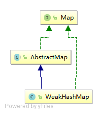

# WeakHashMap

WeakHashMap 是一种弱引用map，内部的key会存储为弱引用，当jvm gc的时候，如果这些key没有强引用存在的话，会被gc回收掉，下一次当我们操作map的时候会把对应的Entry整个删除掉，基于这种特性，WeakHashMap 特别适用于缓存处理。

# 基础体系




可见，WeakHashMap没有实现Clone和Serializable接口，所以不具有克隆和序列化的特性。

# 存储结构

WeakHashMap因为gc的时候会把没有强引用的key回收掉，所以注定了它里面的元素不会太多，因此也就不需要像HashMap那样元素多的时候转化为红黑树来处理了。

因此，WeakHashMap的存储结构只有（数组 + 链表）。

# 源码解析

## 属性

```java
// 默认容量16
private static final int DEFAULT_INITIAL_CAPACITY = 16;
// 最大容量2的30次方
private static final int MAXIMUM_CAPACITY = 1 << 30;
// 默认装载因子
private static final float DEFAULT_LOAD_FACTOR = 0.75f;
// 桶
Entry<K,V>[] table;
// 元素个数
private int size;
// 扩容门槛
private int threshold;
// 装载因子
private final float loadFactor;
// 引用队列，当弱键失效的时候，会把Entry添加到这个队列中
private final ReferenceQueue<Object> queue = new ReferenceQueue<>();
```


1. 容量：容量为数组的长度，亦即桶的个数，默认为16，最大为2的30次方，当容量达到64时才可以树化。

2. 装载因子：装载因子用来计算容量达到多少时才进行扩容，默认装载因子为0.75。
3. 引用队列：当弱键失效的时候会把Entry添加到这个队列中，当下次访问map的时候会把失效的Entry清除掉。


# Entry内部类

```java
private static class Entry<K,V> extends WeakReference<Object> implements Map.Entry<K,V> {
    V value;
    final int hash;
    Entry<K,V> next;

    /**
         * Creates new entry.
         */
    Entry(Object key, V value,
          ReferenceQueue<Object> queue,
          int hash, Entry<K,V> next) {
        super(key, queue);
        this.value = value;
        this.hash  = hash;
        this.next  = next;
    }

    @SuppressWarnings("unchecked")
    public K getKey() {
        return (K) WeakHashMap.unmaskNull(get());
    }

    public V getValue() {
        return value;
    }

    public V setValue(V newValue) {
        V oldValue = value;
        value = newValue;
        return oldValue;
    }

    public boolean equals(Object o) {
        if (!(o instanceof Map.Entry))
            return false;
        Map.Entry<?,?> e = (Map.Entry<?,?>)o;
        K k1 = getKey();
        Object k2 = e.getKey();
        if (k1 == k2 || (k1 != null && k1.equals(k2))) {
            V v1 = getValue();
            Object v2 = e.getValue();
            if (v1 == v2 || (v1 != null && v1.equals(v2)))
                return true;
        }
        return false;
    }

    public int hashCode() {
        K k = getKey();
        V v = getValue();
        return Objects.hashCode(k) ^ Objects.hashCode(v);
    }

    public String toString() {
        return getKey() + "=" + getValue();
    }
}
```

