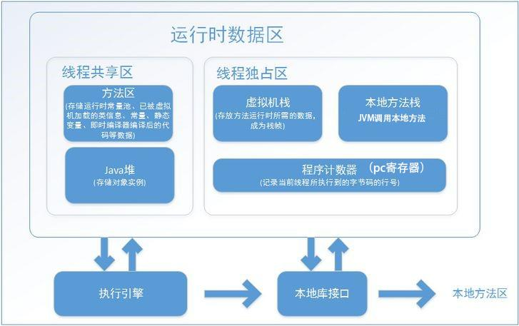

# jvm 内存管理示意图

## 程序计数器

* 程序计数器是一块比较小的内存空间，它可以看作是当前线程所执行的字节码的行号指示器。
* 程序计数器处于线程独占区。
* 如果线程执行的是Java方法，这个计数器记录的是正在执行的虚拟机字节码指令的地址。如果正在执行的是native方法，这个计数器的值为undefined。
* 此区域是唯一一个在Java虚拟机规范中没有规定任何OutOfMemoryError情况的区域。

## 栈

* 虚拟机栈描述的是Java方法执行的动态内存模型。
* 栈帧
  * 每个方法执行，都会创建一个栈帧，伴随着方法从创建到执行完成。用于存储局部变量表、操作数栈、动态链接、方法出口等。
* 局部变量表（存的是对象的引用）
  * 存放编译期可知的各种基本数据类型、引用类型、returnAddress类型。
  * 局部变量表的内存空间在编译期完成分配，当进入一个方法时，这个方法需要在帧分配多少内存是固定的，在方法运行期间是不会改变局部变量表的大小。
* 大小