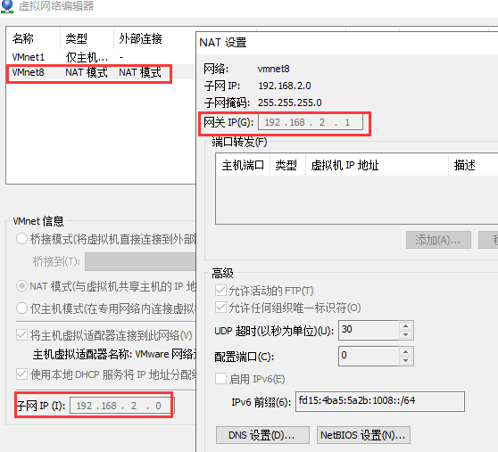
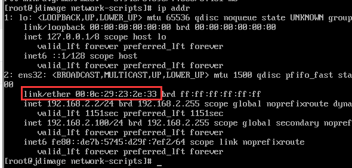
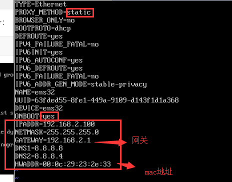

# centos 7 mini版本安装后需要的操作


## 配置普通用户的sudo权限

1. 切换到root用户下，命令是：

```shell
su 
```

2. 添加sudo文件的写权限，命令是:

```shell
chmod u+w /etc/sudoers
```

3. 编辑sudoers文件

```shell
vi /etc/sudoers
# root ALL=(ALL) ALL,在他下面添加xxx ALL=(ALL) ALL (这里的xxx是你的用户名)
```

4. 撤销sudoers文件写权限,命令:

```shell
chmod u-w /etc/sudoers
```

5. 这样普通用户就可以使用sudo了

## 配置网络连接

1. 使用nat模式，配置虚拟机的子掩码、网关等信息



2. 打开centos-7 mini，获取mac地址并记录下来，输入指令：

```shell
ip addr
```



3. 配置网络信息

```shell
cd /etc/sysconfig/network-scripts
vi ifcfg-ens32 #各个电脑会有差别
```

添加修改如下信息




4. 重启网络

```shell
service network restart
```


## 安装必要的工具

```shell
# 下载文件命令
yum -y install wget
# 命令行自动补全
yum -y install bash-completion
# 安装第三方软件包库
yum -y install epel-release
# 安装gcc gcc-c++ make
yum -y install gcc gcc-c++ make
# 安装vim
yum -y install vim*

# 安装ifconfig命令
yum -y install net-tools
# 安装完整版man-page
yum -y install man-pages
# 域名解析
yum -y install bind-utils


```


## 安装docker

### 安装docker服务器、客户端

```shell
# 查看内核，建议3.10以上
uanme -a
# 更新最新yum
yum update
# 安装需要的软件包
yum install -y yum-utils device-mapper-persistent-data lvm2
# 设置yum源
yum-config-manager --add-repo https://download.docker.com/linux/centos/docker-ce.repo
# 安装docker
yum -y install docker
# 启动docker
systemctl start docker
# 设置为开机启动
systemctl enable docker
# 验证是否安装成功(有client和service两部分表示docker安装启动都成功了)
docker version

```

### 创建docker用户组

保存在/etc/group中

```shell
# 查看组信息
groups
# 显示用户所在的组 
groups username
# 添加docker用户组
sudo groupadd docker
# 将登陆用户加入到docker用户组中
sudo gpasswd -a jdimage docker
# 刷新docker用户组 （或者重启）
newgrp docker
# 测试docker命令是否可以使用sudo正常使用
docker ps
```


## centos文件权限设置

### 文件权限基础概念

drwxr-xr-x

+ rwx ：第2-4位表示这个文件的属主拥有的权限。r是读、w是写、x是执行 
+ r-x ：第5-7位表示和这个文件属主所在同一个组的用户所具有的权限 
+ r-x ：第8-10位表示其他用户所具有的权限


具体的权限是由数字来表示的，读取的权限等于4，用r表示；写入的权限等于2，用w表示；执行的权限等于1，用x表示；

通过4、2、1的组合，得到以下几种权限：

0（没有权限）；4（读取权限）；5（4+1 | 读取+执行）；6（4+2 | 读取+写入）；7（4+2+1 | 读取+写入+执行）

以755为例：

+ 1-3位7等于4+2+1，rwx，所有者具有读取、写入、执行权限；
+ 4-6位5等于4+1+0，r-x，同组用户具有读取、执行权限但没有写入权限；
+ 7-9位5，同上，也是r-x，其他用户具有读取、执行权限但没有写入权限。


### 文件权限设置

```shell
# 在filanme目录及子目录 给本用户、组、其它用户添加 读写执行 
chmod -R 777 filename
```


## 安装jdk 8 & maven 3.6


1. 下载jdk、maven [jdk下载](https://www.oracle.com/technetwork/java/javase/downloads/jdk8-downloads-2133151.html) [maven下载](https://maven.apache.org/download.cgi)

2. 把下载好的文件放到 `/usr/src` 

3. 解压缩文件 

   ```shell
   tar -zxvf jdk... maven...
   ```

   

4. 编辑```/etc/profile```

5. 添加如下内容：

   ```shell
   export M2_HOME=/usr/src/apache-maven-3.6.1
   export JAVA_HOME=/usr/src/jdk1.8.0_211
   export PATH=$JAVA_HOME/bin:$M2_HOME/bin:$PATH
   export CLASSPATH=.:$JAVA_HOME/lib/dt.jar:$JAVA_HOME/lib/tools.jar
   ```

   

6. 运行```source /ect/profile```

7. 查看java、maven是否安装成功

   ```shell
   java -version
   mvn -v
   ```


## 配置yum源(可选)

1. 首先备份/etc/yum.repos.d/CentOS-Base.repo

```shell
mv /etc/yum.repos.d/CentOS-Base.repo /etc/yum.repos.d/CentOS-Base.repo.backup
```

2. 下载对应版本repo文件, 放入/etc/yum.repos.d/(操作前请做好相应备份)

```shell
wget -O /etc/yum.repos.d/CentOS-Base.repo http://mirrors.aliyun.com/repo/Centos-7.repo
```

3. 运行以下命令生成缓存

```shell
yum clean all
yum makecache
```


## xshell 远程连接不上问题(可选)

```shell
vi /etc/ssh/sshd_config
```


## 防火墙设置（可选）

```shell
# 启动
systemctl start firewalld
# 关闭
systemctl stop firewalld
# 查看状态
systemctl status firewalld 
# 开机启动
systemctl enable firewalld
# 开机禁用
systemctl disable firewalld

=============

# 那怎么开启一个端口呢
# 添加（--permanent永久生效，没有此参数重启后失效）
firewall-cmd --zone=public --add-port=80/tcp --permanent  
# 重新载入
firewall-cmd --reload
# 查看
firewall-cmd --zone= public --query-port=80/tcp
# 删除
firewall-cmd --zone= public --remove-port=80/tcp --permanent
```

