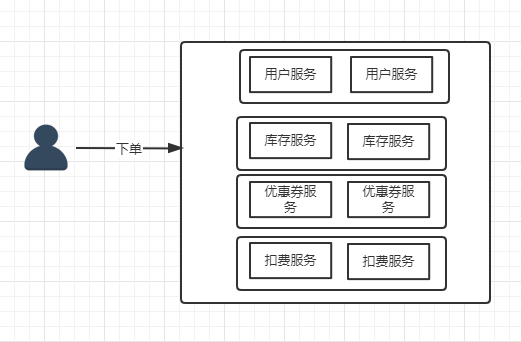

# 分布式架构下思考

假设一个下单流程，原来的单体架构只需要一个服务就可以完成流程。

但是在分布式服务下需要服务间的相互调用。

 

在上述的调用链的过程中，就会存在服务间的远程通信。

那服务间的远程通信设计到的问题：

1. 目标服务扩容、宕机等情况，如何通知客户端
2. 如何对服务进行负载均衡
3. 如何维护目标服务地址

# 通过问题引入注册中心

**引入注册中心**  

服务注册中心主要用于实现服务的注册和服务的发现功能，在微服务架构中，它起到了非常 

大的作用。 

**注册中心的实现**  

Dubbo 体系中的 Zookeeper、Spring Cloud 中的 Eureka 和 Consul 

# http & rpc 区别

http的优势在于成熟稳定、兼容好。通常使用json来进行序列化，所以 http 协议在开放 API、跨平台的服务间调用、对性能要求不苛刻的场景中有着广泛的使用。

rpc的优势在于高效的网络传输模型(通常使用NIO)，以及针对服务调用场景专门设计协议(tcp)和高效的序列化技术(json、Hessian、protobuf)。

