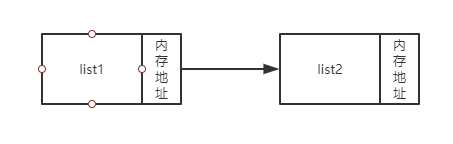
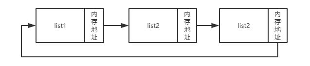
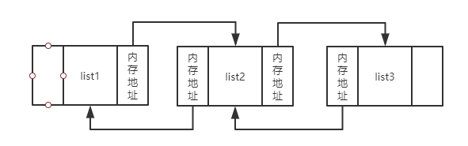
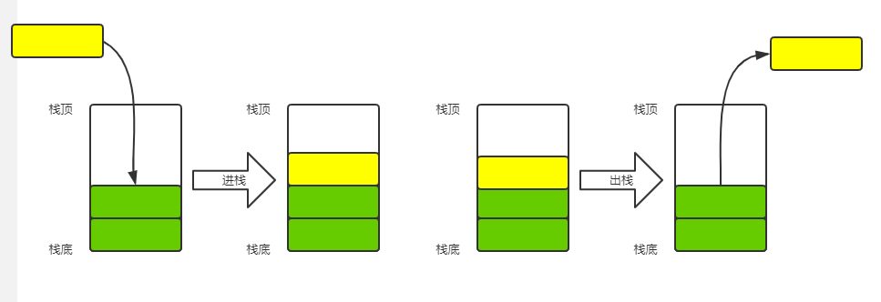
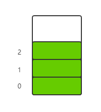
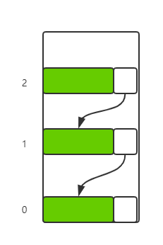
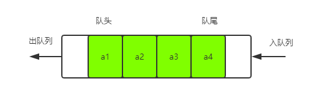
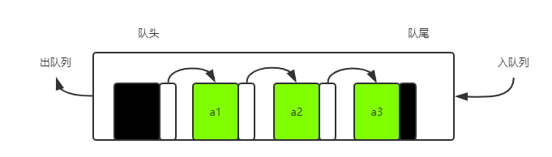

# 数据结构

## 逻辑结构

1. 集合结构

集合结构： 集合结构中的数据元素除了同属于一个集合外，他们之间没有其他关系。

2. 线性结构

线性结构：线性结构中的数据元素之间是一对一的关系。

3. 树状结构

树状结构：树状结构中的数据元素之间存在一种一对多的层次关系。

4. 图形结构

图形结构：图形结构的数据元素是多对多的关系。

## 物理结构（存储结构）

1. 顺序存储结构

顺序存储结构：是把数据元素存放在地址连续的存储单元里，其数据间的逻辑关系和物理关系是一致的。

2. 链式存储结构

链式存储结构：是把数据元素存放在任意的存储单元里，这组存储单元可以是连续的，也可以是不连续的。

# 算法

## 算法的特性

算法具有五个基本特性 输入、输出、有穷性、确定性和可行性。

### 输入、输出

输入和输出特性比较容易理解， 算法具有零个或多个输入。尽管对于绝大多数算 法来说，输入参数都是必要的，但对于个别情况，如打印 “hello wo ld” 这样的代码，不需要任何输入参数，因此算法的输入可以是零个。 算法至少有一个或多个输出， 算法是一定需要输出的，不需要输出，你用这个算法干吗?输出的形式可以是打印输出，也可以是返回一个或多个值等。

### 有穷性

有穷性：指算法在执行有限的步骤之后，自动结束而不会出现无限循环，并且每一个步骤在可接受的时间内完成。

### 确定性

确定性：算法的每一步骤都具有确定的含义，不会出现二义性。

### 可行性

可行性：算法的每一步都必须是可行的，也就是说，每一步都能够通过执行有限次数完成。

# 线性表

## 线性表的抽象数据类型

ADT  线性表 （List）

Data

线性表的数据对象集合为  {${a_1,a_2,a_3,...,a_n}$} ，每个元素的类型均为DataType。其中，除了第一个元素$a_1$外，每一个元素有且只有一个直接前驱元素，除了最后一个元素$a_n$外，每一个元素有且只有一个直接后继元素。数据元素之间的关系是一对一的关系。

## 线性表的顺序存储结构

线性表的顺序存储结构，指的是用一段地址连续的储存单元依次存储线性表的数据元素

线性表顺序储存结构的优缺点：

* 优点
  * 无须为表示表中元素之间逻辑关系而增加额外的储存空间
  * 可以快速的存取表中任一位置的元素
* 缺点
  * 插入和删除操作需要移动大量元素
  * 当线性表长度变化较大时，难以确定存储空间的容量
  * 造成空间碎片

## 线性表的链式存储结构

节点定义：表示每个数据元素 ${a_i}$ 与其直接后继元素 ${a_{i+1}}$ 之间的逻辑关系，对数据元素 ${a_i}$ 来说，除了存储其本身的信息之外，还需存储一个指示其直接后继的信息。我们把存储数据元素信息的域成为数据域，把存储直接后继位置的域成为指针域。指针域中存储的信息成为指针或链。这两部分信息组成的数据元素 ${a_i}$ 的存储映像，称为节点。

线性表链式存储结构定义：n个节点链结成一个链表，即为线性表(${a_1,a_2,...,a_n}$) 的链式存储结构，因为此链表的每个节点中只包含一个指针域，所以也叫做单链表。

### 单链表

### 循环链表结构

### 双向链表结构

## 栈与队列

### 栈

==**栈是限定仅在表尾进行插入和删除操作的线性表。**==

#### 栈的顺序存储结构

#### 栈的链式存储结构

### 队列

==**队列（queue）是指允许在一段进行插入操作、而另一端进行删除操作的线性表**==

#### 队列的顺序结构

顺序存储队列的不足：假设一个队列有n个元素，则顺序存储的队列需建立一个大于n的数组，并把队列的所有元素储存在数组的前n个单元，数组下标为0的一端是对头。所谓入队列操作，其实就是在队尾追加一个元素，不需要移动任何元素，因此时间复杂度为 ${O(1)}$ 。但是出队列需要把下标为1之后的所有元素向前移动，此时的时间复杂度为 ${O(n)}$。

可有时候想想，为什么要把出队列时的元素全部往前移动呢，如果不去移动队列元素，出队的性能会大大增加。

所以我们可以定义两个指针front、rear标识队列的队头跟队尾，在固定容量为5的数组中，${(a_0,a_1,a_2,a_3,a_4)}$ 。 ${a_0}$和${a_1}$出队列， front指针指向${a_2}$，rear指向${a_4}$。新入一个元素，放到${a_0}$的位置，这时rear指针指向${a_0}$，这样就形成了一个循环队列。

#### 循环队列

通用队列长度公式： (rear-front + queueSize) % queueSize

#### 队列的链式结构

# 串

**串（String）是由零个或多个字符组成的有限序列，又称字符串。**

# 树

# 图

