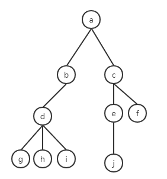
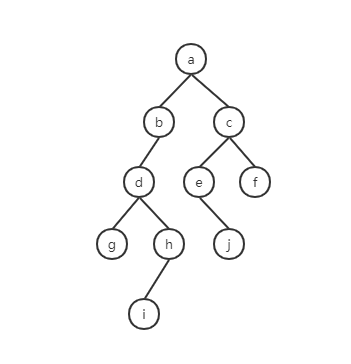
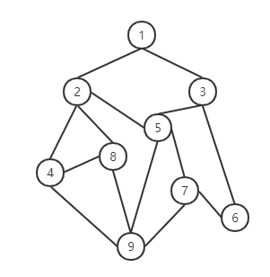
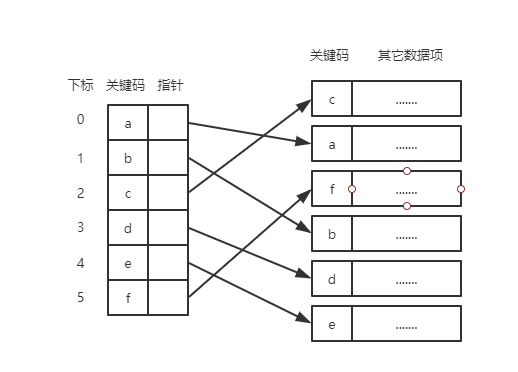
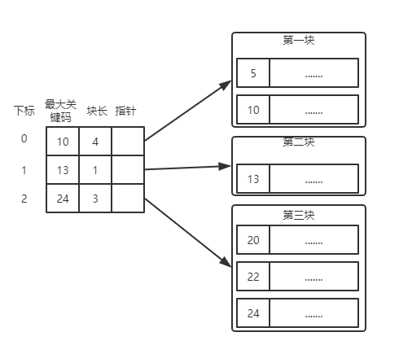
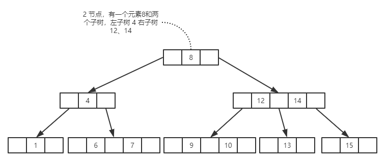
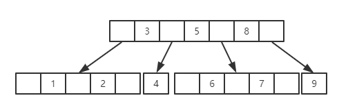
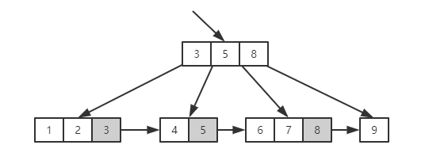

# 数据结构

## 逻辑结构

1. 集合结构

集合结构： 集合结构中的数据元素除了同属于一个集合外，他们之间没有其他关系。

2. 线性结构

线性结构：线性结构中的数据元素之间是一对一的关系。

3. 树状结构

树状结构：树状结构中的数据元素之间存在一种一对多的层次关系。

4. 图形结构

图形结构：图形结构的数据元素是多对多的关系。


## 物理结构（存储结构）

1. 顺序存储结构

顺序存储结构：是把数据元素存放在地址连续的存储单元里，其数据间的逻辑关系和物理关系是一致的。

2. 链式存储结构

链式存储结构：是把数据元素存放在任意的存储单元里，这组存储单元可以是连续的，也可以是不连续的。


# 算法

## 算法的特性

算法具有五个基本特性 输入、输出、有穷性、确定性和可行性。

### 输入、输出

输入和输出特性比较容易理解， 算法具有零个或多个输入。尽管对于绝大多数算 法来说，输入参数都是必要的，但对于个别情况，如打印 “hello wo ld” 这样的代码，不需要任何输入参数，因此算法的输入可以是零个。 算法至少有一个或多个输出， 算法是一定需要输出的，不需要输出，你用这个算法干吗?输出的形式可以是打印输出，也可以是返回一个或多个值等。

### 有穷性

有穷性：指算法在执行有限的步骤之后，自动结束而不会出现无限循环，并且每一个步骤在可接受的时间内完成。

### 确定性

确定性：算法的每一步骤都具有确定的含义，不会出现二义性。

### 可行性

可行性：算法的每一步都必须是可行的，也就是说，每一步都能够通过执行有限次数完成。


## 算法的时间复杂度

> 推到大O阶：
>
> 1. 用常数 1 取代运行时间中的所有加法常数。
> 2. 在修改后的运行次数函数中，只保留最高阶项。
> 3. 如果最高阶项存在且不是1， 则去除与这个项相乘的常数。
>
> 得到的结果就是大 O 项。


### 常数阶

执行次数与问题的大小武馆，执行时间恒定的算法，称为具有 ${O(1)}$ 的时间复杂度，又叫常数阶。

```java
int sum = 0,n = 20;
sum = (1 + n) * n / 2;      // 只执行一次
System.out.println(sum);
```


### 线性阶

下面这段代码，它的循环的时间复杂度是  ${O(n)}$ ,因为循环体重的代码需要执行 n 次。 

```java
int n = 20;
for (int i = 0; i < n; i++) {
    //执行20次
}
```


### 对数阶

下面这段代码，它的时间复杂度是 ${O(logn)}$ 。由于每次 count 乘以 2 之后，就距离 n 更近了一步。由 ${2^n=n}$ 得到 ${x=log_2n}$ 。所以这个循环的时间复杂度为 ${O(logn)}$ 

```java
int n = 20;
int count = 1;
while (count < n) {
    count = count * 2;
}
```


### 平方阶

下面这段代码，它的时间复杂度是 ${O(n^2)}$

```
int n = 20;
for (int i = 0; i < n; i++) {
    for (int j = 0; j < n; j++) {
    	// 执行n * n次
    }
}
```

下面这段代码，它的时间复杂度是 ${O(m \times n)}$ 


## 常见的时间复杂度


| 执行次数函数          | 阶           | 非正式术语 |
| --------------------- | ------------ | ---------- |
| ${12}$                | ${O(1)}$ | 常数阶     |
| ${2n + 3}$            |   ${O(n)}$   | 线性阶     |
| ${3n^2+2n+1}$         |   ${O(n^2)}$ | 平方阶     |
| ${5log_2n+20}$        | ${O(logn)}$  | 对数阶     |
| ${2n + 3nlog_2n +19}$ | ${O(nlogn)}$ | nlogn阶    |
| ${6n^3+2n^2+3n+4}$    | ${O(n^3)}$   | 立方阶     |
| ${2^n}$               | ${O(2^n)}$   | 指数阶     |


常用的时间复杂度所耗费的时间从小到大依次是：

${O(1)<O(logn)<O(n)<O(nlogn)<O(n^2)<O(n^3)<O(2^n)<O(n!)<O(n^n)}$ 


# 线性表

## 线性表的抽象数据类型

ADT  线性表 （List）

Data

线性表的数据对象集合为  {${a_1,a_2,a_3,...,a_n}$} ，每个元素的类型均为DataType。其中，除了第一个元素$a_1$外，每一个元素有且只有一个直接前驱元素，除了最后一个元素$a_n$外，每一个元素有且只有一个直接后继元素。数据元素之间的关系是一对一的关系。


## 线性表的顺序存储结构

线性表的顺序存储结构，指的是用一段地址连续的储存单元依次存储线性表的数据元素

线性表顺序储存结构的优缺点：

* 优点
  * 无须为表示表中元素之间逻辑关系而增加额外的储存空间
  * 可以快速的存取表中任一位置的元素
* 缺点
  * 插入和删除操作需要移动大量元素
  * 当线性表长度变化较大时，难以确定存储空间的容量
  * 造成空间碎片

## 线性表的链式存储结构

节点定义：表示每个数据元素 ${a_i}$ 与其直接后继元素 ${a_{i+1}}$ 之间的逻辑关系，对数据元素 ${a_i}$ 来说，除了存储其本身的信息之外，还需存储一个指示其直接后继的信息。我们把存储数据元素信息的域成为数据域，把存储直接后继位置的域成为指针域。指针域中存储的信息成为指针或链。这两部分信息组成的数据元素 ${a_i}$ 的存储映像，称为节点。

线性表链式存储结构定义：n个节点链结成一个链表，即为线性表(${a_1,a_2,...,a_n}$) 的链式存储结构，因为此链表的每个节点中只包含一个指针域，所以也叫做单链表。


### 单链表


### 循环链表结构


### 双向链表结构


## 栈与队列

### 栈

==**栈是限定仅在表尾进行插入和删除操作的线性表。**==


#### 栈的顺序存储结构


#### 栈的链式存储结构


### 队列

==**队列（queue）是指允许在一段进行插入操作、而另一端进行删除操作的线性表**==


#### 队列的顺序结构

顺序存储队列的不足：假设一个队列有n个元素，则顺序存储的队列需建立一个大于n的数组，并把队列的所有元素储存在数组的前n个单元，数组下标为0的一端是对头。所谓入队列操作，其实就是在队尾追加一个元素，不需要移动任何元素，因此时间复杂度为 ${O(1)}$ 。但是出队列需要把下标为1之后的所有元素向前移动，此时的时间复杂度为 ${O(n)}$。

可有时候想想，为什么要把出队列时的元素全部往前移动呢，如果不去移动队列元素，出队的性能会大大增加。

所以我们可以定义两个指针front、rear标识队列的队头跟队尾，在固定容量为5的数组中，${(a_0,a_1,a_2,a_3,a_4)}$ 。 ${a_0}$和${a_1}$出队列， front指针指向${a_2}$，rear指向${a_4}$。新入一个元素，放到${a_0}$的位置，这时rear指针指向${a_0}$，这样就形成了一个循环队列。

#### 循环队列

通用队列长度公式： (rear-front + queueSize) % queueSize

#### 队列的链式结构


# 串

**串（String）是由零个或多个字符组成的有限序列，又称字符串。**


# 树

**树（Tree）是 n(n ≥ 0) 个节点的有限集。 n=0时称为空树。在任意一棵非空树种：（1）有且仅有一个特定的称为根（Root）的节点；（2)当 n > 1时，其余节点可分为 m （m>0）个互不相交的有限集${T_1,T_2,....,T_m}$，其中每一个集合本身又是一棵树，并且称为根的子树（SubTree）** 


## 节点

**树的节点包含一个数据元素及若干指向其子树的分支。节点拥有的子树数称为节点的度（Degree）。 度为0的节点称为叶节点（Leaf）或终端节点；度不为0的节点称为非终端节点或分支节点。除了根节点之外，分支节点也称为内部节点。树的度是树内各节点的度的最大值。**


## 树的存储结构




## 二叉树

**二叉树（Binary Tree）是 n (n≥0) 个节点的有限集合，该集合或者为空集（称为空二叉树），或者有一个根节点和两棵互不相交的、分别称为根节点的左子树和右子树的二叉树组成。 **

 



### 二叉树的特点

二叉树的特点：

* 每个节点最多有两棵子树，所以二叉树中不存在大于2的节点。注意不是只有两棵子树，而是最多有。没有子树或者有一棵子树都是可以的。
* 左子树和右子树是有顺序的，次序不能任意颠倒。
* 即使树中某节点只有一棵子树，也要区分它是左子树还是右子树。


# 图

**图(Graph) 是由顶点的有穷非空集合和顶点之间的边的集合组成，通常表示为：G(V,E)，其中，G表示一个图，V是图G中顶点的集合，E是图G中边的集合。**





# 查找

## 顺序查找（Sequential Search）

顺序查找又叫线性查找，是最基本的查找技术，它的查找过程是：从表中第一个（或最后一个）记录开始，逐个进行记录的关键字和给定值比较，若某个记录的关键字和给定值相等，则查找成功，找到所查的记录；如果知道最后一个（或第一个）记录，其关键字和给定值比较都不等时，则表中没有所查的记录，查找不成功。


```java
/**
* @param a 顺序数组
* @param key 关键字
* @return 关键字位置
*/
public static int sequentialSearch(int[] a, int key) {
    for (int i = 0, size = a.length; i < size; i++) {
        if(a[i] == key) {
            return i;
        }
    }
    return -1;
}
```


## 有序表查找


### 折半查找（binary search）（二分查找）

```java
/**
* @param a 顺序数组
* @param key 关键字
* @return 关键字位置
*/
public static int binarySearch(int[] a, int key) {
    int low = 1, high = a.length -1, mid;
    while (low < high) {
        mid = (low + high) / 2;
        if (a[mid] > key) {
            high = mid - 1;
        } else if (a[mid] < key) {
            low = mid + 1;
        } else {
            return mid;
        }
    }
    return -1;
}
```

优点：比较次数少。

缺点：要求待查表为有序表，且插入删除困难。

### 插值查找法(Interpolation  Search)

在中文词典中查找”啊“这个单词，我们就会从书本前面开始查，而不是折半查找。

同样的，比如要在取值范围 0 ~ 100之间的1--个元素从小到大均匀分布的数组查找5 ，我们自然会考虑从数组下标较小的开始查找。

折半查找代码的`mid = (low + high) / 2;`, 我们略微灯饰变换后得到

${mid = \frac{low + high}{2} = low + \frac{1}{2} (high - low)}$

也就是mid等于最低下标low加上最高下标high与low的差的一半。算法科学家考虑的就是将这个 ${\frac{1}{2}}$ 改进，改进为下面的计算方案：

${mid = low + \frac{key- a[low]}{a[high]-a[low]}(high-low)}$

将 ${\frac{1}{2}}$ 改成了 ${\frac{key- a[low]}{a[high]-a[low]}}$ 有什么道理呢？

假设有数组a[11] = {0,1,16,24,35,47,59,62,73,88,99} , low = 1,high = 10,则a[low] = 1,a[high] = 99,如果我们要查找key=16时，按照原来的折半查找的做法，我们需要四次才可以得到结构，但是如果用新办法，${\frac{key- a[low]}{a[high]-a[low]}=\frac{16-1}{99-1}\approx0.153}$ ，即${mid\approx1+0.153\times\left(10-1\right)=2.377}$ 取整得到mid = 2，我们字需要2次就可以得到结果了。

```java
/**
* @param a 顺序数组
* @param key 关键字
* @return 关键字位置
*/
public static int interpolationSearch(int[] a, int key) {
    int low = 1, high = a.length -1, mid;
    while (low < high) {
        mid = low + (high - low) * (key - a[low]) / (a[high] - a[low]);
        if (a[mid] > key) {
            high = mid - 1;
        } else if (a[mid] < key) {
            low = mid + 1;
        } else {
            return mid;
        }
    }
    return -1;
}
```

插值查找(Interpolation Search)是根据要查找的关键字 key 与查找表中最大最小记录的关键字比较后的查找方法，其核心就在于插值的计算公式 ${\frac{key- a[low]}{a[high]-a[low]}}$ 。

优点：比较次数更加少。

缺点：要求待查表为分布比较均匀的有序表。


### 斐波那契查找(Fibonacci Search)

斐波那契查找（Fibonacci Search）是利用了黄金分割原理来实现的。

 斐波那契数列，又称黄金分割数列，指的是这样一个数列：${1、1、2、3、5、8、13、21、····}$，在数学上，斐波那契被递归方法如下定义：${F(1)=1，F(2)=1，F(n)=f(n-1)+F(n-2) （n>=2）}$。该数列越往后相邻的两个数的比值越趋向于黄金比例值（**0.618**）。

```java
public static void main(String[] args) {

    int[] data = {1, 5, 15, 22, 25, 31, 39, 42, 47, 49, 59, 68, 88};
    int search = 39;
    int position = fibonacciSearch(data,search);
    System.out.println("值"+search+"的元素位置为："+position)
}

public static int fibonacciSearch(int[] data, int key) {
    int low = 0;
    int high = data.length - 1;
    int mid = 0;
    //斐波那契分割数值下标
    int k = 0;
    //序列元素个数
    int i = 0;
    // 获取斐波那契数列
    int[] f = fibonacci(20);
    //获取斐波那契分割数值下标
    while (data.length > f[k] - 1) {
        k++;
    }
    //创建临时数组
    int[] temp = new int[f[k] - 1];
    for (int j = 0; j < data.length; j++) {
        temp[j] = data[j];
    }
    //序列补充至f[k]个元素
    //补充的元素值为最后一个元素的值
    for (i = data.length; i < f[k] - 1; i++) {
        temp[i] = temp[high];
    }
    for (int j : temp) {
        System.out.print(j + " ");
    }
    while (low <= high) {
        // low：起始位置
        // 前半部分有f[k-1]个元素，由于下标从0开始
        // 则-1 获取 黄金分割位置元素的下标
        mid = low + f[k - 1] - 1;
        if (temp[mid] > key) {
            // 查找前半部分，高位指针移动
            high = mid - 1;
            // （全部元素） = （前半部分）+（后半部分）
            //   f[k]  =  f[k-1] + f[k-1]
            // 因为前半部分有f[k-1]个元素，所以 k = k-1
            k = k - 1;
        } else if (temp[mid] < key) {
            // 查找后半部分，高位指针移动
            low = mid + 1;
            // （全部元素） = （前半部分）+（后半部分）
            //   f[k]  =  f[k-1] + f[k-1]
            // 因为后半部分有f[k-1]个元素，所以 k = k-2
            k = k - 2;
        } else {
            //如果为真则找到相应的位置
            if (mid <= high) {
                return mid;
            } else {
                //出现这种情况是查找到补充的元素
                //而补充的元素与high位置的元素一样
                return high;
            }
        }
    }
    return -1;
}

private static int[] fibonacci(int size) {
    int arr[] = new int[size];
    arr[0] = arr[1] = 1;
    for (int i = 2; i < arr.length; i++) {
        arr[i] = arr[i - 1] + arr[i - 2];
    }
    return arr;
}
```

优点：

* 斐波那契查找只是简单的加减法，在海量数据查找过程中，可能会影响查找效率
* 平均性能要优于折半查找

缺点：

* 最坏情况下，key值始终都处于左侧长半区在查找，那效率要低于折半查找。


### 总结

三种查找法本质上是分割点的选择不同，各有优劣，实际开发时可根据数据的特点综合考虑作出选择。


## 线性索引查找

很多数据集可能增长非常快，要保证数据某个关键字有序，其时间代价是非常高昂的，所以这种把数据通常都是按先后顺序存储。

对于这样的查找表，我们如何能够快速查找到需要的数据呢？办法就是——索引。

数据结构的最终目的就是提高数据的处理速度，索引是为了加快查找速度而设计的一种数据结构。**索引就是把一个关键字与它对应的记录相关联的过程**，一个索引由若干个索引构成，每个索引项至少应包含关键字和其对应的记录在存储器中的位置等信息。索引技术是组织大型数据库以及磁盘文件的一种重要技术。

索引按照结构可以分为线性索引、树形索引和多级索引。

**所谓线性索引就是将索引项集合组织为线性结构，也称索引表。**重点介绍三种线性索引：稠密索引、分块索引和倒排索引。


### 稠密索引

稠密索引是指在线性索引中，讲数据集中的每个记录对应一个索引项。对于这个索引再说，索引项一定是按照关键码有序的排列。




### 分块索引

分块有序，是把数据集的记录分成了若干块，并且这些块需要满足两个条件：

* 块内无序，即每一块内的记录不要求有序。块内有序需要付出大量的时间、空间的代价，因此我们不要求块内有序。
* 块内有序，要求第二块所有记录的关键字均要大于第一块中的额所有记录关键字，第三块均要大于第二块的。因为只有块间有序，才有可能在查找时带来效率。



### 倒排索引

最基础的搜索技术——倒排索引。

现有两个句子，编号 1 和 2 。

1. Books and friends should be few but good.
2. A good book is a good friend.

我们忽略大小写、复数的差异，可以整理出一张单词表

| 英文单词 | 文章编号 |
| -------- | -------- |
| a        | 2        |
| and      | 1        |
| be       | 1        |
| book     | 1,2      |
| but      | 1        |
| few      | 1        |
| friend   | 1,2      |
| good     | 1,2      |
| is       | 2        |
| should   | 1        |

在这里这样单词表就是索引表，索引项的通用结构是：

* 次关键码，例如上面的“英文单词”
* 记录号表，例如上面的“文章编号”

**其中记录表储存具有相同次关键字的所有记录的记录号（可以是指向记录的指针或者是该记录的主关键字）。这样的索引就是倒排索引** 

优点：查找记录快

缺点：记录号不定长、维护困难


## 二叉排序树（Binary Sort Tree）

二叉排序树（Binary Sort Tree），又称二叉查找树。它或者是一棵空树，或者是具有下列性质的二叉树：

* 若它的左子树不空，则左子树上所有节点的值均小于它的根节点的值；
* 若它的右子树不空，则右子树上所有节点的值均大于它的根节点的值；
* 它的左、右子树也分别为二叉排序树。


## 平衡二叉树(Self-Balancing Binary Search Tree)

平衡二叉树是一种二叉排序树（AVL树），其中没一个节点的左子树和右子树的高度知多等于1。我们将二叉树上节点的左子树深度减去右子树深度的值称为平衡因子BF（Balance Factor）


## 多路查找树（B树）

多路查找树（muitl-way search tree），其每一个节点的孩子书可以多于两个，且每一个节点处可以存储多个元素。它的4 种特殊形式： 2-3 树、2-3-4 树、B 树、B + 树。


### 2-3 树

2-3树是这样一棵多路查找树：其中的每一个节点都具有两个孩子（我们称它为 2 节点）或三个孩子（我们称它为 3 节点）。





### 2-3-4 树

2-3-4 树其实就是 2-3 树的概念扩展，包括了 4 节点的使用。一个 4 节点包含小中大三个元素和四个孩子（或没有孩子）。


### B 树

B 树是一种平衡的多路查找树， 2-3 树和 2-3-4 树都是 B 树的特例。节点最大的孩子数目称为 B 树的阶（order）

一个 m 阶的 B 树具有如下属性：

* 如果根节点不是叶节点，则其至少有两棵子树
* 每一个非根的分支节点都有 k-1 个元素和 k 个孩子， 其中 ${[m/2] \leq k \leq m}$ 。每一个叶子节点 n 都有 k-1 个元素，其中  ${[m/2] \leq k \leq m}$ 
* 所有叶子节点都位于同一层次




### B+ 树

B+ 树是 B 树的一种变形。

一棵 m 阶的 B+ 树和 m 阶的 B 树的差异在于：

* 有 n 棵子树的节点中包含有 n 个关键字
* 所有的叶子节点包含全部关键字的信息，及指向含这些关键字记录的指针，叶子节点本身依关键字的大小自小而大顺序链接
* 所有分支节点可以看成是索引，节点中仅含有其子树中的最大（或最小）关键字。





## 散列表查找（哈希表）

散列技术是在记录的储存位置和它的关键字之间建立一个确定的对应关系 f，是使得每个关键字 `key` 对应一个储存位置 `f(key)` 。查找时，根据这个确定的对应关系找到给定值 `key` 的映射 `f(key)` ，若查找集合中存在这个记录，则必定在 `f(key)` 的位置上。

我们把这种对应关系 f 称为散列函数，又称为哈希（Hash）函数。按照这个思想，采用散列技术奖记录储存在一块连续的储存空间中，这块连续存储空间称为散列表或哈希表（Hash table）。

**散列技术最适合的求解问题是查找与给定值相等的记录。**


# 排序

其中排序算法，按照算法的额复杂度氛围两大类，冒泡排序、简单选择排序、直接插入排序属于简单算法，而希尔排序、堆排序、并归排序、快速排序属于改进算法。

## 冒泡排序

**冒泡排序（Bubble Sort）是一种交换排序，它的基本思想是：两两比较相邻记录的关键字，如果反序则交换，知道没有反序的记录为止。** 

```java
// 标准冒泡
// 所有的字段都记性比较
public static void main(String[] args) {
    int[] arr = {8, 9, 3, 7, 4, 5, 6, 3, 2, 1};
    int len = arr.length;
    for (int i = 0; i < len; i++) {
        for (int j = 0; j < len - 1; j++) {
            if (arr[j] > arr[j + 1]) {
                int temp = arr[j];
                arr[j] = arr[j + 1];
                arr[j + 1] = temp;
            }
        }
    }
    System.out.println(Arrays.toString(arr));
}
```


```java
// 冒泡优化
// 增加判断比较，有序的数组直接返回
// 减少循环次数 len-1-i 冒泡到最后的肯定是最大的，所以不需要再次比较
public static void main(String[] args) {
    // int[] arr = {8, 9, 3, 7, 4, 5, 6, 3, 2, 1};
    int[] arr = {1,2,3,4,5,6,7,8,9};
    int len = arr.length;
    int mod = 0;
    for (int i = 0; i < len; i++) {
        boolean flag = false;
        for (int j = 0; j < len - 1 -i; j++) {
            if (arr[j] > arr[j + 1]) {
                int temp = arr[j];
                arr[j] = arr[j + 1];
                arr[j + 1] = temp;
                flag = true;
            }
            mod++;
        }
        if (!flag) break;
    }
    System.out.println(mod);
    System.out.println(Arrays.toString(arr));
}
```


## 选择排序

选择排序算法的实现思路有点类似插入排序，也分已排序区间和未排序区间。但是选择排序每次会从未排序区间中找到最小的元素，将其放到已排序区间的末尾。

```java
public static void main(String[] args) {
    int[] arr = {7, 5, 3, 8, 5, 2, 2, 1, 4, 9, 5, 1, 2, 9, 5};
    for (int i = 0; i < arr.length - 1; i++) {
        int minIndex = i; // 用来记录最小值的索引位置，默认值为i
        for (int j = i + 1; j < arr.length; j++) {
            if (arr[j] < arr[minIndex]) {
                minIndex = j; // 遍历 i+1~length 的值，找到其中最小值的位置
            }
        }
        // 交换当前索引 i 和最小值索引 minIndex 两处的值
        if (i != minIndex) {
            int temp = arr[i];
            arr[i] = arr[minIndex];
            arr[minIndex] = temp;
        }
        // 执行完一次循环，当前索引 i 处的值为最小值，直到循环结束即可完成排序
    }
    System.out.println(Arrays.toString(arr));
}
```


## 插入排序

思想：一个有序的数组，插入一条数据，只需要遍历，比较大小之后，插入对应位置。

如数组{4,5,6, 3,1,2}

首先，我们将数组中的数据分为两个区间，已排序区间和未排序区间。初始已排序区间只有一个元素，就是数组的第一个元素。插入算法的核心思想是取未排序区间中的元素，在已排序区间中找到合适的插入位置将其插入，并保证已排序区间数据一直有序。重复这个过程，直到未排序区间中元素为空，算法结束。

```java
public class Test {
    static int[] array = {3, 2, 5, 7, 9, 1};
    static int len = array.length;
    public static void main(String[] args) {
        for (int i = 1; i < len; i++) {
            int value = array[i];
            int j = i - 1;

            for (; j >= 0; j--) {
                if (array[j] > value) {
                    array[j + 1] = array[j];
                } else {
                    break;
                }
            }
            array[j + 1] = value;
        }
        System.out.println(Arrays.toString(array));
    }
}
```


