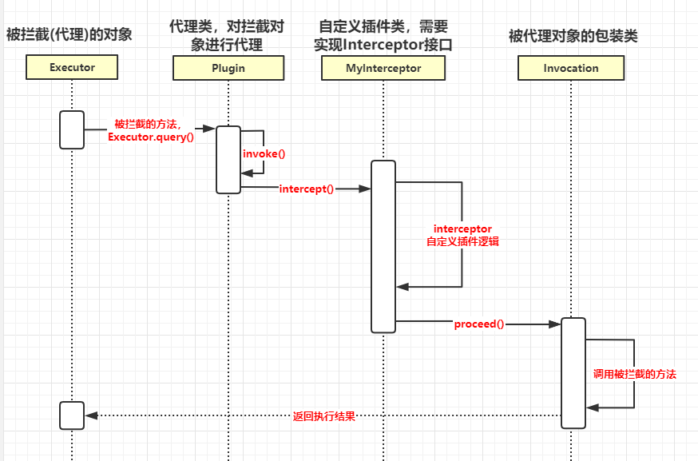

# mybatis 源码解读


## mybatis 使用步骤


参照如下代码：

```java
@Test
    public void testStatement() throws IOException {
        // 1. 读取配置文件
        InputStream inputStream = Resources.getResourceAsStream("mybatis-config.xml");
        SqlSessionFactory sqlSessionFactory = new SqlSessionFactoryBuilder().build(inputStream);
		// 2. 创建回话
        SqlSession session = sqlSessionFactory.openSession();
        try {
            // 3. 获取mapper
            BlogMapper mapper = session.getMapper(BlogMapper.class);
            // 4. 执行sql返回结果
            Blog blog = mapper.selectBlogById(1);
            System.out.println(blog);
        } finally {
            session.close();
        }
    }
```


## 配置解析过程源码解读


## 创建会话


## 获取代理对象


## 执行sql返回结果


## mybatis 核心对象


| 对象             | 相关对象                                                     | 作用                                                         |
| :--------------- | ------------------------------------------------------------ | ------------------------------------------------------------ |
| Configuration    | MapperRegistry<br />TypeAliasRegistry<br />TypeHandlerRegistry | 包含mybatis所有的配置信息                                    |
| SqlSession       | SqlSessionFactory<br />DefaultSqlSession                     | 对操作数据库的增删改查api进行了封装，提供给应用层使用        |
| Executor         | BaseExecutor<br />SimpleExecutor<br />BatchExecutor<br />ReuseExecutor | MyBatis 执行器，是mybatis调度的核心，负责sql语句的生成和查询缓存的维护 |
| StatementHandler | BaseStatementHandler<br />SimpleStatementHandler<br />PreparedStatementHandler<br />CallableStatementHandler | 封装了JDBC statement 操作，负责对对jdbc statement的操作，如设置参数、将statement结果集转换成list集合 |
| ParameterHandler | DefaultParameterHandler                                      | 把用户传递的参数转换成jdbc statement所需要的参数             |
| ResultSetHandler | DefaultResultSetHandler                                      | 把jdbc 返回的ResultSet 结果集对象转换成List类型的集合        |
| MapperProxy      | MapperProxyFactory                                           | 代理对象，用户代理Mapper接口方法                             |
| MappedStatement  | SqlSource<br />BoundSql                                      | MappedStatement 维护了一条update、select节点的封装，包括sql信息，入参信息，出参信息 |


## mybatis 插件机制


### 案例代码：实现输出执行的sql语句以及执行时间

```java
import org.apache.ibatis.executor.statement.StatementHandler;
import org.apache.ibatis.mapping.BoundSql;
import org.apache.ibatis.plugin.*;
import org.apache.ibatis.session.ResultHandler;

import java.sql.Statement;
import java.util.Properties;

@Intercepts(@Signature(type = StatementHandler.class, method = "query", args = {Statement.class, ResultHandler.class}))
public class SqlLogInterceptor implements Interceptor {
    @Override
    public Object intercept(Invocation invocation) throws Throwable {
        StatementHandler  statementHandler = (StatementHandler ) invocation.getTarget();
        BoundSql boundSql = statementHandler.getBoundSql();
        System.out.println(boundSql.getSql());
        long startTime = System.currentTimeMillis();
        Object proceed = invocation.proceed();
        long endTime = System.currentTimeMillis();
        System.out.println("SQL执行耗时：" + (endTime-startTime) +"ms");
        return proceed;
    }

    @Override
    public Object plugin(Object target) {
        return Plugin.wrap(target, this);
    }

    @Override
    public void setProperties(Properties properties) {
    }
}
```


mybatis-congfig.xml添加插件信息

```xml
<plugins>
    <plugin interceptor="com.demo.SqlLogInterceptor"></plugin>
</plugins>
```


### 插件可以拦截对象以及方法


<table>
  <tr>
    <th>对象</th>
    <th>描述</th>
    <th>可拦截的方法</th>
    <th>方法作用</th>
  </tr>
  <tr>
    <td rowspan="8">Executor</td>
    <td rowspan="8">上层的对象，SQL执行全过程<br>包括组装参数，组装结果集返<br>回和执行SQL过程</td>
    <td>update</td>
    <td>执行update、insert、delete操作</td>
  </tr>
  <tr>
    <td>query</td>
    <td>执行query操作</td>
  </tr>
  <tr>
    <td>flushStatement</td>
    <td>在commit的适合自动调用，SimpleExecutor、<br>ReuseExecutor、BatchExecutor处理不同</td>
  </tr>
  <tr>
    <td>commit</td>
    <td>提交事务</td>
  </tr>
  <tr>
    <td>rollback</td>
    <td>事务回滚</td>
  </tr>
  <tr>
    <td>getTransaction</td>
    <td>获取事务 </td>
  </tr>
  <tr>
    <td>close</td>
    <td>结束（关闭）事务</td>
  </tr>
  <tr>
    <td>isClose</td>
    <td>判断事务是否关闭</td>
  </tr>
  <tr>
    <td rowspan="5">StatementHandler</td>
    <td rowspan="5">执行sql的过程，最常用的拦截对象</td>
    <td>prepare</td>
    <td>sql 预编译</td>
  </tr>
  <tr>
    <td>parameterize</td>
    <td>设置参数</td>
  </tr>
  <tr>
    <td>batch</td>
    <td>批处理</td>
  </tr>
  <tr>
    <td>update</td>
    <td>增删改操作</td>
  </tr>
  <tr>
    <td>query</td>
    <td>查询操作</td>
  </tr>
  <tr>
    <td rowspan="2">ParameterHandler</td>
    <td rowspan="2">SQL参数组装的过程</td>
    <td>getParameterObject</td>
    <td>获取参数</td>
  </tr>
  <tr>
    <td>setParameters</td>
    <td>设置参数</td>
  </tr>
  <tr>
    <td rowspan="2">ResultSetHandler</td>
    <td rowspan="2">结果的组装</td>
    <td>handlerResultSets</td>
    <td>处理结果集</td>
  </tr>
  <tr>
    <td>handlerOutputParameters</td>
    <td>处理存储过程出参</td>
  </tr>
</table>


### 插件调用流程




### 插件机制核心对象


| 对象           | 作用                                                    |
| -------------- | ------------------------------------------------------- |
| Interceptor    | 自定义插件需要实现的接口，实现三个方法                  |
| InterceptChain | 配置的插件解析后会保存在Configuration的InterceptChain中 |
| Plugin         | 用来创建代理对象，包装四大对象                          |
| Invocation     | 对被代理类进行包装，可以调用proceed()调用到被拦截的方法 |


### 应用场景分析

| 作用                     | 实现方式                                                     |
| ------------------------ | ------------------------------------------------------------ |
| 水平分表                 | 对query、update方法进行拦截<br />在接口上添加注解，通过反射获取接口注解，根据注解上配置的参数进行分表<br />修改原来的sql，例如id取模，按月分表 |
| 脱敏                     | 获得返回结果进行脱敏处理                                     |
| 数据过滤、<br />租户模式 | 对query方法进行拦截<br />在方法上添加注解，根据注解配置、用户信息，在sql上加上权限过滤条件 |

