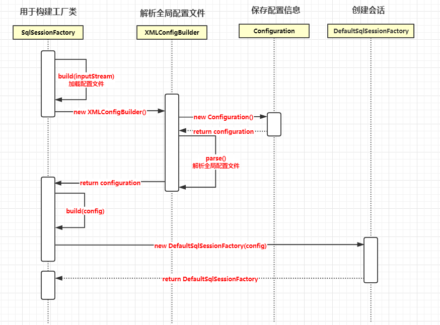
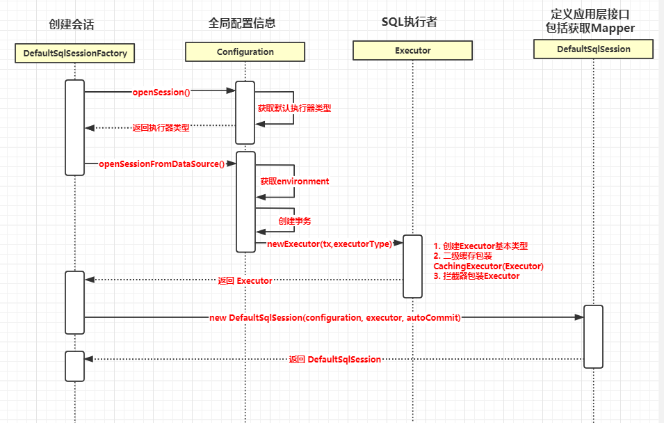
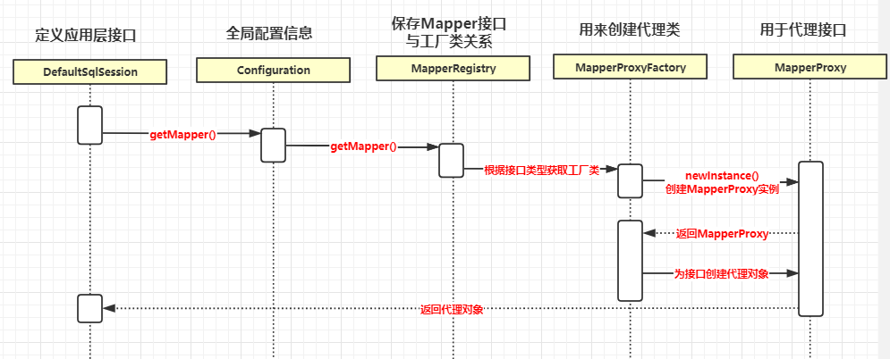
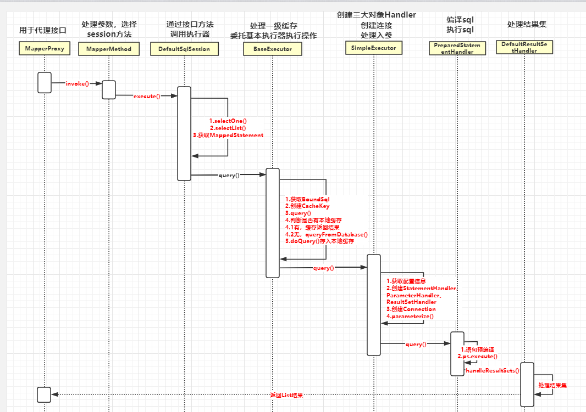

# mybatis 源码解读


## mybatis 使用步骤


参照如下代码：

```java
@Test
    public void testStatement() throws IOException {
        // 1. 读取配置文件
        InputStream inputStream = Resources.getResourceAsStream("mybatis-config.xml");
        SqlSessionFactory sqlSessionFactory = new SqlSessionFactoryBuilder().build(inputStream);
		// 2. 创建回话
        SqlSession session = sqlSessionFactory.openSession();
        try {
            // 3. 获取mapper
            BlogMapper mapper = session.getMapper(BlogMapper.class);
            // 4. 执行sql返回结果
            Blog blog = mapper.selectBlogById(1);
            System.out.println(blog);
        } finally {
            session.close();
        }
    }
```


## 配置解析过程源码解读





## 创建会话





## 获取代理对象




## 执行sql返回结果





## mybatis 核心对象


| 对象          | 相关对象                                                     | 作用                                                         |
| :------------ | ------------------------------------------------------------ | ------------------------------------------------------------ |
| Configuration | MapperRegistry<br />TypeAliasRegistry<br />TypeHandlerRegistry | 包含mybatis所有的配置信息                                    |
| SqlSession    | SqlSessionFactory<br />DefaultSqlSession                     | 对操作数据库的增删改查api进行了封装，提供给应用层使用        |
| Executor      | BaseExecutor<br />SimpleExecutor<br />BatchExecutor<br />ReuseExecutor | MyBatis 执行器，是mybatis调度的核心，负责sql语句的生成和查询缓存的维护 |
|               |                                                              |                                                              |
|               |                                                              |                                                              |
|               |                                                              |                                                              |
|               |                                                              |                                                              |
|               |                                                              |                                                              |


