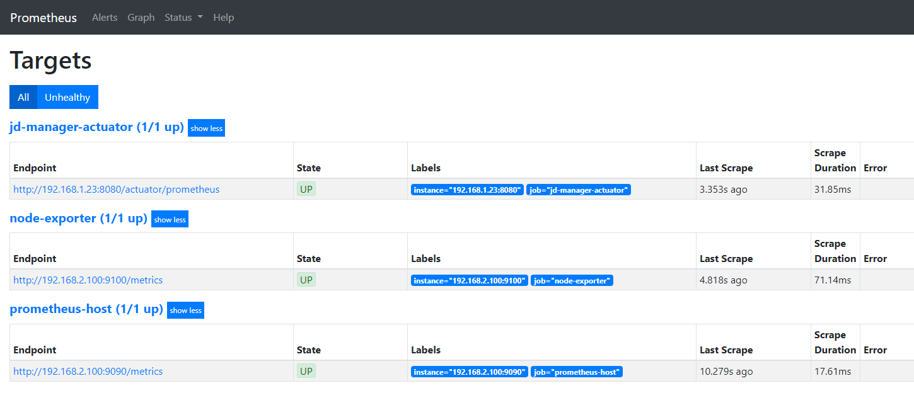
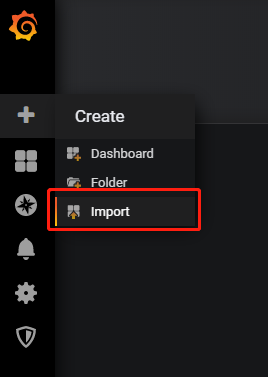
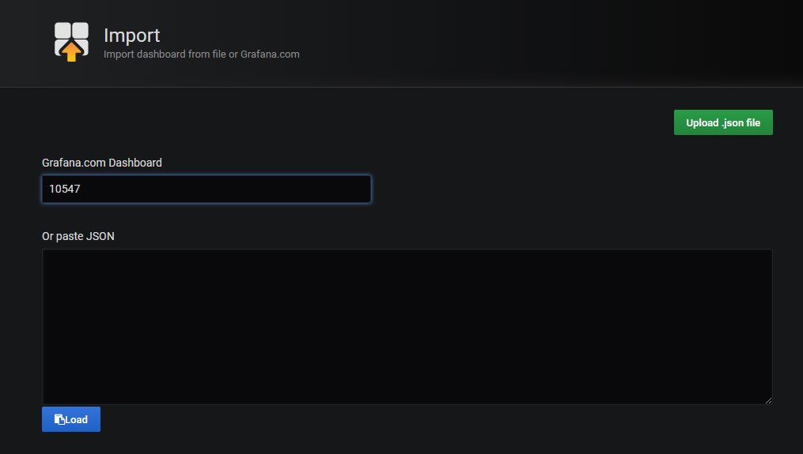
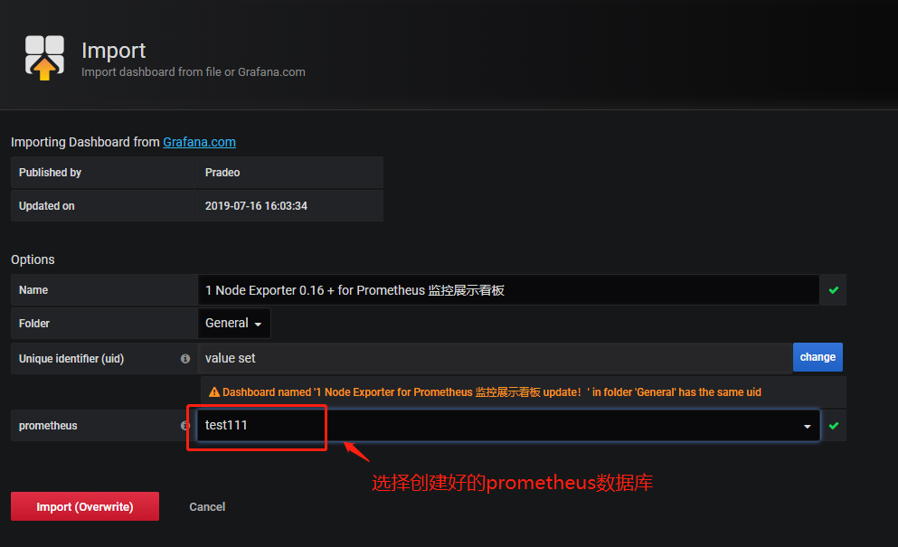
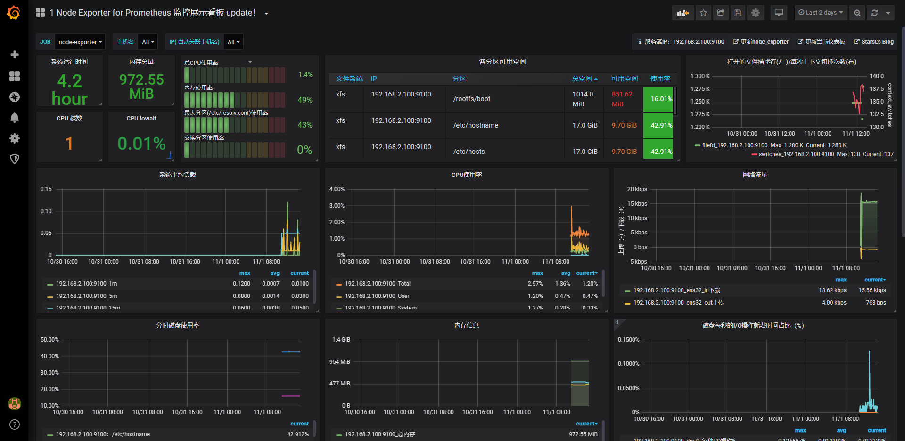
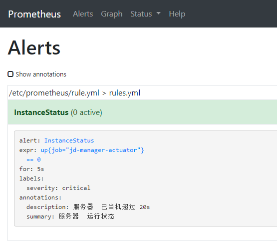
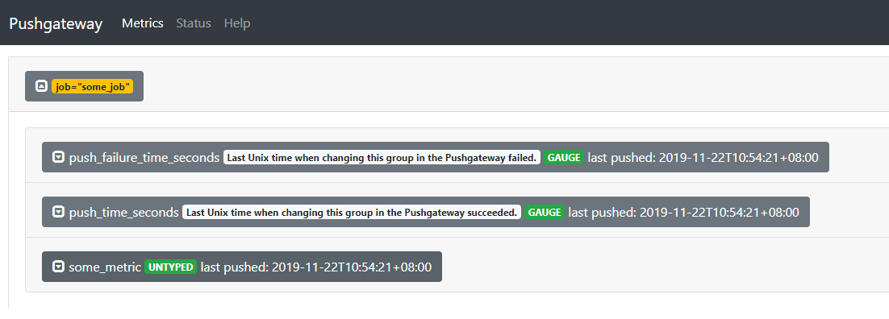

# 基于docker 搭建 promtheus 监控相关服务


## 搭建 node-exporter 组件

`node-export` 组件是监控服务器硬件信息，cpu、内存、磁盘、温度等。

1. 创建 `node-exporter` 目录

2. 在 `node-exporter` 目录下，创建 `Dockerfile` 

   ```dockerfile
   FROM quay.io/prometheus/node-exporter
   MAINTAINER "shenguangyang"<shenguangyang@jdimage.cn>
   ```
   
3. 在node-exporter目录下，创建 `start.sh` 文件 

   ```shell
   docker stop node-exporter
   docker rm node-exporter
   docker rmi node-exporter
   docker build -t node-exporter .
   
   docker run --privileged=true -dt -p 9100:9100 \
     --net="host" \
     --pid="host" \
     -v "/:/host:ro,rslave" \
     -v /etc/timezone:/etc/timezone  \
     -v /etc/localtime:/etc/localtime \
     --name node-exporter node-exporter \
     --path.rootfs /host
   ```

   

4. root账号运行， `sh start.sh` 

5. 浏览器打开 [http://192.168.2.100:9100/metrics](http://192.168.2.100:9100/metrics) ，显示如下说明搭建成功。

   


## 搭建 prometheus server

1. 创建 `prometheus ` 文件夹

2. 在 `prometheus ` 文件夹下，创建 `Dockerfile` 

   ```dockerfile
   FROM docker.io/prom/prometheus
   MAINTAINER "shenguangyang"<shenguangyang@jdimage.cn>
   ```
   
3. 创建 `prometheus.yml` 

   ```yml
   # 全局设置
   global:
     scrape_interval:     15s # 15s 执行一次
     evaluation_interval: 15s # 15s 执行一次
   
   # 监控配置
   scrape_configs:
     - job_name: 'prometheus-host' 
       static_configs:
       - targets: ['192.168.2.100:9090']
   
     - job_name: 'node-exporter' # 目标主机
       static_configs:
       - targets: ['192.168.2.100:9100']
   
   ```

   

4. 创建 `prometheus` 启动文件  `start.sh` 

   ```shell
   docker stop prometheus
   docker rm prometheus
   docker rmi prometheus
   docker build -t prometheus .
   docker run --privileged=true  -d  -p 9090:9090 \
    -v /etc/timezone:/etc/timezone  \
    -v /etc/localtime:/etc/localtime \
    -v "$(pwd)"/prometheus.yml:/etc/prometheus/prometheus.yml \
    -v "$(pwd)"/rule.yml:/etc/prometheus/rule.yml \
    --name prometheus prometheus --config.file=/etc/prometheus/prometheus.yml \
    --web.enable-lifecycle \
   ```

   

5. root账号运行， `sh start.sh` 

6. 浏览器打开，[http://192.168.2.100:9090/targets](http://192.168.2.100:9090/targets) 显示如下说明搭建成功

   


## 搭建 grafana 图形化展示组件


1. 创建 `grafana` 文件夹 

2. 在 `grafana` 文件夹下创建 `Dockerfile` 

   ```dockerfile
   FROM docker.io/grafana/grafana
   MAINTAINER "shenguangyang"<shenguangyang@jdimage.cn>
   ```
   
3. 在 `grafana` 文件夹，创建 grafana-storage 文件夹，设置 777 权限

   ```shell
   mkdir grafana-storage
   chmod 777 -R grafana-storage
   ```

4. 在 `grafana` 文件夹，创建 `start.sh` 启动文件 

   ```shell
   docker stop grafana
   docker rm grafana
   docker rmi grafana
   docker build -t grafana .
   
   docker run --privileged=true  -dt -p 3000:3000 \
    -v /etc/timezone:/etc/timezone  \
    -v /etc/localtime:/etc/localtime \
    -v "$(pwd)"/grafana-storage:/var/lib/grafana \
    --name grafana grafana
   ```

5. 运行 `start.sh` 启动文件 

6. 浏览器打开 [http://192.168.2.100:3000/](http://192.168.2.100:3000/) 初始默认密码admin、admin

7. 在 [https://grafana.com/grafana/dashboards](https://grafana.com/grafana/dashboards) 查找需要展示图形模板，记录id

8. 在如图操作

   1. 点击如图所示按钮

      

   2. 把现在好的模板id复制过来

      

   3.  选择数据库

      

   4. 看到如下如展示说明成功

      


## 搭建 alertmanager 组件（实现邮件报警）

主要流程：搭建alertmanager组件、配置prometheus、配置报警规则

1. 创建 `alertmanager ` 文件夹

2. 在 `alertmanager ` 文件夹下创建 `Dockerfile` 

   ```dockerfile
   FROM docker.io/prom/prometheus
   MAINTAINER "shenguangyang"<shenguangyang@jdimage.cn>
   ```
   
3. 在 `alertmanager ` 文件夹下创建 `alertmanager.yml` 

   ```yml
   global:
     smtp_smarthost: 'smtp.163.com:25'
     smtp_from: '....@163.com'	# 发送人邮箱
     smtp_auth_username: '15268183286@163.com' # 发送人邮箱
     smtp_auth_password: '0UdGZlNvjDVMxKjX' # 这里是邮箱的授权密码，不是登录密码
     smtp_require_tls: false
   templates:
     - 'etc/alertmanager/template/email.tmpl'
   route:
     group_by: ['alertname', 'cluster', 'service']
     group_wait: 30s
     group_interval: 5m
     repeat_interval: 10m
     receiver: default-receiver
   receivers:
   - name: 'default-receiver'
     email_configs:
     - to: '434539550@qq.com' # 接收人
       headers: { Subject: "[WARN] 报警邮件 test" }
   ```

4. 在 `alertmanager ` 文件夹下创建 `template` 文件夹

5. 在 `template` 文件夹下创建 `email.tmpl` 

   ```go
   {{ define "wechat.default.message" }}
   {{ range $i, $alert :=.Alerts }}
   ========监控报警==========
   告警状态：{{   .Status }}
   告警级别：{{ $alert.Labels.severity }}
   告警类型：{{ $alert.Labels.alertname }}
   告警应用：{{ $alert.Annotations.summary }}
   告警主机：{{ $alert.Labels.instance }}
   告警详情：{{ $alert.Annotations.description }}
   触发阀值：{{ $alert.Annotations.value }}
   告警时间：{{ $alert.StartsAt.Format "2006-01-02 15:04:05" }}
   ========end=============
   {{ end }}
   {{ end }}
   ```

6. 在 `alertmanager ` 文件夹下创建 `start.sh` 

   ```shell
   docker stop alertmanager
   docker rm alertmanager
   docker rmi alertmanager
   docker build -t alertmanager .
   docker run --privileged=true -dt -p 9093:9093 \
    -v /etc/timezone:/etc/timezone  \
    -v /etc/localtime:/etc/localtime \
    -v "$(pwd)"/alertmanager.yml:/etc/alertmanager/alertmanager.yml \
    -v "$(pwd)"/template:/etc/alertmanager/template \
    --name alertmanager alertmanager  \
    --config.file=/etc/alertmanager/alertmanager.yml \
   ```

7. 运行 `sh start.sh`

8. 以下需要配置 **prometheus server** ，所有操作均在`prometheus` 文件下操作

9. 在 `prometheus.yml` 增加以下配置

   ```yml
   # Alertmanager configuration
   alerting:
     alertmanagers:
     - static_configs:
       - targets: ['192.168.2.100:9093']
   
   # Load rules once and periodically evaluate them according to the global 'evaluation_interval'.
   rule_files:
     - "/etc/prometheus/rule.yml"
   ```
   
10. 在 `prometheus` 文件夹下创建 `rule.yml`

    ```yml
    groups:
    - name: rules.yml
      rules:
          - alert: InstanceStatus # alert 名字
            expr: up{job="jd-manager-actuator"} == 0 # 判断条件
            for: 5s # 条件保持 10s 才会发出 alter
            labels: # 设置 alert 的标签
              severity: "critical"
            annotations:  # alert 的其他标签，但不用于标识 alert
              description: "jd-manager-actuator 服务器 已当机超过 20s"
              summary: "jd-manager-actuator 服务器 运行状态"
    ```

11. 重新启动  **prometheus server** 

12. 浏览器打开 [http://192.168.2.100:9090/alerts](http://192.168.2.100:9090/alerts) 出现如下图所示说明配置成功

    

13. 服务挂掉，可以正常收到邮件。


## 搭建 push-gateway 组件 

`push-gateway` 组件是通过http接口接受其他业务统计信息，暂存到本地，prometheus 在定时获取数据。

1. 创建 `push-gateway` 目录

2. 在 `push-gateway` 目录下，创建 `Dockerfile` 

   ```dockerfile
   FROM docker.io/prom/pushgateway
   MAINTAINER "shenguangyang"<shenguangyang@jdimage.cn>
   ```
```

3. 在 `push-gateway` 目录下，创建 `start.sh` 文件 

   ```shell
   docker stop push-gateway
   docker rm push-gateway
   docker rmi push-gateway
   docker build -t push-gateway .
   docker run --privileged=true -dt -p 9091:9091 \
     --name push-gateway  push-gateway \
```

4. root账号运行， `sh start.sh` 

5. 通过 **bash **上发数据命令 `echo "some_metric 3.14" | curl --data-binary @- http://192.168.2.100:9091/metrics/job/some_job` 

6. 浏览器打开 [http://192.168.2.100:9091](http://192.168.2.100:9100) ，显示如下说明搭建成功。

   


## 搭建 loki 日志组件

`loki` 是 `grafana` 推出的日志聚合系统。包含组件：

- `loki` 是主服务器，负责存储日志和处理查询。
- `promtail` 是代理服务，负责收集日志并将其发送给Loki。


### 搭建 loki 服务

1. 创建 `loki` 目录

2. 在 `loki` 目录下, 设置 777 权限

3. 在 `loki` 目录下，创建 `Dockerfile` 

   ```dockerfile
   FROM docker.io/grafana/loki
   MAINTAINER "shenguangyang"<shenguangyang@jdimage.cn>
   ```

4. 在 `loki` 目录下，创建 `loki-local-config.yaml` 

   ```yaml
   auth_enabled: false
   
   server:
     http_listen_port: 3100
   
   ingester:
     lifecycler:
       address: 127.0.0.1
       ring:
         kvstore:
           store: inmemory
         replication_factor: 1
       final_sleep: 0s
     chunk_idle_period: 5m
     chunk_retain_period: 30s
     max_transfer_retries: 1
   
   schema_config:
     configs:
     - from: 2019-10-10
       store: boltdb
       object_store: filesystem
       schema: v9
       index:
         prefix: index_
         period: 168h
   
   storage_config:
     boltdb:
       directory: /tmp/loki/index
   
     filesystem:
       directory: /tmp/loki/chunks
       
   limits_config:
     enforce_metric_name: false
     reject_old_samples: true
     reject_old_samples_max_age: 168h
   
   chunk_store_config:
     max_look_back_period: 0
   
   table_manager:
     chunk_tables_provisioning:
       inactive_read_throughput: 0
       inactive_write_throughput: 0
       provisioned_read_throughput: 0
       provisioned_write_throughput: 0
     index_tables_provisioning:
       inactive_read_throughput: 0
       inactive_write_throughput: 0
       provisioned_read_throughput: 0
       provisioned_write_throughput: 0
     retention_deletes_enabled: false
     retention_period: 0
   
   ```

5. 在 `loki` 目录下，创建 `start.sh` 文件 

   ```shell
   docker stop loki
   docker rm loki
   docker rmi loki
   docker build -t loki .
   docker run --privileged=true -dt -p 3100:3100 \
    -v $(pwd)/loki-local-config.yaml:/etc/loki/local-config.yaml \
    -v $(pwd)/loki-storage:/tmp/loki \
    --name loki loki \
    -config.file=/etc/loki/local-config.yaml
   ```

6. root账号运行， `sh start.sh` 

7. 新增 `push.sh` 脚本，增加执行权限`chmod +x push.sh`，脚本代码如下（网址信息对应修改）

   ```shell
   #!/bin/bash
   NOW=$(date -u +%FT%TZ)
   LINE=$1
   DATA="{\"streams\": [{ \"labels\": \"{job=\\\"app\\\"}\", \"entries\": [{ \"ts\": \"${NOW}\", \"line\": \"info hahahahha line line\" }] }]}"
   echo 'Seding ' ${DATA}
   curl \
   -H "Content-Type: application/json" \
   -XPOST "http://192.168.2.100:3100/api/prom/push" \
   --data "$DATA"
   ```

8. 执行脚本


### 搭建 promtail 组件

个人感觉，用于linux系统，监控某一个日志文件。通过配置scrape_configs 采集系统或自定义日志

1. 创建 `promtail` 目录

2. 在 `promtail` 目录下，创建 `Dockerfile` 

   ```dockerfile
   FROM docker.io/grafana/promtail
   MAINTAINER "shenguangyang"<shenguangyang@jdimage.cn>
   ```

3. 在 `promtail` 目录下，创建 `promtail-docker-config.yaml` 

   ```yaml
   server:
     http_listen_port: 9080
     grpc_listen_port: 0
   
   positions:
     filename: /tmp/positions.yaml
   
   clients:
     - url: http://192.168.2.100:3100/loki/api/v1/push
   
   scrape_configs:
   - job_name: system
     static_configs:
     - targets:
         - localhost
       labels:
         job: varlogs
         __path__: /var/log/*
   # 正则采集自定义日志
   scrape_configs:
   - job_name: tikv
     pipeline_stages:
     - regex:
         expression: '\[(?P<time>\d{4}\/\d{2}\/\d{2}.\d{2}:\d{2}:\d{2}.\d{3}.\+\d{2}:\d{2})\].\[(?P<level>\w*)\].\[(?P<source>\w.*):(?P<line>\d*)\].(?P<message>.*$)'
     - labels:
         level:
     - timestamp:
         format: 2006/01/02 15:04:05.000 -07:00
         source: time
     static_configs:
     - targets:
         - localhost
       labels:
         job: tikv
         __path__: /var/tikv*.log
   ```

4. 在 `promtail` 目录下，创建 `start.sh` 文件 

   ```shell
   docker stop promtail
   docker rm promtail
   docker rmi promtail
   docker build -t promtail .
   docker run --privileged=true -dt  \
    -v $(pwd)/promtail-docker-config.yaml:/etc/promtail/promtail-docker-config.yaml \
    -v /var/log:/var/log \
    --name promtail promtail \
    --config.file=/etc/promtail/promtail-docker-config.yaml \
   
   ```

5. root账号运行， `sh start.sh` 


## grafana无数据展示问题

node-exporter、prometheus、grafana都有正常运行的情况下，没有数据展示。

就要查看宿主机与docker容器时间是不是一致

```shell
# 时间同步
cp /usr/share/zoneinfo/Asia/Shanghai /etc/localtime
date # 查看时间
#不行执行下面命令
yum install ntpdate -y; 
ntpdate time.windows.com 
```


