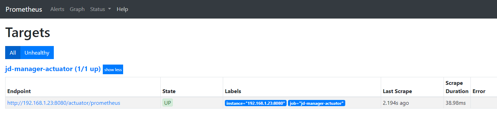

# prometheus 监控springboot

没有搭建好 prometheus 服务的清参考 [prometheus 搭建](prometheus 搭建.md)

这里主要说明 springboot 的配置

## springboot 集成 prometheus

1. pom.xml 添加如下依赖

   ```xml
   <dependency>
       <groupId>org.springframework.boot</groupId>
       <artifactId>spring-boot-starter-actuator</artifactId>
   </dependency>
   <dependency>
       <groupId>io.micrometer</groupId>
       <artifactId>micrometer-registry-prometheus</artifactId>
   </dependency>
   ```

2. 开放prometheus的端点

   ```yml
   management:
     endpoints:
       web:
         exposure:
           include: '*'
   ```

3. 配置 `prometheus.yml` 

   ```yml
   scrape_configs:
     - job_name: 'manager-actuator'
       metrics_path: '/actuator/prometheus'
       scrape_interval: 5s
       static_configs:
       - targets: ['192.168.1.23:8080']
   ```

4. 重启 prometheus 服务，浏览器打开 [http://192.168.2.100:9090/targets](http://192.168.2.100:9090/targets) 出现如下说明配置成功

   

