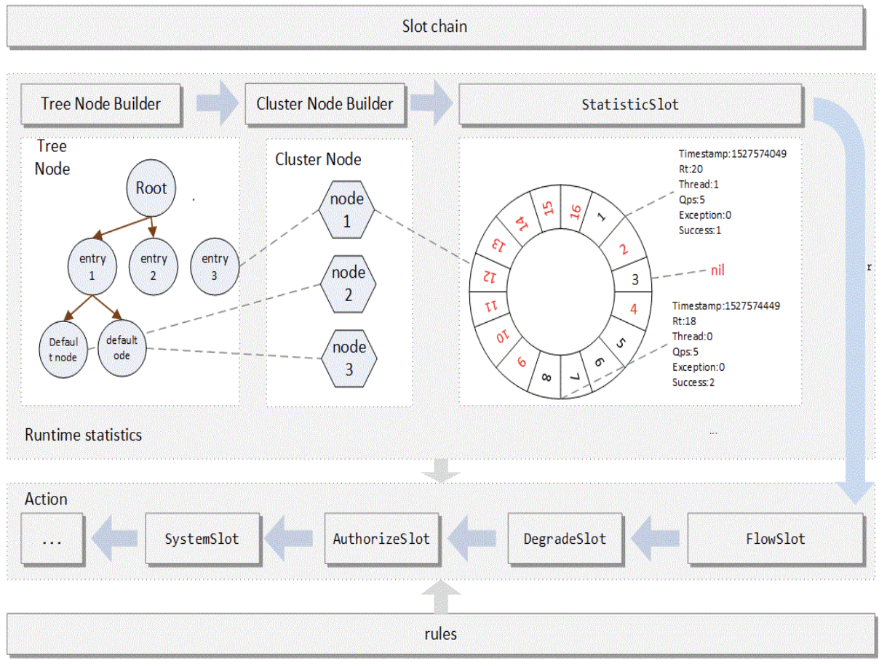

# Sentinel 限流简单使用

## demo案例

```java
public class SentinelMain {

    private static final String resource = "Hello";

    private static void init() {
        FlowRule rule = new FlowRule();
        rule.setResource(resource);
        rule.setGrade(RuleConstant.FLOW_GRADE_QPS);
        rule.setCount(1000);
        FlowRuleManager.loadRules(Collections.singletonList(rule));
    }


    public static void main(String[] args) {
        init();
        while (true) {
            Entry entry = null;
            try {
                entry = SphU.entry(resource);
            } catch (BlockException e) {
                e.printStackTrace();
            } catch (Exception e) {
                e.printStackTrace();
                Tracer.traceEntry(e, entry);
            } finally {
                if (entry != null) {
                    entry.exit();
                }
            }
        }
    }
}
```


# Sentinel 源码分析

从demo里面看主要两个步骤

1. 加载配置的规则
2. 执行限流逻辑


## 加载配置规则

### FlowRuleManager.loadRules()

```java
public static void loadRules(List<FlowRule> rules) {
  currentProperty.updateValue(rules);
}
```

### Dynami.SentinelProperty.updateValue()

```java
public boolean updateValue(T newValue) {
  if (isEqual(value, newValue)) {
    return false;
  }
  RecordLog.info("[DynamicSentinelProperty] Config will be updated to: " + newValue);
	// 更新保存配置规则
  value = newValue;
  for (PropertyListener<T> listener : listeners) {
    listener.configUpdate(newValue);
  }
  return true;
}
```


## 执行限流逻辑

### SphU.entry()

```java
public static Entry entry(String name) throws BlockException {
  return Env.sph.entry(name, EntryType.OUT, 1, OBJECTS0);
}
```

### CtSph.entry()

```java
public Entry entry(String name, EntryType type, int count, Object... args) throws BlockException {
  // 定义资源限流包装
  StringResourceWrapper resource = new StringResourceWrapper(name, type);
  return entry(resource, count, args);
}

public Entry entry(ResourceWrapper resourceWrapper, int count, Object... args) throws BlockException {
  return entryWithPriority(resourceWrapper, count, false, args);
}
```

### CtSph.entryWithPriority()

```java
private Entry entryWithPriority(ResourceWrapper resourceWrapper, int count, boolean prioritized, Object... args)
  throws BlockException {
  Context context = ContextUtil.getContext();
	// 省略部分代就，判断context是否合法
  // 加载资源处理的责任链
  ProcessorSlot<Object> chain = lookProcessChain(resourceWrapper);

  if (chain == null) {
    return new CtEntry(resourceWrapper, null, context);
  }

  Entry e = new CtEntry(resourceWrapper, chain, context);
  try {
    // 责任链的处理
    chain.entry(context, resourceWrapper, null, count, prioritized, args);
  } catch (BlockException e1) {
    e.exit(count, args);
    throw e1;
  } catch (Throwable e1) {
    // This should not happen, unless there are errors existing in Sentinel internal.
    RecordLog.info("Sentinel unexpected exception", e1);
  }
  return e;
}
```

### CtSph.lookProcessChain()

```java
 ProcessorSlot<Object> lookProcessChain(ResourceWrapper resourceWrapper) {
   ProcessorSlotChain chain = chainMap.get(resourceWrapper);
   if (chain == null) {
     // 双重锁检查
     synchronized (LOCK) {
       chain = chainMap.get(resourceWrapper);
       if (chain == null) {
         // Entry size limit.
         if (chainMap.size() >= Constants.MAX_SLOT_CHAIN_SIZE) {
           return null;
         }
				 // 创建资源需要处理的责任链
         chain = SlotChainProvider.newSlotChain();
         Map<ResourceWrapper, ProcessorSlotChain> newMap = new HashMap<ResourceWrapper, ProcessorSlotChain>(
           chainMap.size() + 1);
         newMap.putAll(chainMap);
         newMap.put(resourceWrapper, chain);
         chainMap = newMap;
       }
     }
   }
   return chain;
 }
```

### SlotChainProvider.newSlotChain()

```java
public static ProcessorSlotChain newSlotChain() {
  if (builder != null) {
    // 生成处理的责任链
    return builder.build();
  }

  resolveSlotChainBuilder();

  if (builder == null) {
    RecordLog.warn("[SlotChainProvider] Wrong state when resolving slot chain builder, using default");
    builder = new DefaultSlotChainBuilder();
  }
  return builder.build();
}
```


### DefaultSlotChainBuilder.build()

```java
public ProcessorSlotChain build() {
  // 这就是具体的责任链处理流程
  ProcessorSlotChain chain = new DefaultProcessorSlotChain();
  chain.addLast(new NodeSelectorSlot());
  chain.addLast(new ClusterBuilderSlot());
  chain.addLast(new LogSlot());
  chain.addLast(new StatisticSlot());
  chain.addLast(new SystemSlot());
  chain.addLast(new AuthoritySlot());
  chain.addLast(new FlowSlot());
  chain.addLast(new DegradeSlot());

  return chain;
}
```


- `NodeSelectorSlot` 负责收集资源的路径，并将这些资源的调用路径，以树状结构存储起来，用于根据调用路径来限流降级；
- `ClusterBuilderSlot` 则用于存储资源的统计信息以及调用者信息，例如该资源的 RT, QPS, thread count 等等，这些信息将用作为多维度限流，降级的依据；
- `StatisticSlot` 则用于记录、统计不同纬度的 runtime 指标监控信息；
- `FlowSlot` 则用于根据预设的限流规则以及前面 slot 统计的状态，来进行流量控制；
- `AuthoritySlot` 则根据配置的黑白名单和调用来源信息，来做黑白名单控制；
- `DegradeSlot` 则通过统计信息以及预设的规则，来做熔断降级；
- `SystemSlot` 则通过系统的状态，例如 load1 等，来控制总的入口流量；




### 责任链执行

​	回到  `chain.entry(context, resourceWrapper, null, count, prioritized, args);`  执行责任链的处理步骤。那首先应该调用 `NodeSelectorSlot` 里面的代码逻辑


#### NodeSelectorSlot.entry()

```java
public void entry(Context context, ResourceWrapper resourceWrapper, Object obj, int count, boolean prioritized, Object... args)
  throws Throwable {
  
  DefaultNode node = map.get(context.getName());
  // 构建树逻辑
  if (node == null) {
    synchronized (this) {
      node = map.get(context.getName());
      if (node == null) {
        node = new DefaultNode(resourceWrapper, null);
        HashMap<String, DefaultNode> cacheMap = new HashMap<String, DefaultNode>(map.size());
        cacheMap.putAll(map);
        cacheMap.put(context.getName(), node);
        map = cacheMap;
      }
      // Build invocation tree
      ((DefaultNode)context.getLastNode()).addChild(node);
    }
  }

  context.setCurNode(node);
  // 调用下一责任链
  fireEntry(context, resourceWrapper, node, count, prioritized, args);
}
```

#### LogSlot.entry()

```java
public void entry(Context context, ResourceWrapper resourceWrapper, DefaultNode obj, int count, boolean prioritized, Object... args)
  throws Throwable {
  try {
    fireEntry(context, resourceWrapper, obj, count, prioritized, args);
  } catch (BlockException e) {
    EagleEyeLogUtil.log(resourceWrapper.getName(), e.getClass().getSimpleName(), e.getRuleLimitApp(),
                        context.getOrigin(), count);
    throw e;
  } catch (Throwable e) {
    RecordLog.warn("Unexpected entry exception", e);
  }

}
```

#### ClusterBuilderSlot.entry()

```java
public void entry(Context context, ResourceWrapper resourceWrapper, DefaultNode node, int count, boolean prioritized, Object... args)
  throws Throwable {
  if (clusterNode == null) {
    // 双重锁检查
    synchronized (lock) {
      if (clusterNode == null) {
        // Create the cluster node.
        clusterNode = new ClusterNode(resourceWrapper.getName(), resourceWrapper.getResourceType());
        HashMap<ResourceWrapper, ClusterNode> newMap = new HashMap<>(Math.max(clusterNodeMap.size(), 16));
        newMap.putAll(clusterNodeMap);
        newMap.put(node.getId(), clusterNode);

        clusterNodeMap = newMap;
      }
    }
  }
  node.setClusterNode(clusterNode);

  if (!"".equals(context.getOrigin())) {
    Node originNode = node.getClusterNode().getOrCreateOriginNode(context.getOrigin());
    context.getCurEntry().setOriginNode(originNode);
  }

  fireEntry(context, resourceWrapper, node, count, prioritized, args);
}
```


#### StatisticSlot.entry()

```java
public void entry(Context context, ResourceWrapper resourceWrapper, DefaultNode node, int count, boolean prioritized, Object... args) throws Throwable {
  try {
    // Do some checking.
    // 检查
    fireEntry(context, resourceWrapper, node, count, prioritized, args);

    // Request passed, add thread count and pass count.
    // 请求通过，增加线程数量和通过数量
    node.increaseThreadNum();
    node.addPassRequest(count);

    if (context.getCurEntry().getOriginNode() != null) {
      // Add count for origin node.
      context.getCurEntry().getOriginNode().increaseThreadNum();
      context.getCurEntry().getOriginNode().addPassRequest(count);
    }

    // 入站策略配置
    if (resourceWrapper.getEntryType() == EntryType.IN) {
      // Add count for global inbound entry node for global statistics.
      Constants.ENTRY_NODE.increaseThreadNum();
      Constants.ENTRY_NODE.addPassRequest(count);
    }

    // Handle pass event with registered entry callback handlers.
    for (ProcessorSlotEntryCallback<DefaultNode> handler : StatisticSlotCallbackRegistry.getEntryCallbacks()) {
      // 判断是否能通过限流拦截
      handler.onPass(context, resourceWrapper, node, count, args);
    }
  } catch (PriorityWaitException ex) {
    node.increaseThreadNum();
    if (context.getCurEntry().getOriginNode() != null) {
      // Add count for origin node.
      context.getCurEntry().getOriginNode().increaseThreadNum();
    }

    if (resourceWrapper.getEntryType() == EntryType.IN) {
      // Add count for global inbound entry node for global statistics.
      Constants.ENTRY_NODE.increaseThreadNum();
    }
    // Handle pass event with registered entry callback handlers.
    for (ProcessorSlotEntryCallback<DefaultNode> handler : StatisticSlotCallbackRegistry.getEntryCallbacks()) {
      handler.onPass(context, resourceWrapper, node, count, args);
    }
  } catch (BlockException e) {
    // Blocked, set block exception to current entry.
    context.getCurEntry().setError(e);

    // Add block count.
    node.increaseBlockQps(count);
    if (context.getCurEntry().getOriginNode() != null) {
      context.getCurEntry().getOriginNode().increaseBlockQps(count);
    }

    if (resourceWrapper.getEntryType() == EntryType.IN) {
      // Add count for global inbound entry node for global statistics.
      Constants.ENTRY_NODE.increaseBlockQps(count);
    }

    // Handle block event with registered entry callback handlers.
    for (ProcessorSlotEntryCallback<DefaultNode> handler : StatisticSlotCallbackRegistry.getEntryCallbacks()) {
      handler.onBlocked(e, context, resourceWrapper, node, count, args);
    }

    throw e;
  } catch (Throwable e) {
    // Unexpected error, set error to current entry.
    context.getCurEntry().setError(e);

    // This should not happen.
    node.increaseExceptionQps(count);
    if (context.getCurEntry().getOriginNode() != null) {
      context.getCurEntry().getOriginNode().increaseExceptionQps(count);
    }

    if (resourceWrapper.getEntryType() == EntryType.IN) {
      Constants.ENTRY_NODE.increaseExceptionQps(count);
    }
    throw e;
  }
}
```


##### DefaultNode.addPassRequest()

```java
public void addPassRequest(int count) {
  super.addPassRequest(count);
  // 增加默认节点的通过请求数量
  this.clusterNode.addPassRequest(count);
}
```

##### StatisticNode.addPassRequest()

```java
public void addPassRequest(int count) {
  // 增加每秒的数量
  rollingCounterInSecond.addPass(count);
  // 增加每分钟的数量
  rollingCounterInMinute.addPass(count);
}
```

##### ArrayMetric.addPass()

```java
public void addPass(int count) {
  // 获取当前窗口
  WindowWrap<MetricBucket> wrap = data.currentWindow();
  // 增加通过数量
  wrap.value().addPass(count);
}
```

##### LeapArray.currentWindow()

```java
public WindowWrap<T> currentWindow() {
  return currentWindow(TimeUtil.currentTimeMillis());
}
```

##### LeapArray.currentWindow()

```java
public WindowWrap<T> currentWindow(long timeMillis) {
  if (timeMillis < 0) {
    return null;
  }

  int idx = calculateTimeIdx(timeMillis);
  // Calculate current bucket start time.
  long windowStart = calculateWindowStart(timeMillis);


  while (true) {
    WindowWrap<T> old = array.get(idx);
    if (old == null) {
     
      WindowWrap<T> window = new WindowWrap<T>(windowLengthInMs, windowStart, newEmptyBucket(timeMillis));
      if (array.compareAndSet(idx, null, window)) {
        // Successfully updated, return the created bucket.
        return window;
      } else {
       
        Thread.yield();
      }
    } else if (windowStart == old.windowStart()) {
      return old;
    } else if (windowStart > old.windowStart()) {
      
      if (updateLock.tryLock()) {
        try {
          // Successfully get the update lock, now we reset the bucket.
          return resetWindowTo(old, windowStart);
        } finally {
          updateLock.unlock();
        }
      } else {
        Thread.yield();
      }
    } else if (windowStart < old.windowStart()) {
      return new WindowWrap<T>(windowLengthInMs, windowStart, newEmptyBucket(timeMillis));
    }
  }
}
```


#### SystemSlot.entry()

```java
public void entry(Context context, ResourceWrapper resourceWrapper, DefaultNode node, int count,
                  boolean prioritized, Object... args) throws Throwable {
  SystemRuleManager.checkSystem(resourceWrapper);
  fireEntry(context, resourceWrapper, node, count, prioritized, args);
}
```


#### AuthoritySlot.entry()

```java
public void entry(Context context, ResourceWrapper resourceWrapper, DefaultNode node, int count, boolean prioritized, Object... args)
  throws Throwable {
  //检查黑白名单
  checkBlackWhiteAuthority(resourceWrapper, context);
  fireEntry(context, resourceWrapper, node, count, prioritized, args);
}
```

#### FlowSlot.entry()


#### DegradeSlot.entry()