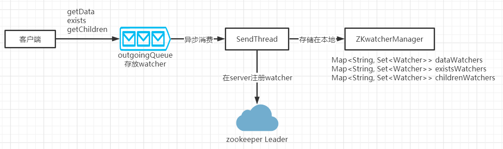
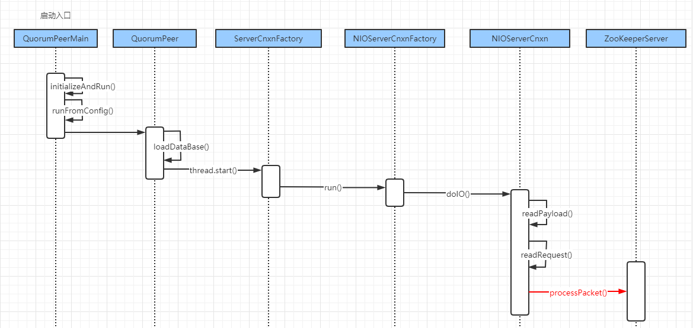

# zookeeper 原理

## zookeeper 数据同步流程

​		在zookeeper 设计中，可以知道zookeeper是由三种集群角色来组成整个高性能的。客户端会随机连接到zookeeper集群中的一个节点，如果是读请求，就直接从当前节点中读取数据，如果是写请求，那么请求会被转发给leader提交事务，然后leader会广播事务，只要有超过半数节点写入成功，那么些请求就会被提交（类似2PC事务）。

从上面可以发现几个问题：

1. 集群中的leader是如何选举出来的？
2. leader 节点奔溃后，整个集群无法处理写请求，如何快速从其他节点里面选举出新的leader呢？
3. leader 节点和各个follower 节点的数据一致性如何保证的


### ZAB协议

​		ZAB（zookeeper atomic broadcast）协议是为分布式协调服务 zookeeper 专门设计的一种支持奔溃恢复的原子广播协议。在zookeeper 中，主要依赖ZAB协议来实现分布式数据一致性，基于该协议，zookeeper实现了一种主备模式的系统架构来保持集群中各个副本之间的数据一致性。


#### zab 协议介绍

zab 协议包含两种基本模式，分别是

1. 奔溃恢复
2. 原子广播


​		当整个集群在启动时，或者当leader节点出现网络中断、奔溃等情况，ZAB协议就会进入恢复模式并选举产生新的leader，当leader选举出来之后，并且集群中有过半的机器和该leader节点完成数据同步后，ZAB协议机会退出恢复模式。

​		当集群中有过半的follower节点完成了和leader状态同步之后，那么整个集群就进入了消息广播模式。这个时候，在leader 节点正常工作时，启动一台新的服务器加入到集群，那这个服务器会直接进入数据恢复模式，和leader节点进行数据同步。同步完成后即可正常对外提供非事务请求的处理。


#### 消息广播的实现原理

消息广播的过程实际上是一个简化版本的二阶段提交过程。

1. leader接收到消息请求后，将消息赋予一个全局唯一的64位自增id（zxid），通过zxid的大小比较可以实现有序性
2. leader为每个follower准备了一个FIFO队列（通过TCP协议来实现，以实现全局有序这一个特点）将带有zxid的消息作为一个提案分发给所有follower
3. 当follower接受到提案，先把提案写到磁盘，写入成功后向leader回复一个ack
4. 当leader接受到合法数量的ack后，leader就会向这些follower发生commit命令，同时会在本地执行该消息
5. 当follower收到消息的commit 命令以后，会提交该消息


#### 奔溃恢复的实现原理


​		leader 因为各种问题失去了过半的follower节点的联系，那么就会进入到奔溃恢复模式，在奔溃恢复状态下，zab协议需要做两件事情：

1. 选举出新的leader
2. 数据同步


​		因为ZAB协议是一个简化的2PC协议，这种协议只需要集群中过半的节点响应提交即可。但是它无法处理leader服务器奔溃带来的数据不一致问题。

​		那么ZAB协议中的奔溃恢复需要保证，如果一个事务在一台机器上成功处理，那么这个事务应该在所有机器上处理成功。为了达到这个目的，zookeeper中会有哪些场景导致数据不一致性，以及针对这个场景，zab协议中的奔溃恢复应该怎么处理。

1. 已经被处理的消息不能丢：leader发送一个事务请求A，follower节点接收到请求，并返回ack，当leader发送commit命令前，leader奔溃这种情况下，ZAB协议需要事务A最终能在所有机器上成功提交
2. 被丢弃的消息不能再次出现：当leader接受到一个事务请求A之后，leader未转发给follower节点就奔溃，经过重新选举leader之后，事务A是被跳过的。原来的leader重启后变成了follower节点，它保留的事务A的状态跟集群的状态是不一致，需要删除。


​		ZAB 协议需要满足上面两种情况，就必须要设计一个leader选举算法：能够确保已经被leader提交的事务能够提交、同时丢弃已经被跳过的事务。

针对这个要求：

1. 如果leader选举算法能够保证新选举出来的leader服务器拥有集群中所有机器最高的编号（zxid）最大的事务请求，那么就可以保证这个新选举出来的leader一定具有已经提交的提案。
2. zxid 是有32位的epoch + 32位的消息计数器组成。这样设计的好处在于老的leader挂了以后重启，它不会被选举为leader。因此它的zxid肯定小于当前新的leader。当老的leader作为follower接入新的leader集群后，新的leader会让它将所有拥有旧的epoch号的未被commit的事务清除。


## leader选举原理


leader 选举存在两个阶段：

1. 启动时候的leader选举
2. 运行过程中，leader奔溃之后的选举


首先要知道选举过程设计到几个重要参数

- myid: 服务器对应的id，编号越大在算法中权重越大

- zxid: 事务id，值越大说明数据越新
- epoch: 投票次数，每一次投票会自增

选举状态

- LOOKING：竞选状态
- FOLLOWING：随从状态，同步leader状态，参与投票
- OBSERVING：观察状态，同步leader状态，不参与投票
- LEADING：领导者状态


### 服务器启动时的leader选举 

​		若进行lead选举，至少需要两台机器，假设有3台机器组成的集群。在server1启动时，其单独无法完成leader选举，当server2启动时，此时server1和server2可以互相通信，每台机器都试图找到leader，于是进入leader选举过程。选举过程如下：

1. 每个server发出一个投票。由于是初始状态，server1和server2都会将自己作为leader来进行投票，每次投票会包含锁推举的服务器的(myid,zxid,epoch)，此时server1的投票为(1,0,0)，server2的投票为(2,0,0)，然后各自将这个投票发给集群中的其它机器。
2. 接受来自各个服务器的投票。集群的每个服务器收到投票后，首先判断该投票的有效性，如检查是否本轮投票（epoch），是否来自LOOKING状态的服务器
3. 处理投票。针对每一个投票，服务器都需要将别人的投票和自己的投票进行PK，PK规则如下
   1. 优先比较epoch
   2. 再比较zxid，zxid最大的服务器有限作为leader
   3. 如果zxid相同，那就比较myid，myid最大的服务器作为leader
4. 统计投票。每次投票后，服务器都会统计投票信息，判断是否已经有过半机器接受相同的投票信息，对于server1、server2来说，都统计出集群中已经有两台机器接受了(2,0,0)的投票信息，此时便认为已经选出了leader
5. 改变服务器状态，一旦确定了leader，每个服务器就会更新自己的状态。

### 运行过程中的leader选举

​		当集群中的leader出现奔溃时，那么整个集群无法对外提供服务，而是进入新一轮的leader选举，服务器运行期间的leader选举和启动时期的leader选举基本过程是一致的。

1. 变更状态。leader奔溃后，余下的follower服务器都会讲自己的服务器状态变更为LOOKING。然后进入leader选举
2. 每个server会发出一个投票，在运行期间，每个服务器上的zxid可能不同，此时假定server1的zxid=123，server的zxid为122，在每一轮投票中，server1和server3都会投资及，产生投票(1,123,3)、(1,122,3)，然后各自将投票发送给集群中的所有机器。
3. 接受各自服务器的投票、处理投票、统计投票、改变服务器状态。（后续流程与启动选举相同）


## watcher 原理

​		zookeeper 的watcher 机制，总的来说可以分为三个过程：客户端注册watcher、服务器处理watcher和客户端回调watcher。

​		大致流程如下如所示：




### watcher demo

```java
public class App implements Watcher{
    static ZooKeeper zooKeeper;
    public static final String path = "/watcher";
    static {
        try {
            zooKeeper = new ZooKeeper("192.168.2.100:2181", 500000, new App());
        } catch (IOException e) {
            e.printStackTrace();
        }
    }

    public static void main(String[] args) throws Exception {
        zooKeeper.create(path, "0".getBytes(), ZooDefs.Ids.OPEN_ACL_UNSAFE, CreateMode.PERSISTENT);
        zooKeeper.exists(path, true);
        zooKeeper.setData(path, "1".getBytes(), -1);
        zooKeeper.setData(path, "2".getBytes(), -1);
        zooKeeper.setData(path, "3".getBytes(), -1);
        zooKeeper.setData(path, "4".getBytes(), -1);
    }

    @Override
    public void process(WatchedEvent watchedEvent) {
        if (watchedEvent.getType() == Event.EventType.NodeDataChanged) {
            System.out.println("event.type: " + watchedEvent.getType());
            try {
                zooKeeper.exists(path, true);
            } catch (KeeperException | InterruptedException e) {
                e.printStackTrace();
            }
        }
    }
}
```


### 注册watcher的前置准备


#### ZooKeeper 的初始化

```java
public ZooKeeper(String connectString, int sessionTimeout, Watcher watcher,
                 boolean canBeReadOnly)
    throws IOException {
    LOG.info("Initiating client connection, connectString=" + connectString
             + " sessionTimeout=" + sessionTimeout + " watcher=" + watcher);
	// 设置默认的watcher
    watchManager.defaultWatcher = watcher;

    ConnectStringParser connectStringParser = new ConnectStringParser(connectString);
    HostProvider hostProvider = new StaticHostProvider(connectStringParser.getServerAddresses());
    // 初始化ClientCnxn
    cnxn = new ClientCnxn(connectStringParser.getChrootPath(),
                          hostProvider, sessionTimeout, this, watchManager,
                          getClientCnxnSocket(), canBeReadOnly);
    // 启动ClientCnxn
    cnxn.start();
}

```


#### ClientCnxn 的初始化

ClientCnxn是zookeeper客户端与服务端进行通信和事件通知处理的主要类，内部主要包含两个类：

1. SendThread：负责客户端和服务端的数据通信，也包括时间信息的传输
2. EventThread：主要是客户端回调注册的watcher进行通知处理

```java
public ClientCnxn(String chrootPath, HostProvider hostProvider, int sessionTimeout, 	ZooKeeper zooKeeper, ClientWatchManager watcher, 
    ClientCnxnSocket clientCnxnSocket, long sessionId, byte[] sessionPasswd, boolean canBeReadOnly) {
    this.zooKeeper = zooKeeper;
    this.watcher = watcher;
    this.sessionId = sessionId;
    this.sessionPasswd = sessionPasswd;
    this.sessionTimeout = sessionTimeout;
    this.hostProvider = hostProvider;
    this.chrootPath = chrootPath;

    connectTimeout = sessionTimeout / hostProvider.size();
    readTimeout = sessionTimeout * 2 / 3;
    readOnly = canBeReadOnly;
	// 初始化sendThread
    sendThread = new SendThread(clientCnxnSocket);
    // 初始化eventThread
    eventThread = new EventThread();

}
```


### 服务器接收请求处理流程


启动zookeeper 的启动流程如下




上面时序图中红色部分为主要处理逻辑，分析该方法代码

#### ZooKeeperServer.processPacket()

```java
 public void processPacket(ServerCnxn cnxn, ByteBuffer incomingBuffer) throws IOException {
     // We have the request, now process and setup for next
     InputStream bais = new ByteBufferInputStream(incomingBuffer);
     BinaryInputArchive bia = BinaryInputArchive.getArchive(bais);
     RequestHeader h = new RequestHeader();
     h.deserialize(bia, "header");
     // Through the magic of byte buffers, txn will not be
     // pointing
     // to the start of the txn
     incomingBuffer = incomingBuffer.slice();
     // 判断当前操作类型
     if (h.getType() == OpCode.auth) { 
         LOG.info("got auth packet " + cnxn.getRemoteSocketAddress());
         AuthPacket authPacket = new AuthPacket();
         ByteBufferInputStream.byteBuffer2Record(incomingBuffer, authPacket);
         String scheme = authPacket.getScheme();
         AuthenticationProvider ap = ProviderRegistry.getProvider(scheme);
         Code authReturn = KeeperException.Code.AUTHFAILED;
         if(ap != null) {
             try {
                 authReturn = ap.handleAuthentication(cnxn, authPacket.getAuth());
             } catch(RuntimeException e) {
                 LOG.warn("Caught runtime exception from AuthenticationProvider: " + scheme + " due to " + e);
                 authReturn = KeeperException.Code.AUTHFAILED;                   
             }
         }
         if (authReturn!= KeeperException.Code.OK) {
             if (ap == null) {
                 LOG.warn("No authentication provider for scheme: "
                          + scheme + " has "
                          + ProviderRegistry.listProviders());
             } else {
                 LOG.warn("Authentication failed for scheme: " + scheme);
             }
             // send a response...
             ReplyHeader rh = new ReplyHeader(h.getXid(), 0,
                                              KeeperException.Code.AUTHFAILED.intValue());
             cnxn.sendResponse(rh, null, null);
             // ... and close connection
             cnxn.sendBuffer(ServerCnxnFactory.closeConn);
             cnxn.disableRecv();
         } else {
             if (LOG.isDebugEnabled()) {
                 LOG.debug("Authentication succeeded for scheme: "
                           + scheme);
             }
             LOG.info("auth success " + cnxn.getRemoteSocketAddress());
             ReplyHeader rh = new ReplyHeader(h.getXid(), 0,
                                              KeeperException.Code.OK.intValue());
             cnxn.sendResponse(rh, null, null);
         }
         return;
     } else {
         // 判断是否是sasl操作
         if (h.getType() == OpCode.sasl) {
             Record rsp = processSasl(incomingBuffer,cnxn);
             ReplyHeader rh = new ReplyHeader(h.getXid(), 0, KeeperException.Code.OK.intValue());
             cnxn.sendResponse(rh,rsp, "response"); // not sure about 3rd arg..what is it?
             return;
         }
         // 最终进入这边处理
         else {
             // 封装 request 请求
             Request si = new Request(cnxn, cnxn.getSessionId(), h.getXid(),h.getType(), incomingBuffer, cnxn.getAuthInfo());
             si.setOwner(ServerCnxn.me);
             // 提交请求
             submitRequest(si);
         }
     }
     cnxn.incrOutstandingRequests(h);
 }
```


#### ZooKeeperServer.submitRequest()


```java
public void submitRequest(Request si) {
     //processor 处理器，request 过来以后会经历一系列处理器的处理过程
    if (firstProcessor == null) {
        synchronized (this) {
            try {
               
                while (state == State.INITIAL) {
                    wait(1000);
                }
            } catch (InterruptedException e) {
                LOG.warn("Unexpected interruption", e);
            }
            if (firstProcessor == null || state != State.RUNNING) {
                throw new RuntimeException("Not started");
            }
        }
    }
    try {
        touch(si.cnxn);
        // 判断是否合法
        boolean validpacket = Request.isValid(si.type);
        if (validpacket) {
            // 通过 firstProcessor 调用链发起请求
            // 具体调用链如下
            firstProcessor.processRequest(si);
            if (si.cnxn != null) {
                incInProcess();
            }
        } else {
            LOG.warn("Received packet at server of unknown type " + si.type);
            new UnimplementedRequestProcessor().processRequest(si);
        }
    } catch (MissingSessionException e) {
        if (LOG.isDebugEnabled()) {
            LOG.debug("Dropping request: " + e.getMessage());
        }
    } catch (RequestProcessorException e) {
        LOG.error("Unable to process request:" + e.getMessage(), e);
    }
}
```


##### firstProcessor的请求链组成

​		firstProcessor的初始化是在`zookeeperServer.setupRequestProcessors()` 中完成的。

```java
protected void setupRequestProcessors() {
    RequestProcessor finalProcessor = new FinalRequestProcessor(this);
    RequestProcessor syncProcessor = new SyncRequestProcessor(this, finalProcessor);
    //调用 SyncRequestProcessor.run()
    ((SyncRequestProcessor)syncProcessor).start();
    firstProcessor = new PrepRequestProcessor(this, syncProcessor);
    // 调用 PrepRequestProcessor.run()
    ((PrepRequestProcessor)firstProcessor).start(); 
}
```


​		从上面我们可以看到 firstProcessor 的实例是一个 `PrepRequestProcessor`，而这个构造方法中又传递了一个 Processor 构成了一个调用链。

​		所以具体的调用链是`PrepRequestProcessor` -> `SyncRequestProcessor` -> `FinalRequestProcessor`


##### firstProcessor.processRequest(si);

```java
// firstProcessor.processRequest(si)
// 具体执行的逻辑如下
public void processRequest(Request request) {
    // submittedRequests是LinkedBlockingQueue
    // 异步消费阻塞队列
    submittedRequests.add(request);
}
```


##### PrepRequestProcessor.run()

```java
public void run() {
    try {
        // 死循环消费submittedRequests队列数据
        while (true) {
            Request request = submittedRequests.take();
            long traceMask = ZooTrace.CLIENT_REQUEST_TRACE_MASK;
            if (request.type == OpCode.ping) {
                traceMask = ZooTrace.CLIENT_PING_TRACE_MASK;
            }
            if (LOG.isTraceEnabled()) {
                ZooTrace.logRequest(LOG, traceMask, 'P', request, "");
            }
            if (Request.requestOfDeath == request) {
                break;
            }
            // 调用 pRequest 进行预处理
            pRequest(request);
        }
    } catch (RequestProcessorException e) {
        if (e.getCause() instanceof XidRolloverException) {
            LOG.info(e.getCause().getMessage());
        }
        handleException(this.getName(), e);
    } catch (Exception e) {
        handleException(this.getName(), e);
    }
    LOG.info("PrepRequestProcessor exited loop!");
}
```

##### PrepRequestProcessor.pRequest()

```java
protected void pRequest(Request request) throws RequestProcessorException {
    request.hdr = null;
    request.txn = null;
    try {
        switch (request.type) {
            // 根据op类型进行对应处理
            // 代码太长不展示
        }
    } catch (KeeperException e) {
        if (request.hdr != null) {
            request.hdr.setType(OpCode.error);
            request.txn = new ErrorTxn(e.code().intValue());
        }
        LOG.info("Got user-level KeeperException when processing "
                 + request.toString()
                 + " Error Path:" + e.getPath()
                 + " Error:" + e.getMessage());
        request.setException(e);
    } catch (Exception e) {
        // log at error level as we are returning a marshalling
        // error to the user
        LOG.error("Failed to process " + request, e);

        StringBuilder sb = new StringBuilder();
        ByteBuffer bb = request.request;
        if(bb != null){
            bb.rewind();
            while (bb.hasRemaining()) {
                sb.append(Integer.toHexString(bb.get() & 0xff));
            }
        } else {
            sb.append("request buffer is null");
        }

        LOG.error("Dumping request buffer: 0x" + sb.toString());
        if (request.hdr != null) {
            request.hdr.setType(OpCode.error);
            request.txn = new ErrorTxn(Code.MARSHALLINGERROR.intValue());
        }
    }
    request.zxid = zks.getZxid();
    // 调用下一责任链进行处理
    nextProcessor.processRequest(request);
}
```


##### SyncRequestProcessor. processRequest

​		PrepRequestProcessor的下一责任链是SyncRequestProcessor


```java
//也是一样加入到阻塞队列中进行异步消费
public void processRequest(Request request) {
    // request.addRQRec(">sync");
    queuedRequests.add(request);
}
```


##### SyncRequestProcessor.run()


```java
public void run() {
    try {
        int logCount = 0;

        setRandRoll(r.nextInt(snapCount/2));
        while (true) {
            Request si = null;
            if (toFlush.isEmpty()) {
                // 阻塞队列中获取请求
                si = queuedRequests.take();
            } else {
                si = queuedRequests.poll();
                if (si == null) {
                    flush(toFlush);
                    continue;
                }
            }
            if (si == requestOfDeath) {
                break;
            }
            if (si != null) {
                //下面这块代码，粗略看来是触发快照操作，启动一个处理快照的线程
                // track the number of records written to the log
                if (zks.getZKDatabase().append(si)) {
                    logCount++;
                    if (logCount > (snapCount / 2 + randRoll)) {
                        setRandRoll(r.nextInt(snapCount/2));
                        // roll the log
                        zks.getZKDatabase().rollLog();
                        // take a snapshot
                        if (snapInProcess != null && snapInProcess.isAlive()) {
                            LOG.warn("Too busy to snap, skipping");
                        } else {
                            snapInProcess = new ZooKeeperThread("Snapshot Thread") {
                                public void run() {
                                    try {
                                        zks.takeSnapshot();
                                    } catch(Exception e) {
                                        LOG.warn("Unexpected exception", e);
                                    }
                                }
                            };
                            snapInProcess.start();
                        }
                        logCount = 0;
                    }
                } else if (toFlush.isEmpty()) {
                    
                    if (nextProcessor != null) {
                        // 继续调用后续责任链
                        nextProcessor.processRequest(si);
                        if (nextProcessor instanceof Flushable) {
                            ((Flushable)nextProcessor).flush();
                        }
                    }
                    continue;
                }
                toFlush.add(si);
                if (toFlush.size() > 1000) {
                    flush(toFlush);
                }
            }
        }
    } catch (Throwable t) {
        handleException(this.getName(), t);
        running = false;
    }
    LOG.info("SyncRequestProcessor exited!");
}
```


##### FinalRequestProcessor. processRequest()

```java
// 代码太长
// 展示核心代码

case OpCode.exists: {
    lastOp = "EXIS";
    // TODO we need to figure out the security requirement for this!
    ExistsRequest existsRequest = new ExistsRequest();
    //反序列化 (将 ByteBuffer 反序列化成为 ExitsRequest.这个就是我们在客户端发起请求的时候传递过来的 Request 对象
    ByteBufferInputStream.byteBuffer2Record(request.request,
                                            existsRequest);
     //得到请求的路径
    String path = existsRequest.getPath();
    if (path.indexOf('\0') != -1) {
        throw new KeeperException.BadArgumentsException();
    }
    // 判断断请求的 getWatch 是否存在
    Stat stat = zks.getZKDatabase().statNode(path, existsRequest
                                             .getWatch() ? cnxn : null);
     //在服务端内存数据库中根据路径得到结果进行组装，设置为 ExistsResponse
    rsp = new ExistsResponse(stat);
    break;
}
```


### 客户端接受到服务端处理完成的响应


​		在上面责任链最后的`FinalRequestProcessor.processRequest()` 的逻辑中，会调用这一段代码`cnxn.sendResponse(hdr, rsp, "response");，这段代码就是返回客户端的响应信息。

​		而客户端在启动的时候会开启一个`SendThread`线程,里面的`run()`,会根据状态循环执行这一段代码`clientCnxnSocket.doTransport(to, pendingQueue, outgoingQueue, ClientCnxn.this);`,  `doTransport()` 的核心执行逻辑就是`doIO(pendingQueue, outgoingQueue, cnxn);`,


#### ClientCnxnSocketNIO.doIO()

```java
void doIO(List<Packet> pendingQueue, LinkedList<Packet> outgoingQueue, ClientCnxn cnxn)
    throws InterruptedException, IOException {
    SocketChannel sock = (SocketChannel) sockKey.channel();
    if (sock == null) {
        throw new IOException("Socket is null!");
    }
    if (sockKey.isReadable()) {
        int rc = sock.read(incomingBuffer);
        if (rc < 0) {
            throw new EndOfStreamException(
                "Unable to read additional data from server sessionid 0x"
                + Long.toHexString(sessionId)
                + ", likely server has closed socket");
        }
        if (!incomingBuffer.hasRemaining()) {
            incomingBuffer.flip();
            if (incomingBuffer == lenBuffer) {
                recvCount++;
                readLength();
            } else if (!initialized) {
                readConnectResult();
                enableRead();
                if (findSendablePacket(outgoingQueue,
                                       cnxn.sendThread.clientTunneledAuthenticationInProgress()) != null) {
                    // Since SASL authentication has completed (if client is configured to do so),
                    // outgoing packets waiting in the outgoingQueue can now be sent.
                    enableWrite();
                }
                lenBuffer.clear();
                incomingBuffer = lenBuffer;
                updateLastHeard();
                initialized = true;
            } else {
                //接收服务端的信息进行读取 
                sendThread.readResponse(incomingBuffer);
                lenBuffer.clear();
                incomingBuffer = lenBuffer;
                updateLastHeard();
            }
        }
    }
    if (sockKey.isWritable()) {
        synchronized(outgoingQueue) {
            Packet p = findSendablePacket(outgoingQueue,
                                          cnxn.sendThread.clientTunneledAuthenticationInProgress());

            if (p != null) {
                updateLastSend();
                // If we already started writing p, p.bb will already exist
                if (p.bb == null) {
                    if ((p.requestHeader != null) &&
                        (p.requestHeader.getType() != OpCode.ping) &&
                        (p.requestHeader.getType() != OpCode.auth)) {
                        p.requestHeader.setXid(cnxn.getXid());
                    }
                    p.createBB();
                }
                sock.write(p.bb);
                if (!p.bb.hasRemaining()) {
                    sentCount++;
                    outgoingQueue.removeFirstOccurrence(p);
                    if (p.requestHeader != null
                        && p.requestHeader.getType() != OpCode.ping
                        && p.requestHeader.getType() != OpCode.auth) {
                        synchronized (pendingQueue) {
                            pendingQueue.add(p);
                        }
                    }
                }
            }
            if (outgoingQueue.isEmpty()) {
                // No more packets to send: turn off write interest flag.
                // Will be turned on later by a later call to enableWrite(),
                // from within ZooKeeperSaslClient (if client is configured
                // to attempt SASL authentication), or in either doIO() or
                // in doTransport() if not.
                disableWrite();
            } else if (!initialized && p != null && !p.bb.hasRemaining()) {
                // On initial connection, write the complete connect request
                // packet, but then disable further writes until after
                // receiving a successful connection response.  If the
                // session is expired, then the server sends the expiration
                // response and immediately closes its end of the socket.  If
                // the client is simultaneously writing on its end, then the
                // TCP stack may choose to abort with RST, in which case the
                // client would never receive the session expired event.  See
                // http://docs.oracle.com/javase/6/docs/technotes/guides/net/articles/connection_release.html
                disableWrite();
            } else {
                // Just in case
                enableWrite();
            }
        }
    }
}
```


#### SendThread.readResponse()

这个方法里面主要的流程如下 

首先读取 header，

如果 xid == -2,表明是一个 ping 的 response，return 

如果 xid == -4 ,表明是一个 AuthPacket 的 response return 

如果 xid == -1，表明是一个 notification,此时要继续读取并构造一个 enent，通过 EventThread.queueEvent 发送，return 

其它情况下：从 pendingQueue 拿出一个 Packet，校验后更新 packet 信息


```java
 void readResponse(ByteBuffer incomingBuffer) throws IOException {
     ByteBufferInputStream bbis = new ByteBufferInputStream(
         incomingBuffer);
     BinaryInputArchive bbia = BinaryInputArchive.getArchive(bbis);
     ReplyHeader replyHdr = new ReplyHeader();
	 // 反序列化header
     replyHdr.deserialize(bbia, "header");
     if (replyHdr.getXid() == -2) {
         // -2 is the xid for pings
         if (LOG.isDebugEnabled()) {
             LOG.debug("Got ping response for sessionid: 0x"
                       + Long.toHexString(sessionId)
                       + " after "
                       + ((System.nanoTime() - lastPingSentNs) / 1000000)
                       + "ms");
         }
         return;
     }
     if (replyHdr.getXid() == -4) {
         // -4 is the xid for AuthPacket               
         if(replyHdr.getErr() == KeeperException.Code.AUTHFAILED.intValue()) {
             state = States.AUTH_FAILED;                    
             eventThread.queueEvent( new WatchedEvent(Watcher.Event.EventType.None, 
                                                      Watcher.Event.KeeperState.AuthFailed, null) );            		            		
         }
         if (LOG.isDebugEnabled()) {
             LOG.debug("Got auth sessionid:0x"
                       + Long.toHexString(sessionId));
         }
         return;
     }
     // 表示当前的消息类型是一个notification
     if (replyHdr.getXid() == -1) {
         // -1 means notification
         if (LOG.isDebugEnabled()) {
             LOG.debug("Got notification sessionid:0x"
                       + Long.toHexString(sessionId));
         }
         WatcherEvent event = new WatcherEvent();
         event.deserialize(bbia, "response");

         // convert from a server path to a client path
         if (chrootPath != null) {
             String serverPath = event.getPath();
             if(serverPath.compareTo(chrootPath)==0)
                 event.setPath("/");
             else if (serverPath.length() > chrootPath.length())
                 event.setPath(serverPath.substring(chrootPath.length()));
             else {
                 LOG.warn("Got server path " + event.getPath()
                          + " which is too short for chroot path "
                          + chrootPath);
             }
         }

         WatchedEvent we = new WatchedEvent(event);
         if (LOG.isDebugEnabled()) {
             LOG.debug("Got " + we + " for sessionid 0x"
                       + Long.toHexString(sessionId));
         }

         eventThread.queueEvent( we );
         return;
     }

     // If SASL authentication is currently in progress, construct and
     // send a response packet immediately, rather than queuing a
     // response as with other packets.
     if (clientTunneledAuthenticationInProgress()) {
         GetSASLRequest request = new GetSASLRequest();
         request.deserialize(bbia,"token");
         zooKeeperSaslClient.respondToServer(request.getToken(),
                                             ClientCnxn.this);
         return;
     }

     Packet packet;
     synchronized (pendingQueue) {
         if (pendingQueue.size() == 0) {
             throw new IOException("Nothing in the queue, but got "
                                   + replyHdr.getXid());
         }
         // 因为当前这个数据包已经收到了响应，所以移除
         packet = pendingQueue.remove();
     }
   
     try {
         if (packet.requestHeader.getXid() != replyHdr.getXid()) {
             packet.replyHeader.setErr(
                 KeeperException.Code.CONNECTIONLOSS.intValue());
             throw new IOException("Xid out of order. Got Xid "
                                   + replyHdr.getXid() + " with err " +
                                   + replyHdr.getErr() +
                                   " expected Xid "
                                   + packet.requestHeader.getXid()
                                   + " for a packet with details: "
                                   + packet );
         }

         packet.replyHeader.setXid(replyHdr.getXid());
         packet.replyHeader.setErr(replyHdr.getErr());
         packet.replyHeader.setZxid(replyHdr.getZxid());
         if (replyHdr.getZxid() > 0) {
             lastZxid = replyHdr.getZxid();
         }
         if (packet.response != null && replyHdr.getErr() == 0) {
             // 获得服务端的响应，反序列化到packet中
             packet.response.deserialize(bbia, "response");
         }

         if (LOG.isDebugEnabled()) {
             LOG.debug("Reading reply sessionid:0x"
                       + Long.toHexString(sessionId) + ", packet:: " + packet);
         }
     } finally {
         // 最后调用finishPacket完成处理
         finishPacket(packet);
     }
 }
```


##### ClientCnxn.finishPacket()

```java
private void finishPacket(Packet p) {
    if (p.watchRegistration != null) {
        //注册到watchRegistration中
        p.watchRegistration.register(p.replyHeader.getErr());
    }

    if (p.cb == null) {
        synchronized (p) {
            p.finished = true;
            p.notifyAll();
        }
    } else {
        p.finished = true;
        //当前的数据包添加到等待事件通知的队列中
        eventThread.queuePacket(p);
    }
}
```


##### ClientCnxn.queuePacket()

```java
public void queuePacket(Packet packet) {
    if (wasKilled) {
        synchronized (waitingEvents) {
            if (isRunning) waitingEvents.add(packet);
            else processEvent(packet);
        }
    } else {
        waitingEvents.add(packet);
    }
}
```


### 事件触发

​		假设事件触发通过setData方法


```java
public Stat setData(final String path, byte data[], int version)
        throws KeeperException, InterruptedException {
    final String clientPath = path;
    PathUtils.validatePath(clientPath);

    final String serverPath = prependChroot(clientPath);

    RequestHeader h = new RequestHeader();
    h.setType(ZooDefs.OpCode.setData);
    SetDataRequest request = new SetDataRequest();
    request.setPath(serverPath);
    request.setData(data);
    request.setVersion(version);
    SetDataResponse response = new SetDataResponse();
    ReplyHeader r = cnxn.submitRequest(h, request, response, null);
    if (r.getErr() != 0) {
        throw KeeperException.create(KeeperException.Code.get(r.getErr()),
                                     clientPath);
    }
    return response.getStat();
}
```

