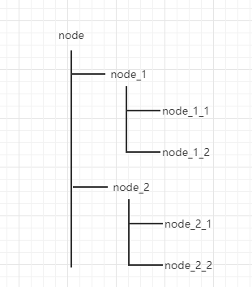

# zookeeper 基础

## zookeeper 数据模型

​		zookeeper 的视图结构和标准的文件系统非常类似，每一个节点称之为 ZNode，是 zookeeper 的最小单元。每个 znode上都可以保存数据以及挂载子节点。构成一个层次化的树形结构。

## zookeeper 节点

- 持久节点(PERSISTENT)：存储在文件中
- 持久有序节点(PERSISTENT_SEQUENTIAL)：为下一级节点维护一个持久顺序节点
- 临时节点(EPHEMERAL)：session回话结束节点删除
- 临时有序节点(EPHEMERAL_SEQUENTIAL)：为下一级节点维护一个临时顺序节点
- 容器节点(CONTAINER)：子节点为空，容器节点删除
- 过期节点(TTL)：过期时间后节点自动删除

## Stat 节点状态

​		一个节点除了存储数据内容以外，还存储了数据节点本身的一些状态信息，通过`get`命令可以获得状态信息的详细内容。

​		版本有点和我们经常使用的乐观锁类似。

|    状态特性    | 说明                                                 |
| :------------: | ---------------------------------------------------- |
|     czxid      | 即 Create ZXID，表示该节点被创建时的事务id           |
|     mzxid      | 即 Modified ZXID，表示该节点最后一次被更新时的事务id |
|     ctime      | 创建的时间                                           |
|     mtime      | 最后一次被更新的时间                                 |
|    version     | 数据节点的版本号                                     |
|    cversion    | 子节点的版本号                                       |
|    aversion    | 节点的ACL版本号                                      |
| ephemeralOwner | 临时节点的sessionId                                  |
|   dataLength   | 数据长度                                             |
|  numChildren   | 当前节点的子节点个数                                 |
|     pzxid      | 表示该节点的子节点列表最后一次被修改的事务Id         |

## 权限

**节点权限**

- Create：允许对子节点 Create 操作 
- Read：允许对本节点 GetChildren 和 GetData 操作 
- Write：允许对本节点 SetData 操作 
- Delete：允许对子节点 Delete 操作 
- Admin：允许对本节点 setAcl 操作

**权限模式**

- IP：通过ip来做权限控制，ip:192.168.1.1/24
- Digest：最常用的权限控制模式，类似于 username:password
- World：所有用户开放权限
- super：超级用户，可以对所有节点进行操作

## 节点事件监听

​		Watcher 监听机制是 Zookeeper 中非常重要的特性，我们基于 zookeeper 上创建的节点，可以对这些节点绑定监听事件，比如可以监听节点数据变更、节点删除、子节点状态变更等事件，通过这个事件机制，可以基于 zookeeper 实现分布式锁、集群管理等功能。

| zookeeper事件                 | 事件含义                                                   |
| ----------------------------- | ---------------------------------------------------------- |
| EventType.NodeCreated         | 当 node-x 这个节点被创建时触发                             |
| EventType.NodeChildrenChanged | 当 node-x 这个节点的直接子节点被创建、被删除、被修改时触发 |
| EventType.NodeDataChanged     | 当 node-x 这个节点的数据发生变更时触发                     |
| EventType.NodeDeleted         | 当 node-x 这个节点被删除时被触发                           |
| EventType.None                | 当 客户端的连接状态发生变更时触发                          |

