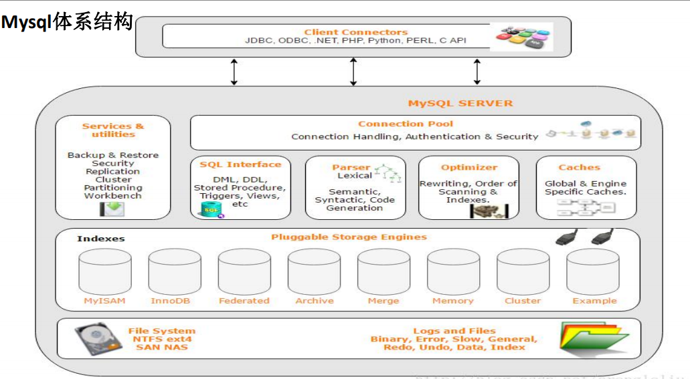
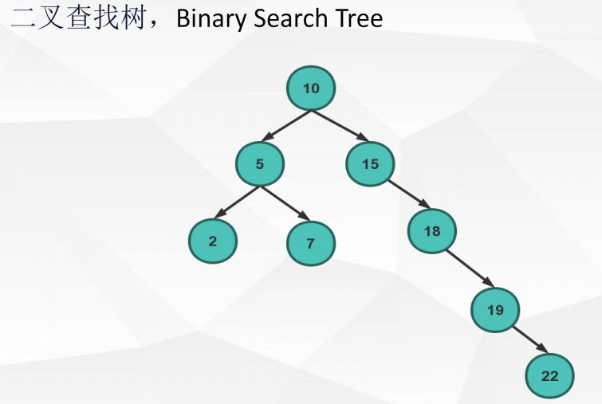
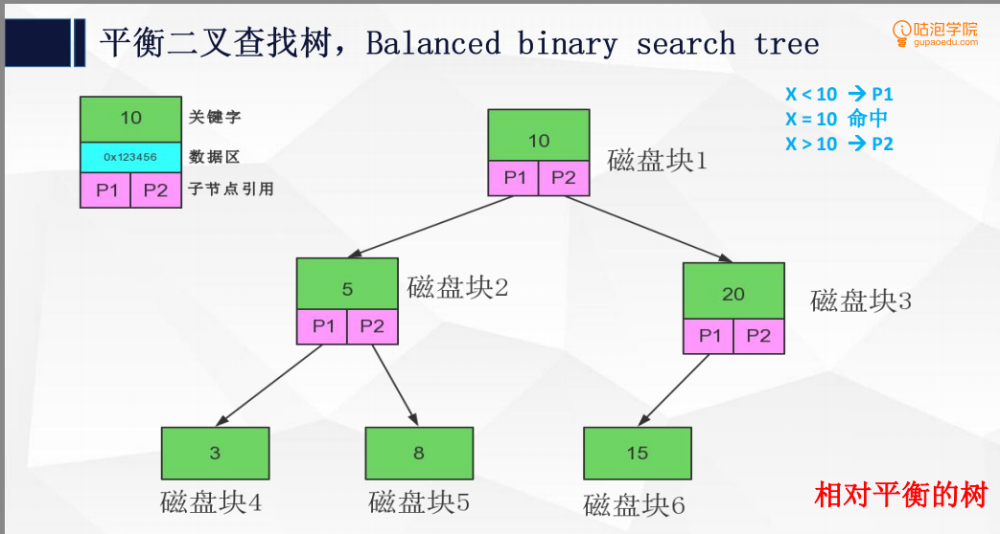
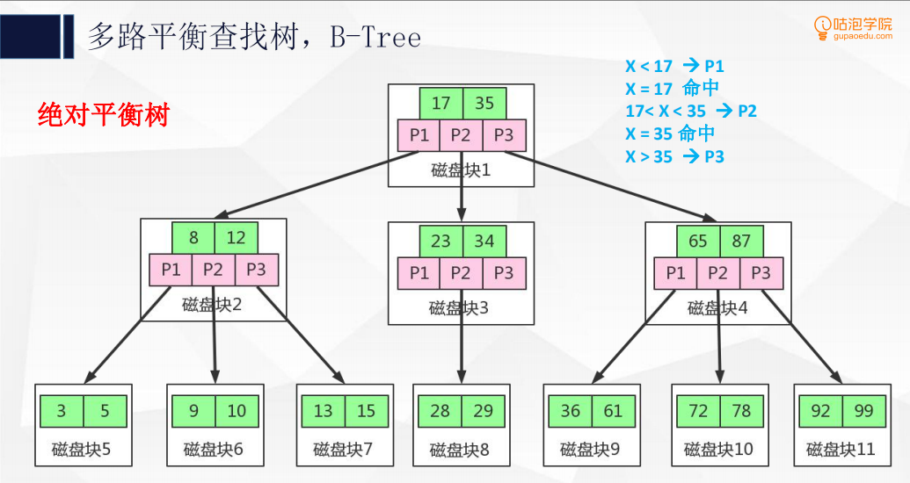
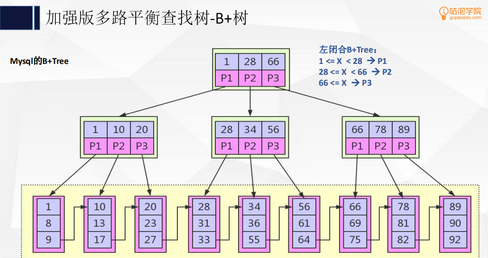

# 初识mysql 体系

## mysql 引擎
8个数据引擎
5.5之前使用MyISAM
5.6 开始使用innoDB

# 理解mysql底层B+tree索引机制

## 索引是什么？
索引是为了加速对表中数据行的检索而创建的一种分散存储的数据结构。

## 为什么使用索引

1. 索引能极大的减少存储引擎需要扫描的数据量
2. 索引可以把随机io变成顺序io
3. 索引可以帮助我们在进行分组、排序等操作时，避免使用临时表

## 为什么使用B+tree作为索引机制

二叉查找树原理图、平衡二叉查找树原理图的缺陷
1. io操作次数太多
2. 每一个磁盘块保存的数据量太小了
3. 没有很好的利用操作磁盘io的数据交换特性
4. 没有很好的利用磁盘的预读能力

B+ 树与B 树的区别
1. B+节点关键字搜索采用闭合区间
2. B+非叶节点不保存数据相关信息，只保存关键字和子节点的引用
3. B+关键字对应的数据保存在叶子节点中
4. B+叶子结点是顺序排列的，并且相邻节点具有顺序引用的关系

为什么选用B+树
B+树是B树的变种多路绝对平衡查找树，他拥有B树的优势
B+树扫库、表能力更强
B+树的磁盘读写能力更强
B+树的排序能力更强
B+树的查询效率更加稳定

### 二叉查找树原理图

### 平衡二叉查找树原理图

### 多路平衡查找树

### 加强多路平衡查找树
